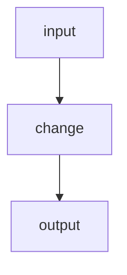

# <project> — spec-NN: <one-line title>

- **Project**: `/abs/path`
- **Priority**: <why now, in one clause>
- **Status**: SPECIFIED — not yet dispatched
- **Source**: <what prompted this: audit finding, defect, plan item>
- **Depends-On**: <specs that must land first, or "none">

---

## Overview

<The why. State the defect or driver concretely — quote the error, the measured
number, the failing behaviour. If a premise about existing code is load-bearing,
say you verified it and where.>

---

## Requirements

### Functional

- **R1 (short name)**: <independently checkable statement>
- **R2 (short name)**: <...>

### Non-Functional

- **N1**: <existing behaviour that must not change — this is the guard on the
  whole spec>
- **N2**: no new runtime dependencies
- **N3**: the quality gate stays green; the test count may only go up

---

## Architecture

**Key decision — <name>.** <What was chosen, what was rejected, and why. The
rejected option is what stops a reimplementation.>

**What this spec is not**: <adjacent work explicitly out of scope>

---

## TDD Contract

| id | test | given | expects |
|----|------|-------|---------|
| R1 | `test_...` | <state> | <observable result> |
| R2 | `test_...` | <state> | <observable result> |

**<id> is the acceptance test.** <Why: the requirement a plausible
implementation satisfies in appearance only. Where useful, require the wrong
version be written first and its failure pasted.>

---

## Exit Criteria

- [ ] `<runnable command>` — <what it proves> (R1)
- [ ] `<runnable command>` — <what it proves> (R2)
- [ ] `<quality gate command>` exits 0
- [ ] `git diff --name-only | grep -q '<forbidden path>'` finds nothing

**Prose criteria**:

1. <Anything requiring human judgement, stated unambiguously.>
2. Test counts pasted raw, one line per binary, **unsummed**.

---

## Guardrails

- **G1 — do NOT edit this spec.** If it is wrong, STOP and report it.
- **G2 — do NOT commit.** Leave work in the working tree.
- **G3 — do NOT weaken, skip or delete an existing test.**
- **G4 — do NOT regenerate a pinned fixture.**
- **G5 — no hardcoded absolute paths.** Test artefacts under `_tmp/`.
- **G6 — report raw output, never summed totals.**

### Error handling expectations

<What must fail loudly rather than silently. Name any path that must not default,
swallow, or treat "could not determine" as success.>

---

## Files to Modify

| File | Change |
|------|--------|
| `path` | <what> (R1) |

**Not modified**: <what stays untouched>
