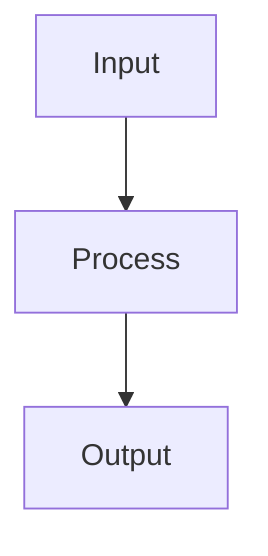

# Spec: [Feature Name]

**Project**: `.` (container: `/projects/[project-name]`)
**Topic**: `[research-topic-slug]`
**Author**: [Author Name]
**Date**: [YYYY-MM-DD]
**Depends-On**: [NN-previous-spec.md] (if applicable)

---

## Overview

[One paragraph description of what this feature does and why it matters.
Include the business/technical driver for this work.]

---

## Requirements

### Functional Requirements

- **R1**: [Requirement description - what the system must do]
- **R2**: [Requirement description]
- **R3**: [Requirement description]

### Non-Functional Requirements

- **R4**: [Constraint or quality attribute]
- **R5**: No `.unwrap()` in production code paths.
- **R6**: [Performance, security, or reliability constraint]

---

## Architecture



### Module Structure

```
src/
├── [module]/
│   ├── mod.rs          # [Description]
│   ├── [file].rs       # [Description]
│   └── README.md       # Module documentation
└── lib.rs              # pub mod [module];
```

### Key Data Structures

```rust
/// [Description of the data structure]
#[derive(Debug, Clone)]
pub struct [StructName] {
    pub field: Type,
}
```

### Key Decisions and Rationale

- **[Decision]**: [Why this approach was chosen]
- **[Decision]**: [Why this approach was chosen]

---

## TDD Contract

Tests that `rust-specialist` must write BEFORE any production code.
Each row maps to exactly one `#[test]` function.

| Test Name | Given | Expects |
|-----------|-------|---------|
| `test_[name]` | [Input/state] | [Expected output/behavior] |
| `test_[name]` | [Input/state] | [Expected output/behavior] |
| `test_[name]` | [Input/state] | [Expected output/behavior] |

---

## Exit Criteria

**CRITICAL**: Every exit criterion MUST be a shell command that returns 0 on success.
No prose allowed. Use `grep -q`, `test -f`, backtick commands only.

Recommended size: 5-7 exit criteria. If you have more than 7, consider splitting
the spec with `pidag split <spec.md>`.

- [ ] `cargo test -p [package] --test [test_file] 2>&1 | grep -q "passed"`
- [ ] `bash /root/.pi/agent/skills/quality-gate/run.sh .`
- [ ] `[command] --help 2>&1 | grep -q "[expected]"`
- [ ] `test -f [expected_file]`
- [ ] `! grep -rE '\.unwrap\(\)|\.expect\(' src/[module]/*.rs 2>/dev/null | grep -v '//' | grep -v test`

---

## Guardrails

What `rust-specialist` must NOT do during implementation:

- Do not run `cargo`, `rustc`, `clippy` outside the TDD cycle steps
- Do not add public API surface not specified in Requirements
- Do not use `.unwrap()`, `.expect()`, or `panic!()` in production code paths
- Do not modify files outside the project root
- Do not add dependencies to `Cargo.toml` without explicit approval
- **Approved dependencies**: [list any pre-approved crates]

On any ambiguity, stop and report back to `loop-engineer`, do not guess.

---

## Files to Modify

| File | Action | Description |
|------|--------|-------------|
| `src/[module]/mod.rs` | CREATE | [Description] |
| `src/[module]/[file].rs` | CREATE | [Description] |
| `src/[module]/README.md` | CREATE | Module documentation |
| `src/lib.rs` | MODIFY | Add `pub mod [module];` |
| `tests/[test_file].rs` | CREATE | TDD tests from contract |

---

## Verification Script

After implementation, verify with:

```bash
# 1. Run tests
cargo test -p [package] --test [test_file]

# 2. Check quality gate
bash /root/.pi/agent/skills/quality-gate/run.sh .

# 3. Smoke test
[command] --help

# 4. Clean up
rm -rf _tmp/test-*
```
