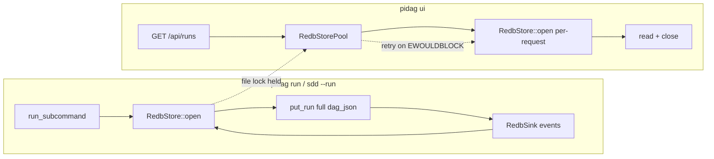

# Spec: RedbStorePool Fix — Use Persistent Lock for Runs

**Project**: `${WORKSPACE}/20260601-on-research/crates/pidag`
**Topic**: `claude-pi-delegation`
**Author**: Fable (Principal Architect)
**Date**: 2026-08-04
**Status**: APPROVED

---

## Overview

`RedbStorePool` opens the vault database per-operation to allow concurrent UI reads
during an SDD run. However, runs created via `RedbStorePool` have corrupted
`dag_json = "{}"` (length 2) instead of the full DAG definition. This breaks the
timeline endpoint (422 "missing field `nodes`") and run-detail view.

**Root cause hypothesis**: The per-operation open/close cycle causes the first
`put_run` write to not be visible when `DagSubmitted` event handler calls
`get_run` milliseconds later. Either redb's file sync timing or a lock/cache
race prevents the second open from seeing the committed data.

**Fix**: Use `RedbStore` (persistent lock for run lifetime) for `pidag run` and
`pidag sdd --run`. Use `RedbStorePool` only for the UI (read-only GET requests).
The UI retries on lock error (acceptable latency). This is simpler than debugging
redb's internal behavior and matches the original design intent.

---

## Requirements

- R1: `pidag run` uses `RedbStore::open()` directly, not `RedbStorePool`
- R2: `pidag sdd --run` (which internally spawns `pidag run`) uses `RedbStore`
- R3: `pidag ui` continues to use `RedbStorePool` for per-request access
- R4: UI gracefully handles lock contention (retry or informative error)
- R5: New runs have full `dag_json` (length >> 2), verifiable via `/api/runs`
- R6: Existing corrupted runs remain (no data migration), timeline shows error
- R7: No regression in existing tests (115+ tests must pass)

---

## Architecture

**Key decisions and rationale:**

- **RedbStore for runs**: A persistent lock is acceptable because runs are
  short-lived (minutes) and the UI can retry. This avoids the per-operation
  open/close timing bug entirely.

- **No data migration**: Corrupted runs (dag_len=2) stay as-is. Fixing them
  requires reparsing the original DAG file, which may not exist. The UI
  already shows "Failed to load timeline" for these runs — acceptable.

- **UI retry on lock**: The UI polls every 2 seconds. If a lock error occurs,
  the next poll will succeed. No user-visible disruption expected.

---

## TDD Contract

Tests in `tests/redb_pool_fix_tests.rs`:

| Test name | Given | Expects |
|---|---|---|
| `test_run_stores_full_dag_json` | `pidag run dag.json` via `RedbStore` | `get_run().dag_json.len() > 100` |
| `test_dag_submitted_does_not_overwrite` | Pre-seeded run + DagSubmitted event | `dag_json` unchanged |
| `test_timeline_endpoint_works_for_new_run` | Run created via `RedbStore` | `/api/runs/:id/timeline` returns 200 |
| `test_ui_handles_lock_contention` | RedbStore held + UI GET | UI returns 503 or retries, no crash |

---

## Exit Criteria

- [ ] `cargo test -p pidag 2>&1 | tail -1 | grep -q "0 failed"`
- [ ] `cargo clippy -p pidag -- -D warnings`
- [ ] `bin/pidag.rs` uses `RedbStore::open()` in `run_subcommand`, not `RedbStorePool`
- [ ] `bin/pidag.rs` uses `RedbStorePool` only in `ui` subcommand
- [ ] New run via `pidag run` has `dag_json.len() > 100` (verified by test)
- [ ] Timeline endpoint returns 200 for new runs
- [ ] Existing `test_dag_submitted_does_not_overwrite_preseeded_dag_json` passes

---

## Guardrails

- Do not modify `RedbStorePool` implementation — it is correct for its purpose
- Do not add retry logic to `RedbStore` — keep it simple
- Do not migrate or delete existing corrupted runs
- Do not change the `Store` trait interface
- Do not add new dependencies

---

## Files to Modify

| File | Change |
|---|---|
| `src/bin/pidag.rs` | `run_subcommand`: replace `RedbStorePool::new` with `RedbStore::open` |
| `src/bin/pidag.rs` | Keep `RedbStorePool` only in `ui` subcommand |
| `tests/redb_pool_fix_tests.rs` | NEW: TDD tests for this fix |
