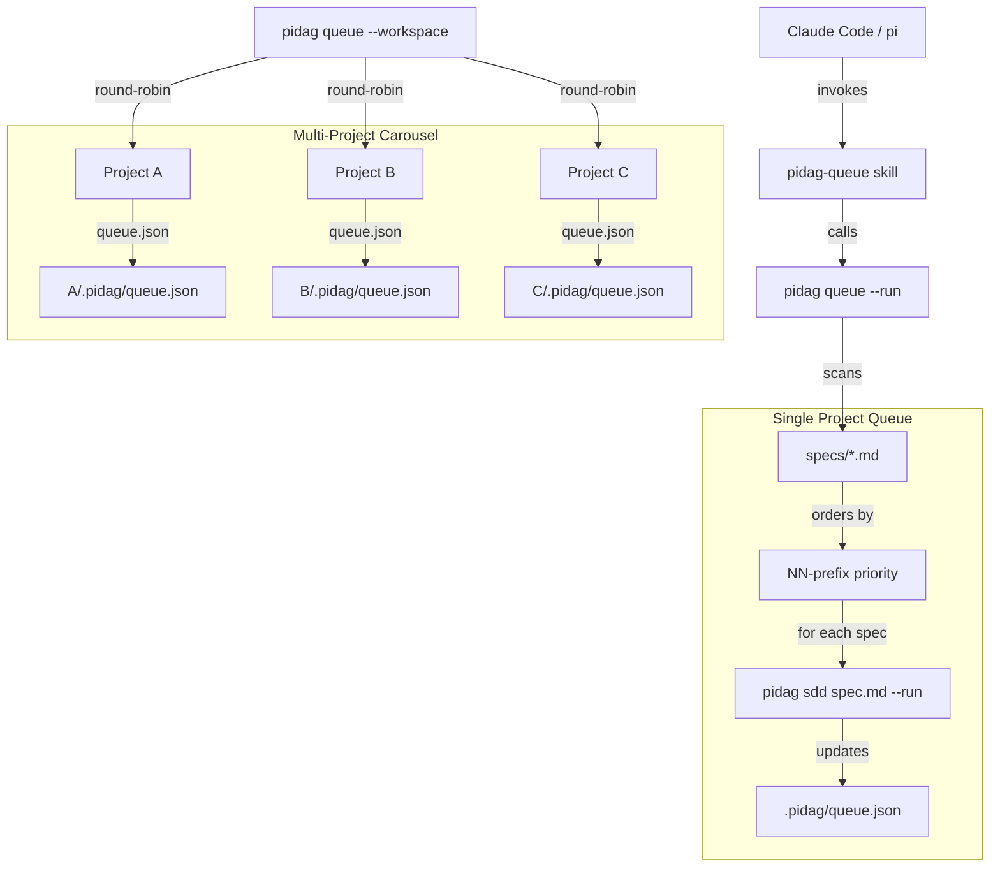

# Spec: pidag Spec Queue with Skill-Driven Orchestration

**Project**: `.` (container: `/projects/pidag`)
**Topic**: `claude-pi-delegation`
**Author**: Fable (Principal Architect)
**Date**: 2026-08-05

---

## Overview

Add automatic multi-spec queue execution to pidag. Currently, `pidag sdd <spec.md> --run`
processes ONE spec at a time, requiring manual invocation for each spec in a project.
This feature enables:

1. **Single-project queue**: Scan `specs/`, order by NN-prefix priority (01 before 02),
   execute in sequence with state persistence for crash recovery.
2. **Multi-project carousel**: Round-robin across projects for fair progress distribution.
3. **Skill interface**: Standard `pidag-queue` skill for Claude Code / pi invocation.

The business driver is autonomous spec execution: a cron job or Claude Code session can
invoke `pidag queue --run` and all pending specs execute in priority order without human
intervention. State persists to `.pidag/queue.json`, enabling resumption after failure.

---

## Requirements

### Functional Requirements

- **R1**: `pidag queue --status` prints a table of all specs in `specs/` with their state
  (Pending, Running, Done, Failed, Skipped) and priority (NN prefix).
- **R2**: `pidag queue --run` executes all Pending specs in priority order (01 before 02,
  etc.), updating state after each spec completes.
- **R3**: `pidag queue --reset` resets all specs to Pending state.
- **R4**: `pidag queue --retry-failed` re-queues only Failed specs as Pending.
- **R5**: `pidag queue --stop-on-failure` (optional flag for `--run`) aborts on first
  failure instead of continuing.
- **R6**: Queue state persists to `.pidag/queue.json` with atomic writes (temp+rename).
- **R7**: `pidag queue --workspace <path> --run` executes round-robin across all projects
  in the workspace directory (project A spec 01, project B spec 01, project A spec 02...).
- **R8**: The `pidag-queue` skill in `/root/.pi/agent/skills/pidag-queue/SKILL.md` allows
  pi invocation of queue commands.

### Non-Functional Requirements

- **R9**: Idempotent: re-running `--run` skips Done specs and resumes from last position.
- **R10**: No `.unwrap()` in production code paths; all errors propagate via `Result`.
- **R11**: Queue discovery is lazy (specs read from filesystem on each invocation, not
  cached in state file); state file only tracks execution status.
- **R12**: Backward compatible: existing `pidag sdd <spec.md> --run` continues to work.

### Spec Size Governance

- **R13**: `pidag sdd` emits a WARNING (to stderr) when spec exceeds soft thresholds:
  - Exit criteria > 7
  - TDD tests > 10
  - Files to modify > 5

  Warning format: `warning: spec exceeds recommended size (N exit criteria, M tests). Consider splitting with: pidag split <spec.md>`

  This is advisory only — execution proceeds. Hard enforcement is in `pidag split` (spec 07).

---

## Architecture



### Module Structure

```
crates/pidag/src/
├── queue/
│   ├── mod.rs          # Re-exports, SpecState enum, QueueEntry struct
│   ├── state.rs        # Atomic JSON read/write for queue.json
│   ├── project.rs      # Single-project queue execution
│   └── workspace.rs    # Multi-project carousel execution
├── cli/
│   └── queue.rs        # CLI subcommand implementation
└── lib.rs              # pub mod queue; and re-exports
```

### Key Data Structures

```rust
/// Execution state of a spec in the queue.
#[derive(Debug, Clone, Copy, PartialEq, Eq, Serialize, Deserialize)]
#[serde(rename_all = "lowercase")]
pub enum SpecState {
    Pending,
    Running,
    Done,
    Failed,
    Skipped,
}

/// A single spec entry in the queue.
#[derive(Debug, Clone, Serialize, Deserialize)]
pub struct QueueEntry {
    pub spec_name: String,       // e.g., "01-fibonacci"
    pub spec_file: String,       // e.g., "specs/01-fibonacci.md"
    pub state: SpecState,
    pub priority: u8,            // from NN prefix (1-99)
    pub last_run_at: Option<String>,
    pub run_id: Option<String>,
    pub error: Option<String>,
}

/// Queue state for a single project.
#[derive(Debug, Clone, Serialize, Deserialize)]
pub struct ProjectQueue {
    pub project_root: String,
    pub entries: Vec<QueueEntry>,
    pub updated_at: String,
}
```

### Key Decisions and Rationale

- **Lazy discovery**: Specs are scanned from filesystem on each invocation rather than
  cached in state file. This ensures new specs are picked up automatically and deleted
  specs don't linger. The state file only tracks execution status, not spec existence.
- **Atomic writes**: State file written via temp+rename to prevent corruption on crash.
  Uses `tempfile` crate with `persist()` for cross-platform atomicity.
- **Round-robin fairness**: Multi-project carousel ensures all projects make equal
  progress rather than completing project A entirely before starting project B.
- **Subprocess for spec execution**: Uses `pidag sdd <spec.md> --run` subprocess rather
  than inlining SDD logic, preserving isolation and enabling future parallelization.

---

## TDD Contract

Tests that `rust-specialist` must write BEFORE any production code.
Each row maps to exactly one `#[test]` function in `tests/queue_tests.rs`.

| Test name | Given | Expects |
|---|---|---|
| `test_spec_state_serde_round_trip` | `SpecState::Pending` serialized to JSON | Deserializes back to `SpecState::Pending` |
| `test_queue_entry_serde_round_trip` | `QueueEntry` with all fields populated | Deserializes back to identical struct |
| `test_discover_specs_empty_dir` | Empty `specs/` directory | Returns empty `Vec<QueueEntry>` |
| `test_discover_specs_finds_numbered` | `specs/` with `01-a.md`, `02-b.md` | Returns 2 entries sorted by priority |
| `test_discover_specs_ignores_unnumbered` | `specs/` with `readme.md`, `01-a.md` | Returns only `01-a.md` entry |
| `test_state_write_atomic` | Write `ProjectQueue` to `.pidag/queue.json` | File exists with valid JSON |
| `test_state_read_nonexistent` | No `.pidag/queue.json` exists | Returns `Ok(None)` |
| `test_state_merge_preserves_done` | Existing Done entry, new spec discovered | Done entry preserved, new entry Pending |
| `test_reset_all_to_pending` | Queue with Done, Failed entries | All entries become Pending |
| `test_retry_failed_only` | Queue with Done, Failed, Pending | Only Failed becomes Pending |
| `test_priority_ordering` | Specs `02-b.md`, `01-a.md`, `03-c.md` | Execute order: 01, 02, 03 |
| `test_stop_on_failure_flag` | `--stop-on-failure` with failing spec | Execution aborts, remaining specs stay Pending |
| `test_workspace_round_robin` | 2 projects, each with 2 specs | Order: A/01, B/01, A/02, B/02 |
| `test_sdd_warns_on_large_spec` | Spec with 10 exit criteria | Warning emitted to stderr, execution proceeds |

---

## Exit Criteria

`loop-engineer` does not exit until every item below is resolved.

Lines wrapped in backticks are shell commands — they run automatically.
Prose lines are passed to `rust-specialist` as self-check assertions.

- [ ] `cargo test -p pidag --test queue_tests 2>&1 | grep -q "14 passed"`
- [ ] `bash /root/.pi/agent/skills/quality-gate/run.sh .`
- [ ] `pidag queue --status 2>&1 | grep -q "SPEC"`
- [ ] `pidag queue --run --project-root _tmp/test-queue 2>&1 | grep -qE "Done|Failed"`
- [ ] `test -f _tmp/test-queue/.pidag/queue.json`
- [ ] `pidag queue --reset --project-root _tmp/test-queue 2>&1 | grep -q "Reset"`
- [ ] `! grep -rE '\.unwrap\(\)|\.expect\(' src/queue/*.rs | grep -v '//' | grep -v '#\[test\]' | grep -v 'test_'`
- [ ] `test -f src/queue/README.md`
- [ ] `test -f /root/.pi/agent/skills/pidag-queue/SKILL.md`

---

## Guardrails

What `rust-specialist` must NOT do during implementation:

- Do not run `cargo`, `rustc`, `clippy`, or any Rust toolchain command outside
  the TDD cycle steps — all commands go through `quality-gate.sh`
- Do not add public API surface not specified in Requirements
- Do not use `.unwrap()`, `.expect()`, or `panic!()` in production code paths
- Do not modify files outside the project root (except creating skill file)
- Do not add dependencies to `Cargo.toml` without explicit approval in the spec
- **Approved dependencies**: `tempfile` (already in workspace, for atomic writes)
- Do not inline SDD execution logic — always subprocess to `pidag sdd <spec.md> --run`
- Do not cache spec list in state file — always discover from filesystem
- Do not modify existing `cli/sdd.rs` behavior — queue is additive

On any ambiguity — stop and report back to `loop-engineer`, do not guess.

---

## Files to Modify

| File | Action | Description |
|---|---|---|
| `src/queue/mod.rs` | CREATE | Data structures (SpecState, QueueEntry, ProjectQueue), re-exports |
| `src/queue/state.rs` | CREATE | Atomic JSON read/write, merge logic |
| `src/queue/project.rs` | CREATE | Single-project queue execution |
| `src/queue/workspace.rs` | CREATE | Multi-project carousel execution |
| `src/queue/README.md` | CREATE | Module documentation |
| `src/cli/queue.rs` | CREATE | CLI subcommand implementation |
| `src/cli/mod.rs` | MODIFY | Add `pub mod queue;` and `pub use queue::queue;` |
| `src/lib.rs` | MODIFY | Add `pub mod queue;` |
| `src/bin/pidag.rs` | MODIFY | Add `"queue"` match arm calling `cli::queue()` |
| `tests/queue_tests.rs` | CREATE | 14 TDD tests from contract |
| `/root/.pi/agent/skills/pidag-queue/SKILL.md` | CREATE | Skill definition for pi |

---

## Verification Script

After implementation, verify with:

```bash
# 1. Create test project
mkdir -p _tmp/test-queue/specs
echo "# Spec: Test A" > _tmp/test-queue/specs/01-test-a.md
echo "# Spec: Test B" > _tmp/test-queue/specs/02-test-b.md

# 2. Check status
pidag queue --status --project-root _tmp/test-queue
# Expected: table with 01-test-a (Pending), 02-test-b (Pending)

# 3. Reset (should be no-op since all Pending)
pidag queue --reset --project-root _tmp/test-queue
pidag queue --status --project-root _tmp/test-queue

# 4. Verify state persistence
cat _tmp/test-queue/.pidag/queue.json
# Expected: JSON with both specs

# 5. Clean up
rm -rf _tmp/test-queue
```

---

## Research Validation (2025-2026 External Research)

This spec's queue architecture is validated by state-of-the-art research on agent
autonomy and long-horizon task execution.

### Closed Feedback Loops (Zylos Research, May 2026)

Zylos identified "closed feedback loops between execution and planning adjustments"
as one of five critical requirements for multi-hour autonomous operation.

**Queue implementation**:
- State persists to `.pidag/queue.json` after each spec
- `--retry-failed` enables automatic recovery
- Crash recovery via atomic writes (temp+rename)
- Progress visible via `--status`

This creates the closed loop: execute → persist → verify → resume.

### Hierarchical Subagent Isolation

Research shows hierarchical planning achieves **3.5x improvement** (CORPGEN) by
isolating failures at each level.

**Queue implementation**:
- Each spec executes as isolated subprocess (`pidag sdd <spec.md> --run`)
- Failure in spec N does not corrupt specs N+1..M
- State per-spec enables selective retry
- Round-robin fairness prevents single-project blocking

### The 35-Minute Wall Mitigation

> "Agent success rates begin declining after approximately 35 minutes"
> with failure rates QUADRUPLING when task duration doubles.

**Queue implementation**:
- Each spec targets <25 tool calls (via spec-split R13 warning)
- Sequential execution ensures clean context between specs
- No accumulated context degradation across specs

### Six Sigma Pattern: Atomic Actions + State

The Six Sigma Agent (arXiv 2601.22290) achieved **14,700x reliability** through
decomposition into atomic actions with state tracking.

**Queue implementation**:
- Each spec = one atomic unit of work
- State tracking: Pending → Running → Done/Failed
- Re-execution of failed specs isolated from completed work
- `--stop-on-failure` enables fail-fast when needed

### Production Engineering Principles Alignment

| Zylos Principle | Queue Feature |
|-----------------|---------------|
| Strong specifications | Specs define exit criteria |
| Cheap verification | Shell commands auto-verify |
| Explicit context management | `queue.json` state file |
| Hierarchical subagent isolation | Subprocess execution |
| Closed feedback loops | Persist → status → retry |

### External Sources

- [Zylos: Long-Horizon Planning and Goal Decomposition](https://zylos.ai/research/2026-05-14-long-horizon-planning-goal-decomposition-ai-agents/)
- [arXiv 2601.22290: Six Sigma Agent](https://arxiv.org/abs/2601.22290)

### Memory Reference

Full research synthesis stored in agent-memory:
- `hermes-lnx-optimization/research/external-task-decomposition-2025-2026` (global scope)
