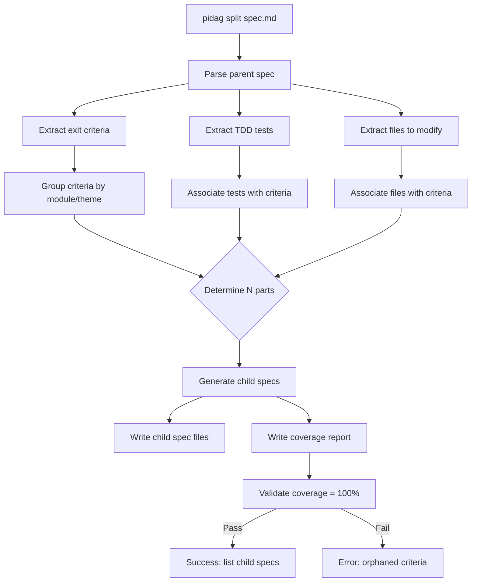

# Spec: pidag Spec Split with Coverage Validation

**Project**: `.` (container: `/projects/pidag`)
**Topic**: `claude-pi-delegation`
**Author**: Fable (Principal Architect)
**Date**: 2026-08-05
**Depends-On**: 06-spec-queue (for size warning integration)

---

## Overview

Add automatic spec splitting to pidag. When a spec exceeds size thresholds (>7 exit
criteria, >10 TDD tests, >5 files), it should be split into smaller, sequentially
numbered specs that together cover ALL original requirements.

The critical invariant: **no exit criteria may be lost in the split**. The split
command must produce a coverage report proving that every original criterion maps
to exactly one child spec. This enables confident parallel development and ensures
the queue executes a complete implementation.

---

## Requirements

### Functional Requirements

- **R1**: `pidag split <spec.md>` analyzes the spec and proposes a split plan.
- **R2**: `pidag split <spec.md> --into N` splits into exactly N child specs.
- **R3**: `pidag split <spec.md> --auto` automatically determines optimal N based on
  thresholds (target: 5-7 exit criteria per child spec).
- **R4**: Child specs are named `NN-<parent-stem>-partM.md` where NN is the parent's
  prefix and M is the part number (e.g., `01-auth.md` splits into `01-auth-part1.md`,
  `02-auth-part2.md`, `03-auth-part3.md`).
- **R5**: Each child spec includes metadata linking to parent:
  ```markdown
  **Parent-Spec**: `01-auth.md`
  **Part**: 2 of 3
  **Covers**: Exit criteria 4-6 from parent
  ```
- **R6**: `pidag split` generates a coverage report (`.pidag/split-coverage.json`)
  mapping each parent exit criterion to its child spec.
- **R7**: `pidag split --validate <parent.md>` verifies all parent criteria are
  covered by existing child specs. Fails if any criterion is orphaned.
- **R8**: Split preserves TDD test groupings — tests stay with their related exit
  criteria (heuristic: tests mentioning same function/module as criterion).

### Coverage Report Format

```json
{
  "parent_spec": "specs/01-auth.md",
  "split_date": "2026-08-05T12:00:00Z",
  "children": [
    {
      "spec": "specs/01-auth-part1.md",
      "exit_criteria_indices": [0, 1, 2],
      "tdd_tests": ["test_auth_model_create", "test_auth_model_validate"]
    },
    {
      "spec": "specs/02-auth-part2.md",
      "exit_criteria_indices": [3, 4, 5],
      "tdd_tests": ["test_auth_endpoint_login", "test_auth_endpoint_logout"]
    }
  ],
  "coverage": {
    "total_parent_criteria": 9,
    "covered_criteria": 9,
    "orphaned_criteria": []
  }
}
```

### Non-Functional Requirements

- **R9**: Split is deterministic — same input always produces same output.
- **R10**: No `.unwrap()` in production code paths.
- **R11**: Parent spec is NOT modified or deleted — children are additive.
- **R12**: If split would create child with 0 exit criteria, abort with error.

---

## Architecture



### Splitting Heuristics

1. **Module grouping**: Criteria mentioning same module/file stay together
2. **Dependency ordering**: If criterion B depends on A, they go in same or A-first spec
3. **Size balancing**: Target 5-7 criteria per child, ±2 for grouping constraints
4. **Test association**: Tests follow their criteria (match by function/module name)

### Key Data Structures

```rust
/// A single exit criterion parsed from the spec.
#[derive(Debug, Clone)]
pub struct ExitCriterion {
    pub index: usize,
    pub text: String,
    pub is_shell_command: bool,  // wrapped in backticks
    pub mentioned_modules: Vec<String>,  // extracted from text
}

/// Coverage mapping from parent to children.
#[derive(Debug, Clone, Serialize, Deserialize)]
pub struct SplitCoverage {
    pub parent_spec: String,
    pub split_date: String,
    pub children: Vec<ChildCoverage>,
    pub coverage: CoverageStats,
}

#[derive(Debug, Clone, Serialize, Deserialize)]
pub struct ChildCoverage {
    pub spec: String,
    pub exit_criteria_indices: Vec<usize>,
    pub tdd_tests: Vec<String>,
}

#[derive(Debug, Clone, Serialize, Deserialize)]
pub struct CoverageStats {
    pub total_parent_criteria: usize,
    pub covered_criteria: usize,
    pub orphaned_criteria: Vec<usize>,
}
```

---

## TDD Contract

| Test name | Given | Expects |
|---|---|---|
| `test_parse_exit_criteria` | Spec with 5 `- [ ]` items | Returns 5 `ExitCriterion` structs |
| `test_parse_exit_criteria_shell_vs_prose` | Mixed backtick and prose criteria | Correctly flags `is_shell_command` |
| `test_split_into_n_parts` | 9 criteria, `--into 3` | 3 child specs with 3 criteria each |
| `test_split_auto_determines_n` | 15 criteria, `--auto` | 2-3 child specs (target 5-7 each) |
| `test_split_preserves_all_criteria` | Parent with 10 criteria | Coverage report shows 10/10 covered |
| `test_split_fails_on_orphan` | Manually corrupted children | `--validate` returns error |
| `test_child_spec_metadata` | Split parent | Child contains `Parent-Spec`, `Part`, `Covers` |
| `test_coverage_report_format` | Completed split | Valid JSON at `.pidag/split-coverage.json` |
| `test_split_deterministic` | Same input twice | Identical output files |
| `test_split_aborts_empty_child` | 2 criteria, `--into 5` | Error: would create empty children |
| `test_module_grouping_heuristic` | Criteria mentioning `auth.rs` and `db.rs` | Grouped by module |
| `test_test_association` | TDD tests with matching function names | Tests follow criteria |

---

## Exit Criteria

- [ ] `cargo test -p pidag --test split_tests 2>&1 | grep -q "passed"`
- [ ] `bash /root/.pi/agent/skills/quality-gate/run.sh .`
- [ ] `pidag split --help 2>&1 | grep -q "split"`
- [ ] `pidag split _tmp/test-split/specs/01-large.md --into 3 && test -f _tmp/test-split/specs/01-large-part1.md`
- [ ] `test -f .pidag/split-coverage.json && grep -q '"covered_criteria"' .pidag/split-coverage.json`
- [ ] `pidag split --validate _tmp/test-split/specs/01-large.md 2>&1 | grep -qE "pass|100%"`
- [ ] `grep -q "Parent-Spec" _tmp/test-split/specs/01-large-part1.md`
- [ ] `! grep -rE '\.unwrap\(\)|\.expect\(' src/split/*.rs 2>/dev/null | grep -v '//' | grep -v test`

---

## Guardrails

- Do not modify or delete the parent spec — splitting is additive
- Do not create child specs with 0 exit criteria
- Do not split criteria that have explicit dependencies (keep together)
- Do not add dependencies beyond what's already in Cargo.toml
- Do not inline spec parsing from `sdd/mod.rs` — extend it properly
- All file writes use atomic temp+rename pattern

---

## Files to Modify

| File | Action | Description |
|---|---|---|
| `src/split/mod.rs` | CREATE | Data structures, parsing, split logic |
| `src/split/coverage.rs` | CREATE | Coverage report generation and validation |
| `src/split/heuristics.rs` | CREATE | Module grouping and test association |
| `src/split/README.md` | CREATE | Module documentation |
| `src/cli/split.rs` | CREATE | CLI subcommand implementation |
| `src/cli/mod.rs` | MODIFY | Add `pub mod split;` |
| `src/lib.rs` | MODIFY | Add `pub mod split;` |
| `src/bin/pidag.rs` | MODIFY | Add `"split"` match arm |
| `tests/split_tests.rs` | CREATE | 12 TDD tests from contract |

---

## Integration with Queue

After splitting:

```bash
$ pidag split specs/01-big-feature.md --auto
Created:
  specs/01-big-feature-part1.md (5 criteria)
  specs/02-big-feature-part2.md (5 criteria)
  specs/03-big-feature-part3.md (5 criteria)

Coverage: 15/15 (100%)

$ pidag queue --run
Executing specs in order:
  [1/3] 01-big-feature-part1.md ... Done
  [2/3] 02-big-feature-part2.md ... Done
  [3/3] 03-big-feature-part3.md ... Done

All specs completed successfully.
```

The parent spec (`01-big-feature.md`) is ignored by the queue since child specs
exist (detected via `.pidag/split-coverage.json`).

---

## Research Validation (2025-2026 External Research)

This spec's design is validated by state-of-the-art research on agent autonomy and task
decomposition. The following findings directly support our architectural decisions.

### The 35-Minute Wall (Zylos Research, May 2026)

> "Agent success rates begin declining after approximately 35 minutes"
> with failure rates QUADRUPLING when task duration doubles.

- After 25-30 tool calls, even 200K-token context windows lose coherence
- Root cause: **exponential** error compounding, not linear decay

**Design implication**: Each child spec must complete within ~25 tool calls (~35 min
for local models). This validates our 5-7 criteria target — achievable in one focused
session without context degradation.

### Why 5-7 Exit Criteria (Cognitive Science)

| Source | Finding | Implication |
|--------|---------|-------------|
| Cowan (2001) | Working memory: 4±1 items | Upper bound on simultaneous criteria |
| arXiv 2509.19517 | Cognitive load causes hallucination-as-guessing | Must reduce context, not just steps |
| NAACL 2025 | Prompt compression reduces errors | Smaller specs = less context saturation |

Our target of **5-7 criteria per child spec** aligns with human cognitive limits (4±1)
while allowing margin for dependency grouping.

### Six Sigma Agent Validation (arXiv 2601.22290)

The Six Sigma Agent achieved **14,700x reliability improvement** through:

1. Task decomposition into **dependency tree of ATOMIC actions**
2. Micro-agent sampling (parallel execution)
3. Consensus voting with dynamic scaling

**Key insight**: "Reliability emerges from principled redundancy and consensus, not model scaling alone."

Our exit criteria map to atomic actions. A 1-step-autonomy local model becomes reliable
when each criterion is truly atomic — exactly what spec-split enforces.

### HELP Architecture (Hierarchical Embodied Language Planner)

HELP separates:
- **High-level decomposition** (natural language)
- **Low-level grounding** (pseudocode/executable)

This directly validates our architecture:

| HELP Layer | pidag Equivalent |
|------------|------------------|
| High-level NL decomposition | Cloud planner generates full spec |
| Low-level executable | Exit criteria (shell commands) |
| Medium-sized LLM execution | Local workhorse executes child specs |

### Production Engineering Principles (Zylos)

Zylos identified five requirements for multi-hour autonomous operation:

| Principle | pidag Implementation |
|-----------|---------------------|
| Strong specifications (critical >20 min) | Spec-driven development |
| Cheap verification mechanisms | Exit criteria as shell commands |
| Explicit context management | `.pidag/vault` structured logs |
| Hierarchical subagent isolation | Child specs as isolated units |
| Closed feedback loops | Validation loop with queue retry |

### External Sources

- [Zylos: Long-Horizon Planning and Goal Decomposition](https://zylos.ai/research/2026-05-14-long-horizon-planning-goal-decomposition-ai-agents/)
- [arXiv 2601.22290: Six Sigma Agent](https://arxiv.org/abs/2601.22290)
- [arXiv 2509.19517: Cognitive Load Limits in LLMs](https://arxiv.org/abs/2509.19517)
- [NAACL 2025: Prompt Compression for LLMs](https://aclanthology.org/2025.naacl-long.368/)

### Memory Reference

Full research synthesis stored in agent-memory:
- `hermes-lnx-optimization/research/external-task-decomposition-2025-2026` (global scope)
