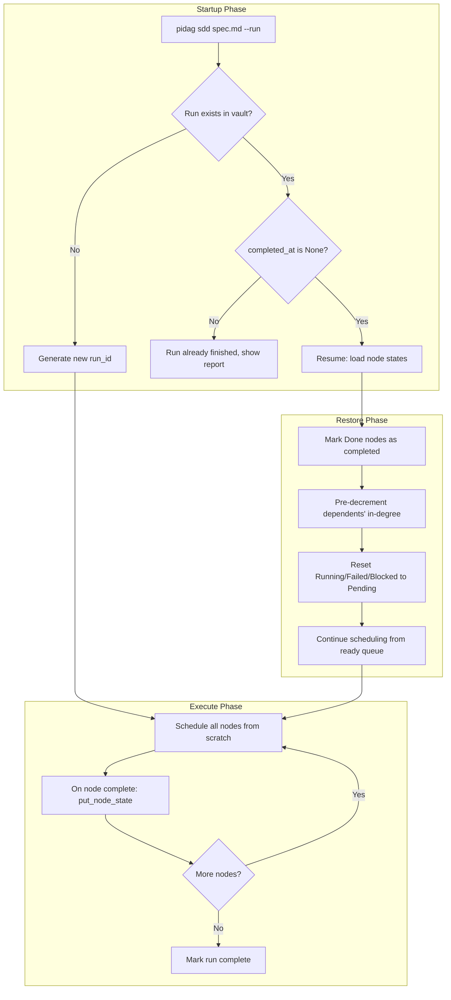

# Spec: Checkpoint-Resume for Interrupted Runs

**Project**: `.` (container: `/projects/pidag`)
**Topic**: `claude-pi-delegation`
**Author**: Claude (Opus 4.5)
**Date**: 2026-08-06
**Depends-On**: 06-spec-queue.md (queue uses resume), 07-spec-split.md (coverage tracks completion)

---

## Overview

When `pidag sdd spec.md --run` is interrupted (process crash, network timeout, SIGKILL,
Ctrl+C, or context-window exhaustion), all progress is lost and the entire 10-node DAG
must restart from scratch. This wastes LLM tokens/quota and delays research cycles.

This spec adds **checkpoint persistence** and **automatic resume** so interrupted runs
continue from the last successfully completed node rather than restarting. The vault
(`.pidag/pidag.db`) already records node state per run; this spec bridges that state
back into the scheduler on startup.

**Business driver**: A spec-07 run was interrupted after completing 6/10 nodes. Without
resume, all 6 completed nodes must re-execute (~$2 in LLM calls, 15 min wall-clock).
With resume, only the remaining 4 nodes execute.

---

## Requirements

### Functional Requirements

- **R1**: On `pidag sdd spec.md --run`, check if an incomplete run exists in the vault
  for this spec. If yes, offer to resume (or auto-resume with `--resume` flag).
- **R2**: Run ID for SDD is derived from spec file path + spec content hash (SHA-256
  truncated to 12 hex chars). Same spec = same run ID = resume support.
- **R3**: Scheduler restores node state from vault: nodes with state `Done` are skipped;
  their dependents' in-degree is pre-decremented.
- **R4**: Nodes with state `Failed` or `Blocked` from a previous run are reset to
  `Pending` for retry (configurable via `--retry-failed` flag).
- **R5**: Nodes with state `Running` (stale from crash) are reset to `Pending`.
- **R6**: `pidag run --fresh` forces a clean start, ignoring any existing checkpoint.
- **R7**: Checkpoint is updated atomically after each node completes (already done
  via redb transactions; no new work needed).

### Non-Functional Requirements

- **R8**: No additional dependencies beyond existing redb/sha2.
- **R9**: Resume startup overhead < 50ms for a 10-node DAG.
- **R10**: No `.unwrap()` in production code paths.

---

## Architecture



### Module Structure

```
src/
├── sdd/
│   ├── mod.rs             # Add run_id_for_spec() function
│   └── resume.rs          # NEW: checkpoint restore logic
├── scheduler/
│   ├── mod.rs             # Add Scheduler::with_checkpoint()
│   └── execute.rs         # Modify to skip pre-completed nodes
└── lib.rs                 # pub use sdd::resume
```

### Key Data Structures

```rust
/// Checkpoint state loaded from vault on resume.
#[derive(Debug, Clone)]
pub struct Checkpoint {
    pub run_id: String,
    pub completed_nodes: HashSet<String>,  // state == "Done"
    pub failed_nodes: HashSet<String>,     // state == "Failed"
    pub blocked_nodes: HashSet<String>,    // state == "Blocked"
    pub stale_running: HashSet<String>,    // state == "Running" (crash-stale)
}

/// Resume decision made at startup.
#[derive(Debug, Clone)]
pub enum ResumeDecision {
    /// No prior run found; start fresh.
    Fresh { run_id: String },
    /// Prior run completed; show cached report.
    AlreadyDone { run_id: String, report: RunReport },
    /// Prior run incomplete; resume from checkpoint.
    Resume { checkpoint: Checkpoint },
}
```

### Key Decisions and Rationale

- **Run ID = hash(spec_path + spec_content)**: Ensures same spec resumes same run, but
  editing the spec creates a new run (intentional: spec changes should restart).
- **Stale `Running` nodes reset to `Pending`**: A node in `Running` state when the
  process died never completed; safe to retry.
- **`--retry-failed` is opt-in**: By default, Failed nodes stay failed (user should
  fix the issue first). With `--retry-failed`, they get another chance.
- **Atomic checkpoint already exists**: redb's `Durability::Immediate` fsyncs every
  commit; no additional durability work needed (see P0-1 crash-recovery tests).

---

## TDD Contract

Tests that `rust-specialist` must write BEFORE any production code.
Each row maps to exactly one `#[test]` function.

| Test Name | Given | Expects |
|-----------|-------|---------|
| `test_run_id_deterministic` | Same spec path + content | Same run_id returned |
| `test_run_id_changes_with_content` | Spec path same, content differs | Different run_id |
| `test_checkpoint_load_empty_vault` | No prior run in vault | `ResumeDecision::Fresh` |
| `test_checkpoint_load_completed_run` | Prior run with `completed_at` set | `ResumeDecision::AlreadyDone` |
| `test_checkpoint_load_partial_run` | Prior run with 3/10 Done nodes, no `completed_at` | `ResumeDecision::Resume` with 3 completed |
| `test_scheduler_skips_done_nodes` | Checkpoint with nodes A, B Done | Scheduler dispatches only C-onwards |
| `test_scheduler_decrements_indegree` | Node C depends on A (Done) | C is immediately ready |
| `test_scheduler_resets_stale_running` | Node D was Running (crashed) | D dispatched as attempt 1 |
| `test_retry_failed_flag_resets_failed` | Node E Failed, `--retry-failed` | E dispatched |
| `test_retry_failed_flag_off_skips_failed` | Node E Failed, no flag | E stays Failed, dependents Blocked |
| `test_fresh_flag_ignores_checkpoint` | `--fresh` flag, prior run exists | Starts new run |
| `test_resume_startup_latency` | 10-node checkpoint in vault | Load completes in < 50ms |

---

## Exit Criteria

**CRITICAL**: Every exit criterion MUST be a shell command that returns 0 on success.

- [ ] `cargo test -p pidag --test checkpoint_resume_tests 2>&1 | grep -q "12 passed"`
- [ ] `bash /root/.pi/agent/skills/quality-gate/run.sh .`
- [ ] `pidag sdd --help 2>&1 | grep -q "\-\-resume"`
- [ ] `pidag sdd --help 2>&1 | grep -q "\-\-fresh"`
- [ ] `pidag sdd --help 2>&1 | grep -q "\-\-retry-failed"`
- [ ] `test -f src/sdd/resume.rs`
- [ ] `! grep -rE '\.unwrap\(\)|\.expect\(' src/sdd/resume.rs 2>/dev/null | grep -v '//' | grep -v test`

---

## Guardrails

What `rust-specialist` must NOT do during implementation:

- Do not modify the redb schema or Store trait (checkpoint uses existing `list_nodes`, `terminal_set`)
- Do not add new dependencies (sha2 is already in Cargo.toml for other uses; use it)
- Do not change the SDD DAG structure (10 nodes remain: baseline, impl-iter1-3, validate-iter1-3, gate, merge, report)
- Do not use `.unwrap()`, `.expect()`, or `panic!()` in production code paths
- Do not modify files outside `src/sdd/`, `src/scheduler/`, `src/bin/pidag.rs`
- **Approved dependencies**: sha2 (already present)

On any ambiguity, stop and report back to `loop-engineer`, do not guess.

---

## Files to Modify

| File | Action | Description |
|------|--------|-------------|
| `src/sdd/resume.rs` | CREATE | `run_id_for_spec()`, `load_checkpoint()`, `ResumeDecision` |
| `src/sdd/mod.rs` | MODIFY | `pub mod resume; pub use resume::*;` |
| `src/scheduler/mod.rs` | MODIFY | Add `Scheduler::with_checkpoint()` constructor |
| `src/scheduler/execute.rs` | MODIFY | Skip pre-completed nodes, pre-decrement in-degree |
| `src/bin/pidag.rs` | MODIFY | Add `--resume`, `--fresh`, `--retry-failed` flags to sdd subcommand |
| `src/lib.rs` | MODIFY | Re-export resume types |
| `tests/checkpoint_resume_tests.rs` | CREATE | 12 TDD tests from contract |
| `src/sdd/README.md` | MODIFY | Document resume feature |

---

## Verification Script

After implementation, verify with:

```bash
# 1. Run tests
cargo test -p pidag --test checkpoint_resume_tests

# 2. Check quality gate
bash /root/.pi/agent/skills/quality-gate/run.sh .

# 3. Simulate interrupt and resume
mkdir -p _tmp/test-resume/specs
cat > _tmp/test-resume/specs/01-test.md << 'EOF'
# Spec: Test Resume

## Exit Criteria
- [ ] `echo "criterion 1"`
- [ ] `echo "criterion 2"`
- [ ] `echo "criterion 3"`
EOF

# Start a run, interrupt after first node
timeout 30 pidag sdd _tmp/test-resume/specs/01-test.md --run --project-root _tmp/test-resume || true

# Resume should continue from checkpoint
pidag sdd _tmp/test-resume/specs/01-test.md --run --resume --project-root _tmp/test-resume

# 4. Verify resume worked (fewer nodes dispatched second time)
pidag show --last --project-root _tmp/test-resume 2>&1 | grep -q "resumed"

# 5. Clean up
rm -rf _tmp/test-resume
```

---

## Analysis: Why Previous Run Didn't Resume

Based on investigation of the interrupted spec-07 run:

1. **Current behavior**: `pidag sdd spec.md --run` generates a fresh UUID run_id each time.
   No association between spec file and run_id exists.

2. **Vault state exists but unused**: The redb vault stores node states (`Done`, `Failed`,
   etc.) but the scheduler never checks for prior runs on startup.

3. **Scheduler always starts fresh**: `Scheduler::new()` initializes all nodes as `Pending`
   regardless of vault contents.

4. **Fix**: Derive run_id from spec identity (path + content hash), then check vault for
   that run_id on startup. If incomplete run found, restore state and continue.

This spec addresses all three gaps: deterministic run_id, startup checkpoint check, and
scheduler state restoration.
