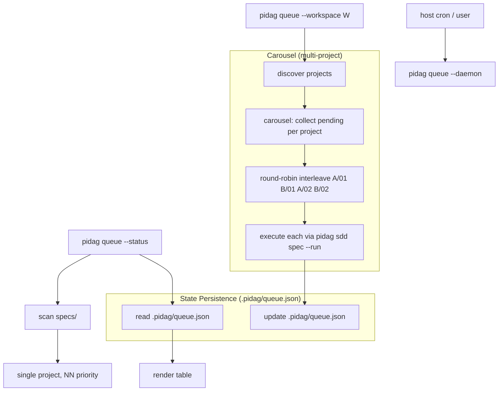

# Spec: pidag Carousel Priority Queue (round-robin scheduling)

**Project**: `.` (container: `/projects/pidag`)
**Topic**: `claude-pi-delegation`
**Author**: Fable (Principal Architect)
**Date**: 2026-08-06
**Depends-On**: none (self-contained — spec 06 is documented but its code is absent from this tree)

---

## Overview

Implement the **carousel priority queue with round-robin scheduling** for pidag.
Memory research (`finding/spec-06-queue-not-in-tree`) confirmed that spec
`06-spec-queue.md` *documents* the queue but the code was never landed: this
tree has **no `src/queue/`, no `src/cli/queue.rs`, and no `queue` match arm** in
`src/bin/pidag.rs`. The AGENTS.md "Future Enhancements" lists exactly this feature:
"Cron Jobs: Priority queue with round-robin for multiple projects."

This spec delivers a **self-contained** `pidag queue` subsystem:

1. **Single-project queue**: scan `specs/`, order by NN-prefix priority (01 before
   02), execute pending specs in sequence with state persistence for crash recovery.
2. **Multi-project carousel**: `--workspace <path>` round-robin across projects for
   fair progress distribution (Project A/01, B/01, A/02, B/02...).
3. **Round-robin scheduler driver**: `pidag queue --daemon` (single pass, non-cron)
   iterates the carousel in bounded batches so a host cron entry can drive it;
   `--round-robin` forces the interleave ordering.

State persists to `.pidag/queue.json` with atomic temp+rename writes, enabling
resumption after failure without partial-work loss.

---

## Requirements

### Functional Requirements

- **R1**: `pidag queue --status [--project-root PATH]` prints a table of all specs
  in `specs/` with state (`Pending`, `Running`, `Done`, `Failed`, `Skipped`) and
  priority (NN prefix).
- **R2**: `pidag queue --run [--project-root PATH]` executes Pending specs in
  priority order, updating state after each spec. Execution subprocesses to
  `pidag sdd <spec.md> --run` (isolation + reuse).
- **R3**: `pidag queue --reset [--project-root PATH]` resets all non-Done specs to
  Pending.
- **R4**: `pidag queue --retry-failed [--project-root PATH]` re-queues only Failed
  specs as Pending.
- **R5**: `pidag queue --stop-on-failure` aborts the run at the first failure.
- **R6**: `pidag queue --workspace <path> --run` executes round-robin across all
  projects in the workspace root: `A/01, B/01, A/02, B/02, ...` (carousel). Only
  Pending specs, per project, done.
- **R7**: `pidag queue --round-robin [--project-root PATH]` (single-project form)
  ensures round-robin ordering is applied when `--run` is combined with it; when a
  workspace is present, `--round-robin` is implied.
- **R8**: `pidag queue --daemon [--workspace <path> | --project-root PATH]
  [--batch N] [--stop-on-failure]` runs **one bounded batch** (round-robin over the
  carousel, ≤N specs total, default N=5) and exits — safe to drive from host cron
  repeatedly until the queue drains.
- **R9**: State persists to `.pidag/queue.json` with atomic write (temp + rename),
  a `--project-root` override, and idempotent re-run (Done specs skipped).
- **R10**: No `.unwrap()` / `.expect()` / `panic!()` in production code paths.
- **R11**: Queue discovery is **lazy** — specs scanned from the filesystem on each
  invocation; the state file tracks only execution status.
- **R12**: `pidag sdd <spec.md> --run` continues to work unchanged (backward compat).

### Data Structures

```rust
#[derive(Debug, Clone, Copy, PartialEq, Eq, Serialize, Deserialize)]
#[serde(rename_all = "lowercase")]
pub enum SpecState { Pending, Running, Done, Failed, Skipped }

#[derive(Debug, Clone, Serialize, Deserialize)]
pub struct QueueEntry {
    pub spec_name: String,     // e.g. "01-fibonacci"
    pub spec_file: String,     // e.g. "specs/01-fibonacci.md"
    pub state: SpecState,
    pub priority: u8,          // from NN prefix (1..=99)
    pub last_run_at: Option<String>,
    pub run_id: Option<String>,
    pub error: Option<String>,
}

#[derive(Debug, Clone, Serialize, Deserialize)]
pub struct ProjectQueue {
    pub project_root: String,     // absolute, normalized
    pub entries: Vec<QueueEntry>,
    pub updated_at: String,
}
```

---

## Architecture



### Module Structure

```
src/
├── queue/
│   ├── mod.rs          # Re-exports, SpecState enum, QueueEntry, ProjectQueue
│   ├── discovery.rs    # Lazy spec scanning + NN-prefix priority parsing
│   ├── state.rs        # Atomic JSON read/write for queue.json (temp+rename)
│   ├── execute.rs      # Single-project run + carousel round-robin interleave
│   ├── daemon.rs       # --daemon bounded-batch driver
│   └── README.md       # Module documentation
├── cli/
│   └── queue.rs        # CLI subcommand implementation
└── lib.rs              # pub mod queue; + re-exports
```

### Round-Robin Interleave Algorithm

Given `projects: Vec<(name, Vec<QueueEntry>)>` where each project's pending
entries are already sorted by priority, produce the execution order by
**round-robin over project lists**:

```
order = []
while any project has remaining Pending:
    for (project) in projects:
        if project.next Pending exists:
            order.push(project.take_next())
```

This yields `A/01, B/01, C/01, A/02, B/02, ...` — fair progress across projects
rather than draining one project before another. Projects with no Pending specs
are skipped without stalling the carousel.

### State File Format (`.pidag/queue.json`)

```json
{
  "project_root": "/abs/path",
  "entries": [
    {"spec_name":"01-a","spec_file":"specs/01-a.md","state":"done","priority":1,
     "last_run_at":"2026-08-06T00:00:00Z","run_id":"run-...","error":null},
    {"spec_name":"02-b","spec_file":"specs/02-b.md","state":"pending","priority":2,
     "last_run_at":null,"run_id":null,"error":null}
  ],
  "updated_at": "2026-08-06T00:00:00Z"
}
```

---

## TDD Contract

Tests must be written BEFORE production code. Each row maps to exactly one
`#[test]` in `tests/queue_tests.rs`.

| Test name | Given | Expects |
|---|---|---|
| `test_spec_state_serde_round_trip` | `SpecState::Pending` serialized | Deserializes back to `Pending` |
| `test_queue_entry_serde_round_trip` | Fully-populated `QueueEntry` | Identical struct after round trip |
| `test_discover_specs_empty_dir` | Empty `specs/` | Empty `Vec<QueueEntry>` |
| `test_discover_specs_finds_numbered` | `01-a.md`, `02-b.md` | 2 entries sorted by priority |
| `test_discover_specs_ignores_unnumbered` | `readme.md`, `01-a.md` | Only `01-a.md` |
| `test_priority_extraction` | `"42-foo"` | `priority == 42` |
| `test_state_write_atomic` | Write `ProjectQueue` | File exists, valid JSON |
| `test_state_read_nonexistent` | No file | `Ok(None)` |
| `test_state_merge_preserves_done` | Existing Done + new discovered | Done preserved, new Pending |
| `test_reset_all_to_pending` | Mixed states | Non-Done → Pending |
| `test_retry_failed_only` | Done/Failed/Pending | Only Failed → Pending |
| `test_priority_ordering` | `02-b`,`01-a`,`03-c` | Order 01,02,03 |
| `test_carousel_interleave` | A[01,02], B[01,02] | A/01,B/01,A/02,B/02 |
| `test_carousel_skips_empty_project` | B has no pending | A/01,A/02 (B skipped) |
| `test_carousel_bounded_batch` | Batch 3, A[01,02,03],B[01] | A/01,B/01,A/02 (stops at 3) |

---

## Exit Criteria

- [ ] `cargo test -p pidag --test queue_tests 2>&1 | grep -q "15 passed"`
- [ ] `bash /root/.pi/agent/skills/quality-gate/run.sh .`
- [ ] `pidag queue --help 2>&1 | grep -q "queue"`
- [ ] `pidag queue --status --project-root _tmp/test-queue 2>&1 | grep -q "01-"`
- [ ] `test -f _tmp/test-queue/.pidag/queue.json`
- [ ] `pidag queue --round-robin '--project-root=_tmp/test-queue' --dry-run 2>&1 | grep -qE "Order:|round-robin"`
- [ ] `! grep -rE '\.unwrap\(\)|\.expect\(|panic!|todo!' src/queue/ | grep -v '//' | grep -v '#\[test\]' | grep -v 'test_'`
- [ ] `test -f src/queue/README.md`

> Exit-criteria note: `--dry-run` renders the round-robin order WITHOUT spawning SDD
> runs, so the gate verifies the carousel ordering deterministically and cheaply.

---

## Guardrails

- Do not run `cargo`/`clippy`/`rustc` outside the TDD cycle; all commands go through
  `quality-gate.sh`.
- Do not use `.unwrap()`, `.expect()`, `.panic!()`, or `todo!()` in production code.
- Do not add public API surface not specified in Requirements.
- Do not add dependencies to `Cargo.toml` without explicit approval (approved:
  `serde`, `serde_json` — already in the workspace).
- Do not inline SDD execution logic — always subprocess to `pidag sdd <spec.md> --run`.
- Do not cache the spec list in the state file — always lazy-discover.
- Do not modify existing `cli/sdd.rs` / `cli/run.rs` behavior — the queue is additive.
- Atomic writes only (temp + rename) for `.pidag/queue.json`.

On any ambiguity — stop and report back, do not guess.

---

## Files to Modify

| File | Action | Description |
|---|---|---|
| `src/queue/mod.rs` | CREATE | Types, re-exports |
| `src/queue/discovery.rs` | CREATE | Lazy scanning + priority |
| `src/queue/state.rs` | CREATE | Atomic JSON I/O |
| `src/queue/execute.rs` | CREATE | Run + carousel interleave |
| `src/queue/daemon.rs` | CREATE | Bounded batch driver |
| `src/queue/README.md` | CREATE | Module docs |
| `src/cli/queue.rs` | CREATE | CLI subcommand |
| `src/cli/mod.rs` | MODIFY | `pub mod queue;` + re-export |
| `src/lib.rs` | MODIFY | `pub mod queue;` |
| `src/bin/pidag.rs` | MODIFY | `"queue"` match arm + help |
| `tests/queue_tests.rs` | CREATE | 15 TDD tests |

---

## Integration with Host Cron

`--daemon` is deliberately **stateless-free-passing**: it reads the queue, runs at
most `--batch` specs round-robin across the carousel, writes the updated state, and
exits. A host crontab entry can invoke it every N minutes:

```cron
*/15 * * * * cd /projects && pidag queue --daemon --workspace /projects --batch 5
```

Because it always completes without lingering processes, repeated cron fires make
steady progress across all projects without concurrency hazards or resource leaks.
