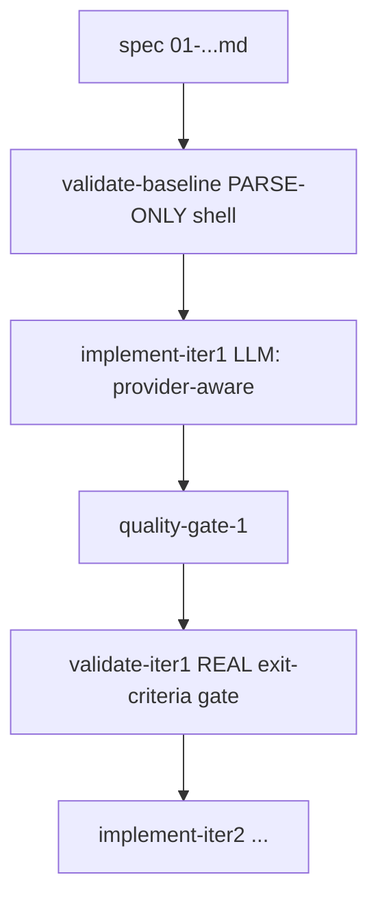

# Spec: sdd-driver-fixes

**Project**: `.` (container: `/projects/pidag`)
**Topic**: `claude-pi-delegation`
**Author**: pi agent (robustness-experiment follow-up)
**Date**: 2026-08-07
**Depends-On**: spec-12 (harness hardening), spec-11 (weight batch)

---

## Overview

Three fixes to the pidag SDD driver that were isolated during the
chromecast-tv-mirror robustness experiment (see
`/projects/chromecast-tv-mirror/AGENTS.md` EXPERIMENT LOG, D1/D2/D3/P13):

1. **D2 — validate-baseline must not hard-block pre-implementation.** A fresh
   spec's exit criteria reference not-yet-existing artifacts, so `validate-baseline`
   (DAG node 0, no deps) currently exits 1 and is reported as a spurious failure.
   Make the baseline a **parse/well-formedness** check, and gate real exit-criteria
   evaluation on the *post-implement* `validate-iterN` nodes only.
2. **P13 — provider routing must select the provider explicitly.** The worker
   invokes `pi --model <string>` without `--provider`, so any `google/...` or
   `nvidia/...` model is still routed to the `deepseek` provider (PI_PROVIDER env)
   and 400s. Teach the worker to pass `--provider` derived from a `provider/model`
   model string, enabling cross-provider exhaustion fallback (nvidia → google
   gemini-3.6-flash).
3. **D3 — observability: surface a failing node's real error.** sdd-run/`pidag show`
   currently report node failure as bare `"execution failed"`. Capture and expose
   the node's real stdout/stderr/exit so failures are debuggable.

---

## Requirements

### Functional Requirements

- **R1 (D2)**: `validate-baseline` runs ONLY a parse/well-formedness check on the
  spec (exit criteria present + checkbox/backtick format) and returns 0 on a
  well-formed spec regardless of whether referenced artifacts exist.
- **R2 (D2)**: The real exit-criteria evaluation remains in `validate-iterN`
  (post `implement-iterN` + `quality-gate-N`), unchanged.
- **R3 (P13)**: A model string of the form `provider/model` OR `provider:model`
  causes the worker to invoke `pi` with BOTH `--provider provider` and
  `--model model`. A bare model string keeps current behavior (no `--provider`).
- **R4 (P13)**: `models_for_iter` + model resolution preserve the current
  free→paid iteration semantics while attaching the resolved provider.
- **R5 (D3)**: A failing node's `stdout`, `stderr`, and exit code are recorded
  (run event / vault) and shown by `pidag show <run>` under the node.
- **R6 (D3)**: sdd-run terminal output lists a failure reason (from R5) per
  failed node, not just "execution failed".
- **R7**: No `.unwrap()`/`.expect()`/`panic!()` in production code paths.

### Non-Functional Requirements

- **R8**: Backward compatible — `pidag sdd specs/NN-x.md --run` and `pidag run <dag.json>`
  keep working. DAGs generated before this change still parse.
- **R9**: `pidag sdd --help` output remains valid and mentions provider behavior.

---

## Architecture



### Module Structure (touched)

```
src/
├── sdd/mod.rs        # validate-baseline -> parse-only prompt; keep validate-iterN
├── sdd/parse.rs      # (TODO) parse-only baseline hook return well-formed flag
├── worker/pi_print.rs# # add --provider passthrough from model string
├── core/dag.rs       # ModelRef gains provider resolution helper
├── core/config.rs    # model string -> (provider, model) split helper
├── store/*           # record NodeFailed stdout/stderr/exit
└── cli/show.rs, cli/sdd.rs  # render node failure detail + parse-only prompt
```

### Key Data Structures

```rust
/// provider/model or provider:model string -> split
fn split_provider_model(s: &str) -> (Option<String>, String);

/// Node failure detail captured by the runner.
pub struct FailureDetail {
    pub stdout: String,
    pub stderr: String,
    pub exit_code: Option<i32>,
}
```

### Key Decisions and Rationale

- Parse-only baseline: the pre-impl graph must start with 0 failures; the
  exit-criteria gate belongs after implementation.
- Explicit `--provider` from the model string: cross-provider fallback is the
  only way to honor "on nvidia exhaustion → google gemini-3.6-flash".
- Error capture at the runner: observability is the prerequisite to debugging
  `implement-iter1` "execution failed" and similar.

---

## TDD Contract

| Test Name | Given | Expects |
|-----------|-------|---------|
| `test_split_provider_model_slash` | `"google/gemini-3.6-flash"` | `(Some("google"), "gemini-3.6-flash")` |
| `test_split_provider_model_colon` | `"nvidia:z-ai/glm-5.2"` | `(Some("nvidia"), "z-ai/glm-5.2")` |
| `test_split_provider_model_bare` | `"deepseek-chat"` | `(None, "deepseek-chat")` |
| `test_worker_invokes_provider_flag` | model `google/gemini-3.6-flash` | cmd includes `--provider google --model gemini-3.6-flash` |
| `test_worker_bare_model_no_provider` | model `deepseek-chat` | cmd has `--model deepseek-chat`, no `--provider` |
| `test_validate_baseline_parse_only` | well-formed spec, artifacts absent | baseline returns 0 (parse-only) |
| `test_validate_baseline_malformed` | spec with no Exit Criteria section | baseline returns non-zero |
| `test_nodestate_records_failure_output` | failing shell node | stored NodeFailure has stdout/stderr/exit |
| `test_show_prints_node_error` | a run with a failed node | `pidag show` output contains the node's stderr/exit |
| `test_no_production_unwrap` | walk src/ production | no `.unwrap()`/`.expect()` outside tests |

---

## Exit Criteria

- [ ] `cargo test -p pidag --test tdd_contract_tests 2>&1 | grep -q "test result: ok"`
- [ ] `pidag sdd --help 2>&1 | grep -q "provider"`
- [ ] `grep -q -- '--provider' src/worker/pi_print.rs`
- [ ] `grep -q 'split_provider_model' src/lib.rs`
- [ ] `pidag sdd specs/13-sdd-driver-fixes.md 2>&1 | grep -q 'validate-baseline'`
- [ ] `cargo test -p pidag --test tdd_contract_tests test_no_production_unwrap 2>&1 | grep -q "test result: ok"`
- [ ] `cd specs 2>/dev/null && pidag sdd 01-cast-tv-terminal.md --project-root /projects/chromecast-tv-mirror 2>&1 | grep -q 'implement-iter1' || (cd / && pidag sdd /projects/chromecast-tv-mirror/specs/01-cast-tv-terminal.md 2>&1 | grep -q 'implement-iter1')`

---

## Guardrails

- Do not run `cargo`, `rustc`, `clippy` outside the TDD cycle steps.
- Do not add public API surface not specified in Requirements.
- Do not use `.unwrap()`, `.expect()`, or `panic!()` in production code paths.
- Do not modify files outside the project root.
- Do not change the `validate-iterN` real-gate semantics (R2) — only the baseline.
- **Approved dependencies**: none new (all existing).

On any ambiguity, stop and report back, do not guess.

---

## Files to Modify

| File | Action | Description |
|------|--------|-------------|
| `src/core/config.rs` | MODIFY | add `split_provider_model` helper |
| `src/worker/pi_print.rs` | MODIFY | pass `--provider` when model string has a prefix |
| `src/sdd/mod.rs` | MODIFY | `validate-baseline` prompt becomes parse-only |
| `src/scheduler/execute.rs` | MODIFY | capture/record node stdout, stderr, exit on failure |
| `src/store/*` | MODIFY | persist `NodeFailed` failure detail |
| `src/cli/show.rs`, `src/cli/sdd.rs` | MODIFY | render node failure reason |
| `tests/sdd_fix_tests.rs` | CREATE | TDD tests from contract |

---

## Verification Script

```bash
# 1. TDD tests
cargo test -p pidag --test sdd_fix_tests

# 2. Quality gate
bash /root/.pi/agent/skills/quality-gate/run.sh .

# 3. DAG gen for our chromecast spec still parses
pidag sdd specs/01-cast-tv-terminal.md --project-root /projects/chromecast-tv-mirror

# 4. clippy + fmt
cargo clippy --lib && cargo fmt -- --check

# 5. Clean up
rm -rf _tmp/test-*
```
