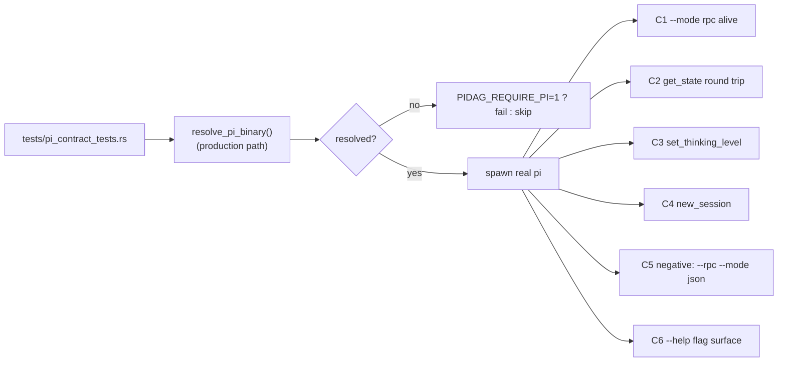

# pidag — spec-17: Contract tests against the real `pi` binary

- **Project**: `/projects/pidag`
- **Crate**: `pidag`
- **Priority**: P0 (nothing about pi integration is trustworthy until this lands)
- **Status**: PLAN APPROVED — implementation NOT started
- **Depends-On**: none. **Blocks**: spec-18.
- **Source**: `specs/ANALYSIS-2026-08-10-pi-sdk-realignment.md` §1, §7

---

## Overview

pidag's entire `pi` integration is validated against **bash shims that pidag itself
writes**. Every worker test replaces the `pi` program with a script that ignores the
real flags, and both `TypeDispatchWorker::with_pi_command` and
`with_pi_and_a2a_command` hardcode `rpc_worker: None` (`type_dispatch.rs:95,127`).

The result: 319 green tests while the committed default path could not spawn `pi` at
all. `src/worker/rpc.rs:84` builds `pi --rpc --mode json`, which the real binary
rejects — *"the argument '--rpc' cannot be used with '--mode <MODE>'"*. A shim cannot
express that; only the real binary can.

This spec adds a **contract test layer**: a small set of tests that execute the real
`pi` binary and pin the exact surface pidag depends on. It deliberately does NOT test
agent behaviour — it tests the *interface contract*, and it does so **without spending
a single token**.

### The key enabling fact (verified 2026-08-10)

`pi --mode rpc` answers `get_state` with no LLM call, no network, and no token spend:

```
$ printf '{"id":"c1","type":"get_state"}\n' | pi --mode rpc
{"command":"get_state","data":{"autoCompactionEnabled":true,...,"sessionId":"44d7e87b-...",
"thinkingLevel":"off"},"id":"c1","success":true,"type":"response"}
```

Every contract test below is built on token-free commands (`get_state`,
`set_thinking_level`, `new_session`, `--help`). **No test in this spec may send a
`prompt`.**

---

## Requirements

### Functional

- **R1 (real binary only)**: New file `tests/pi_contract_tests.rs`. It MUST resolve
  `pi` through the same production path as the worker
  (`worker::pi_print::resolve_pi_binary()`, spec-13 D1) — the test exercises the real
  resolution logic, not an assumed `"pi"` on `PATH`.
- **R2 (graceful skip, loud in CI)**: When `pi` cannot be resolved, each test prints
  `SKIP: pi not resolvable` and passes — a developer without `pi` is not blocked.
  When `PIDAG_REQUIRE_PI=1` is set, an unresolvable `pi` is a **hard failure**. CI and
  the quality gate set `PIDAG_REQUIRE_PI=1`.
- **R3 (token-free)**: No test sends `{"type":"prompt"}`, `steer`, or `follow_up`, and
  no test sets an API key. A reviewer must be able to confirm token-freedom by reading
  the file.
- **R4 (hard timeouts)**: Every contract test wraps its I/O in a ≤10s timeout so a
  wedged `pi` fails the test instead of hanging CI.
- **R5 (negative pinning)**: The suite pins the **known-bad** invocations as negative
  tests, so a future regression to them fails immediately:
  `pi --rpc --mode json` must fail, and `--session <nonexistent-path>` must fail.
- **R6 (flag-surface pin)**: A test asserts `pi --help` still advertises every flag
  pidag depends on: `--mode`, `--rpc`, `--model`, `--provider`, `--thinking`,
  `--append-system-prompt`, `--session`, `--print`. An upstream rename becomes a
  failing test instead of a silent production break.
- **R7 (no shims here)**: `tests/pi_contract_tests.rs` MUST NOT construct a shim
  (`bash -c`, `echo`, `with_command`, `with_pi_command`). Enforced by an exit
  criterion grep. Shim-based tests remain legitimate everywhere else — this one file
  is the anti-shim boundary.

### Non-Functional

- **N1**: Whole file runs in < 30s wall clock.
- **N2**: No network access, no API key, no writes outside `_tmp/`.
- **N3**: Session files created by `new_session` land under `_tmp/` and are cleaned up.

---

## Architecture



A single helper `rpc_roundtrip(request: Value) -> Result<Value, String>` spawns
`pi --mode rpc`, writes one JSON line, reads lines until one carries the matching
`id`, then shuts the child down. **Matching on `id` is part of the contract** — it is
precisely what `src/worker/rpc.rs` failed to do (ANALYSIS §1.6), so the helper models
the correct behaviour that spec-18 will inherit from `RpcTransportClient`.

---

## TDD Contract

| id | test name | given | expects |
|----|-----------|-------|---------|
| C1 | `test_pi_rpc_mode_starts` | `pi --mode rpc` spawned | process alive after 500ms; stdin/stdout piped |
| C2 | `test_pi_rpc_get_state_roundtrip` | send `{"id":"c2","type":"get_state"}` | response with `id=="c2"`, `type=="response"`, `success==true`, `data.sessionId` non-empty |
| C3 | `test_pi_rpc_set_thinking_level` | send `set_thinking_level` `{"level":"low"}`, then `get_state` | second response has `data.thinkingLevel == "low"` |
| C4 | `test_pi_rpc_new_session` | send `{"type":"new_session"}` | `success==true`; a subsequent `get_state` returns a **different** `sessionId` |
| C5a | `test_rpc_and_mode_flags_are_exclusive` | run `pi --rpc --mode json` | non-zero exit AND stderr contains `cannot be used with` |
| C5b | `test_session_flag_requires_existing_file` | run `pi --mode rpc --session _tmp/does-not-exist.jsonl` | non-zero exit AND stderr contains `Session not found` |
| C6 | `test_pi_help_advertises_required_flags` | run `pi --help` | stdout contains each of `--mode`, `--rpc`, `--model`, `--provider`, `--thinking`, `--append-system-prompt`, `--session`, `--print` |
| C7 | `test_resolve_pi_binary_finds_real_pi` | call `resolve_pi_binary()` | returns an absolute path that exists and is executable (pins spec-13 D1) |

**C5a and C5b are the regression tests for the two live defects.** They must fail if
anyone reintroduces the broken invocation.

---

## Exit Criteria

```bash
cd /projects/pidag

# 1. The file exists and is wired into the suite
test -f tests/pi_contract_tests.rs

# 2. All contract tests pass against the real binary
PIDAG_REQUIRE_PI=1 cargo test --test pi_contract_tests 2>&1 | grep -q "test result: ok"

# 3. Anti-shim boundary holds (R7) — no shim constructs in this file
! grep -qE 'with_command|with_pi_command|bash -c|"echo"' tests/pi_contract_tests.rs

# 4. Token-freedom is auditable (R3) — no prompt/steer/follow_up sent
! grep -qE '"type"\s*:\s*"(prompt|steer|follow_up)"' tests/pi_contract_tests.rs

# 5. Negative pins present (R5)
grep -q "cannot be used with" tests/pi_contract_tests.rs
grep -q "Session not found" tests/pi_contract_tests.rs

# 6. Full suite and lints stay green
cargo test 2>&1 | grep -q "test result: ok"
cargo clippy -p pidag -- -D warnings
cargo fmt --check

# 7. The quality gate runs contract tests with the strict flag
grep -q "PIDAG_REQUIRE_PI" deploy/scripts/quality-gate.sh
```

---

## Guardrails

- **Do NOT** send a `prompt` command anywhere in this file. If a future test needs
  real agent behaviour, it belongs in a separate, explicitly-opt-in
  `PIDAG_LIVE_AGENT_TESTS=1` file — not here.
- **Do NOT** fix `src/worker/rpc.rs` as part of this spec. spec-18 deletes it. Landing
  a repair here creates a merge conflict with its own removal.
- **Do NOT** weaken the existing shim-based tests; they cover routing logic correctly.
  This spec adds a layer, it does not replace one.
- **Do NOT** let C5a/C5b assert on exact upstream wording beyond the quoted substrings
  — match loosely enough to survive a punctuation change, strictly enough to prove the
  right failure.
- No new dependencies. `serde_json`, `std::process`, and `tokio` are already present.

---

## Files to Modify

| File | Change |
|------|--------|
| `tests/pi_contract_tests.rs` | **NEW** — C1-C7 |
| `src/worker/pi_print.rs` | Make `resolve_pi_binary()` reachable from tests (`pub(crate)` → `pub`, or re-export at crate root). No behaviour change. |
| `src/lib.rs` | Re-export `resolve_pi_binary` if that is the chosen route |
| `deploy/scripts/quality-gate.sh` | Export `PIDAG_REQUIRE_PI=1` before the test step |

---

## Verification

```bash
cd /projects/pidag
PIDAG_REQUIRE_PI=1 cargo test --test pi_contract_tests -- --nocapture
bash deploy/scripts/quality-gate.sh .
git add -A && git commit -m "feat(pidag): spec-17 real-binary contract tests for the pi CLI surface"
```

## Memory

Store on completion: `pidag/specs/17-pi-binary-contract-tests`,
`pidag/review/20260810-shim-blindness-root-cause`.
