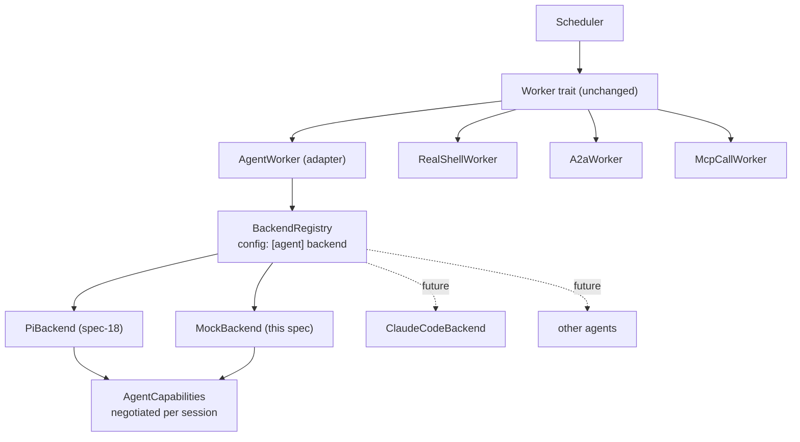

# pidag — spec-21: Pluggable agent backend (`AgentBackend`) — no hardwired `pi`

- **Project**: `/projects/pidag`
- **Crate**: `pidag`
- **Priority**: P0 (blocks spec-18; defines the seam every future agent plugs into)
- **Status**: PLANNED
- **Depends-On**: spec-17 (contract-test harness). **Blocks**: spec-18, spec-19, spec-20.
- **Implementation order**: 17 → **21** → 18 → 19 → 20
- **Source**: `specs/ANALYSIS-2026-08-10-pi-sdk-realignment.md`; user direction 2026-08-10
  ("avoid hardwiring pi with pidag, make it modular, in the future we could use other
  coding agents")

---

## Overview

pidag's orchestration value — DAGs, gates, checkpoints, queues, splitting, the Gantt UI
— is **agent-agnostic**. Nothing about a dependency graph requires `pi`. Yet `pi` is
currently welded in at four separate layers: worker implementations that spawn it
directly, model strings shaped like pi CLI flags, `PI_*` environment variables read deep
inside workers, and retry classification that string-matches pi's stdout.

spec-18 as originally written would have deepened that weld by linking `pi::sdk` straight
into a worker. This spec inserts the seam first.

### Why the existing `Worker` trait is not the seam

pidag already has a `Worker` trait, and it already has five implementations. But its
signature is:

```
run(node_id, model, attempt) -> WorkerOutput
```

That is a **stateless per-call** contract. It has no concept of a conversation, so every
attempt to give the worker continuity had to smuggle session state into an implementation
that the trait says is stateless — which is exactly what spec-15 (`--session` file) and
spec-16 (a process held in a `Mutex` behind `&self`) each did, and why both failed. The
seam is at the wrong altitude.

This spec adds the missing altitude: **backend → session → turn**. `Worker` stays as-is
and becomes a thin adapter, so the scheduler and every existing shell/A2A/MCP worker are
untouched.

---

## Requirements

### Functional — the abstraction

- **R1 (`AgentBackend`)**: A backend is a factory plus a capability declaration:
  - `fn name(&self) -> &str`
  - `fn capabilities(&self) -> AgentCapabilities`
  - `async fn open_session(&self, spec: SessionSpec) -> Result<Box<dyn AgentSession>>`
- **R2 (`AgentSession`)**: A live conversation. Mandatory:
  - `async fn prompt(&mut self, text: &str) -> Result<AgentReply>`
  - `async fn close(&mut self) -> Result<()>`

  Optional (each gated by a declared capability, default impl returns
  `Err(Unsupported)`): `set_model`, `set_thinking`, `fork`, `compact`, `usage`, `abort`.
- **R3 (`AgentCapabilities`)**: An explicit, honest feature declaration:
  `sessions`, `multi_turn`, `model_switch`, `thinking_levels`, `fork`, `compact`,
  `token_usage`, `cancellation`, `tool_events`. A backend MUST NOT declare a capability
  it does not implement — enforced by the conformance suite (R8).
- **R4 (graceful degradation)**: pidag asks for what it wants and degrades predictably
  when a backend lacks it. Degradation is **specified, not ad-hoc**:

  | missing capability | pidag's fallback |
  |---|---|
  | `sessions` / `multi_turn` | one session per node; prompts carry prior context inline |
  | `model_switch` | close the session, open a new one with the target model |
  | `fork` | open a fresh session per DAG branch (no shared prefix) |
  | `compact` | fall back to the spec-splitting heuristic |
  | `token_usage` | fall back to the >7-criteria heuristic (spec-07) |
  | `cancellation` | rely on the existing timeout + drop |
  | `tool_events` | treat the reply as opaque text; classify retryability by string |

  **Every fallback listed is pidag's behaviour as it exists today** — so a zero-capability
  backend is exactly as capable as pidag is now, and richer backends strictly improve on
  it. That property is what makes the abstraction non-speculative.
- **R5 (no vendor types in the trait)**: The `backend` module MUST NOT reference `pi::`,
  `PI_*` env vars, or any pi-specific flag or event shape. Vocabulary is pidag's own:
  `ModelRef`, `ThinkingLevel`, `AgentReply`, `AgentEvent`, `TokenUsage`.
- **R6 (registry + config)**: Backends are selected by name, not by `#[cfg]` or
  hardcoding:
  ```toml
  [agent]
  backend = "pi"            # default; "mock" for tests
  [agent.pi]
  binary = "pi"             # backend-specific settings live in their own table
  ```
  Env override `PIDAG_AGENT_BACKEND` wins over config (consistent with the
  spec-92 priority chain). An unknown backend name is a startup error listing the
  registered names — never a silent fallback.
- **R7 (`Worker` adapter)**: `AgentWorker` implements the existing `Worker` trait over an
  `AgentBackend`, mapping `run(node_id, model, attempt)` to session acquisition + prompt.
  `TypeDispatchWorker` routes LLM nodes to `AgentWorker`. Shell, A2A and MCP branches are
  untouched.
- **R8 (backend conformance suite)**: `tests/backend_conformance.rs` runs one shared test
  battery against **every registered backend that reports itself available**. For each
  declared capability it asserts the capability actually works; for each undeclared one it
  asserts the call returns `Unsupported` rather than panicking or silently no-oping.
  Adding a backend means adding a registry entry — the conformance tests come free.
  This is the generalisation of spec-17: *never trust a self-written double to validate
  an external contract*.
- **R9 (`MockBackend`)**: An in-process, deterministic backend — no subprocess, no
  network — declaring a configurable capability set. It exists to (a) prove the
  abstraction supports more than one implementation, and (b) give tests a real double
  instead of the bash shims that caused ANALYSIS §7. It is the second implementation
  that keeps this from being speculative generality.

### Non-Functional

- **N1**: No behaviour change for existing DAGs. `pidag run` / `pidag sdd` output and
  event streams are unchanged when the `pi` backend is selected.
- **N2**: The `Worker` trait signature is unchanged (spec-16 guardrail, still binding).
- **N3**: No new runtime dependency. `pi_agent_rust` enters in spec-18, behind this trait.
- **N4**: Adding a backend must not require editing the scheduler, the store, or the UI.
  Registry + config only.

---

## Architecture



### Design targets — validating the capability set is not pi-shaped

The capability list must describe agents that are **not** pi. Sanity-checked against:

| candidate backend | sessions | model_switch | fork | compact | token_usage |
|---|---|---|---|---|---|
| `pi` (spec-18) | yes (RPC) | yes (`set_model`) | yes (`fork`) | yes | yes (`get_state`) |
| Claude Code CLI | yes (`--resume`) | per-invocation | no | automatic, not addressable | partial |
| a one-shot HTTP LLM | no | per-call | no | no | per-response |

The third column is the falsifiability test: **if a zero-capability, one-shot backend
cannot be driven through this trait, the design has failed** and has merely renamed
`pi::sdk`. R4's fallback table is what guarantees it can.

---

## TDD Contract

| id | test | given | expects |
|----|------|-------|---------|
| G1 | `test_registry_resolves_configured_backend` | `[agent] backend = "mock"` | registry returns `MockBackend`; `name() == "mock"` |
| G2 | `test_unknown_backend_is_startup_error` | `backend = "nope"` | error naming the unknown backend and listing registered names |
| G3 | `test_env_overrides_config_backend` | config `pi`, `PIDAG_AGENT_BACKEND=mock` | mock selected (serialise with `ENV_LOCK`) |
| G4 | `test_capabilities_are_honest` | `MockBackend` declaring `fork: false` | `session.fork()` returns `Unsupported`, does not panic |
| G5 | `test_degrade_no_model_switch` | backend without `model_switch`, node requests a different model | session closed and reopened with the target model; node still succeeds |
| G6 | `test_degrade_no_fork_opens_fresh_session` | backend without `fork`, DAG with 2 parallel dependents | 2 independent sessions opened; no shared state |
| G7 | `test_agent_worker_maps_node_to_prompt` | `AgentWorker::run("n1", "m", 1)` | one `prompt()` with node `n1`'s text; reply text becomes `WorkerOutput.output` |
| G8 | `test_agent_worker_error_maps_to_worker_output` | session `prompt` returns transport error | `success=false`, `retryable` classified; no panic |
| G9 | `test_no_vendor_types_in_backend_module` | source scan | no `pi::` / `PI_` occurrences under `src/backend/` except `src/backend/pi.rs` (R5) |
| G10 | `test_conformance_suite_runs_all_registered` | registry with `mock` | conformance battery executes for every registered available backend (R8) |
| G11 | `test_zero_capability_backend_completes_a_dag` | `MockBackend` with **all** capabilities false | a 3-node DAG runs to completion via fallbacks alone (R4 falsifiability test) |

G11 is the spec's keystone. If it cannot pass, the abstraction is pi-shaped.

---

## Exit Criteria

```bash
cd /projects/pidag

# 1. The seam exists and is vendor-neutral
test -f src/backend/mod.rs
grep -q "trait AgentBackend" src/backend/mod.rs
grep -q "trait AgentSession" src/backend/mod.rs
grep -q "struct AgentCapabilities" src/backend/capabilities.rs

# 2. No vendor leakage into the abstraction (R5) - the anti-hardwire check
! grep -rE "\bpi::|PI_[A-Z_]+" src/backend/ --include=*.rs | grep -v "src/backend/pi.rs"

# 3. Selection is config-driven, not compiled in (R6)
grep -q "PIDAG_AGENT_BACKEND" src/core/config.rs
grep -q "\[agent\]" src/core/config.rs

# 4. A second implementation exists (R9)
grep -q "MockBackend" src/backend/mock.rs

# 5. Conformance battery is shared, not per-backend (R8)
test -f tests/backend_conformance.rs

# 6. Suite, lints, gate
cargo test 2>&1 | grep -q "test result: ok"
cargo clippy -p pidag -- -D warnings
cargo fmt --check
bash deploy/scripts/quality-gate.sh .

# 7. No behaviour change for existing DAGs (N1)
cd _tmp/bug-a-bloodtest && pidag sdd 01-blood-test.md --run 2>&1 | grep -q "implement-iter1"
```

**Prose criterion**: a reviewer must be able to read `src/backend/mod.rs` end to end and
be unable to tell which coding agent pidag ships with. If `pi`'s vocabulary is visible in
the trait, R5 has failed regardless of what the greps say.

---

## Guardrails

- **Do NOT** implement a second *real* backend here. `MockBackend` proves the seam;
  a Claude Code or aider backend is a separate spec with its own contract tests. Writing
  two real backends speculatively is the failure mode this spec is meant to prevent, not
  reproduce.
- **Do NOT** add capabilities to `AgentCapabilities` that no design-target agent has.
  The list is justified by the table in Architecture; grow it when a backend needs it.
- **Do NOT** change the `Worker` trait signature, the scheduler, the store schema, or
  the UI. If this spec requires touching the scheduler, the seam is in the wrong place —
  stop and escalate.
- **Do NOT** let `AgentReply` carry raw backend JSON. Backend-specific shapes stop at the
  backend boundary; that is the entire point.
- **Do NOT** implement fork/compact/token-budget *behaviour* here — this spec defines the
  capability surface and the fallbacks only. Behaviour is spec-19/20.
- No `unwrap()`/`expect()` in production paths (`test_no_production_unwrap` stays green).

---

## Files to Modify

| File | Change |
|------|--------|
| `src/backend/mod.rs` | **NEW** — `AgentBackend`, `AgentSession`, `AgentReply`, `AgentEvent`, `Unsupported` error |
| `src/backend/capabilities.rs` | **NEW** — `AgentCapabilities` + negotiation/degradation helpers |
| `src/backend/registry.rs` | **NEW** — name → backend resolution, config + env |
| `src/backend/mock.rs` | **NEW** — `MockBackend` with configurable capability set |
| `src/worker/agent.rs` | **NEW** — `AgentWorker` adapter (`Worker` over `AgentBackend`) |
| `src/worker/type_dispatch.rs` | Route LLM nodes to `AgentWorker`; other branches untouched |
| `src/core/config.rs` | `[agent]` section, `PIDAG_AGENT_BACKEND`, per-backend tables |
| `src/lib.rs` | Re-export the backend surface |
| `tests/backend_tests.rs` | **NEW** — G1-G9, G11 |
| `tests/backend_conformance.rs` | **NEW** — shared battery (G10) |

---

## Verification

```bash
cd /projects/pidag
cargo test && cargo clippy -p pidag -- -D warnings && cargo fmt --check
bash deploy/scripts/quality-gate.sh .
git add -A && git commit -m "feat(pidag): spec-21 pluggable AgentBackend seam + MockBackend + conformance suite"
```

## Impact on other specs

- **spec-18** becomes "implement `PiBackend` **behind** `AgentBackend`" rather than
  linking `pi::sdk` into a worker. Its `SessionWorker` collapses into
  `src/backend/pi.rs`; the lane pool moves behind the trait. Amended in this session.
- **spec-19** (fork/session-per-branch) and **spec-20** (token budgeting + compaction)
  become capability-gated features rather than pi features.
- **spec-22** (the `99-production-hardening` P0/P1 rewrite) is unaffected — it concerns
  pidag's own RPC/MCP *server* surface, not the agent it drives.

## Memory

Store on completion: `pidag/specs/21-pluggable-agent-backend`,
`pidag/decision/20260810-agent-backend-seam-altitude`.
