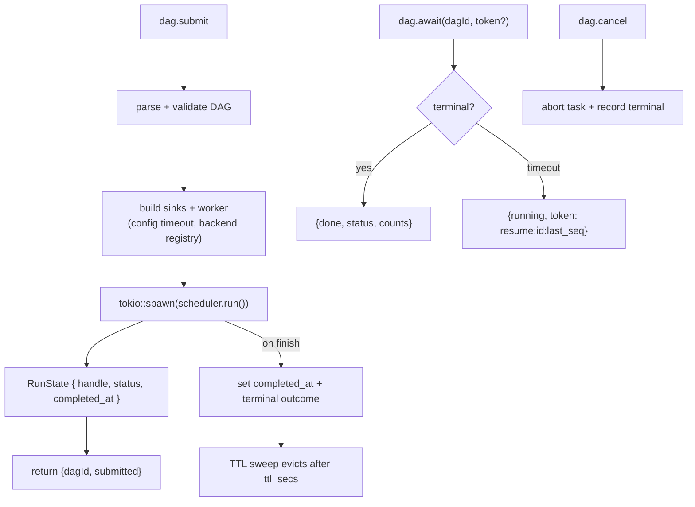

# pidag — spec-22: RPC/MCP server correctness — the server must actually run DAGs

- **Project**: `/projects/pidag`
- **Crate**: `pidag`
- **Priority**: P0 (the server accepts work and silently never performs it)
- **Status**: PLANNED
- **Depends-On**: spec-21 (worker construction goes through the backend registry).
  Independent of 17/18 otherwise — this concerns pidag's **own server surface**, not the
  agent it drives.
- **Replaces**: the open P0/P1 items of `99-production-hardening` (that file targets
  `src/rpc.rs` / a proposed `src/mcp_server.rs`, a layout that no longer exists)
- **Source**: `specs/SPEC-AUDIT-2026-08-10.md` P4, **as corrected below**

---

## 0. Correction to the audit

`SPEC-AUDIT-2026-08-10.md` P4 states that `node.retry`, resume tokens and `dag.result`
are "verified absent from `src/`". **That is wrong.** The audit grepped for the wire
method names (`node.retry`, `last_seq`); the Rust functions are named differently and do
exist. Re-verified by reading the source:

| `99-production-hardening` | claimed | **actual state** |
|---|---|---|
| R1 `dag.result` returns real artifacts | absent | **DONE** — `handlers.rs:167` reads `get_artifact` per node |
| R2 `dag.status` returns real node states | absent | **DONE** — `handlers.rs:123` reads `list_nodes`, counts done/failed |
| R3 `node.retry` re-dispatches | absent | **PARTIAL** — writes `Pending` + emits `NodeRetry` (`handlers.rs:198`), but nothing re-dispatches; `queued: true` is unverified |
| R4 resume tokens functional | absent | **STUB** — helpers exist (`handlers.rs:250,269`) but `dag.await` always emits seq `0` and `parse_resume_token` is **dead code** |
| R5 concurrent requests | — | **DONE** — `tokio::spawn` per line (`server.rs:141`) |
| R6 completed-run TTL cleanup | — | **INERT** — sweep exists (`server.rs:113`) but `completed_at` is only ever set to `None`, so it never collects |
| R7 `uuid_short` no panic | — | **DONE** — `unwrap_or(Duration::ZERO)` (`handlers.rs:281`) |

The audit will be amended. The real defect is worse than the one it reported, and it
sits underneath all of the above.

---

## Overview

**`dag.submit` never runs the DAG.**

`handle_dag_submit` (`src/rpc/handlers.rs:60-119`) parses and validates the DAG, builds
the event sinks, constructs a `Scheduler` — and then stores it in the runs map and
returns `{"dagId": ..., "status": "submitted"}`. There is **no call to `scheduler.run()`
anywhere in `src/rpc/` or `src/mcp/`**. The scheduler is moved into `RunState` and left
there, inert, until the run is cancelled or the process exits.

Every downstream symptom follows from this one fact:

- `dag.status` faithfully reports the store — which stays empty, because nothing executes.
- `dag.await` can never observe completion, so its stub `running: true` is
  indistinguishable from correct behaviour.
- `node.retry`'s `"queued": true` is a claim about a queue that no one is servicing.
- `RunState.completed_at` is never set, so `is_terminal()` is permanently false and the
  TTL sweep never collects — the exact unbounded growth R6 was written to prevent.

Both transports are affected: `pidag mcp` shares these handlers, so `pidag_submit` has
the identical behaviour.

This is the **same defect family as spec-14's Bug B** — a component reporting success it
has not verified. There it was `quality-gate` printing `passed: true` over a failing
`cargo fmt`. Here it is a server reporting `submitted` for work it never starts. The
remedy is the same principle, generalised in R8: **no handler may return a success shape
it has not verified.**

---

## Requirements

### Functional

- **H1 (submit actually executes)**: `dag.submit` spawns the scheduler on a Tokio task
  and returns immediately with `{dagId, status: "submitted"}`. The run executes to
  completion in the background. `RunState` holds a `JoinHandle` (or an abort handle plus
  a shared status), **not** an unexecuted `Scheduler` — the scheduler must move into the
  spawned task.
- **H2 (terminal state is recorded)**: When the run finishes — success, failure, or panic
  — `completed_at` is set to `Some(Instant::now())` and the terminal outcome is recorded.
  `is_terminal()` must become true exactly when the run is over.
- **H3 (`dag.await` awaits)**: `dag.await` blocks until the run is terminal or until a
  caller-supplied timeout (default 30s) elapses.
  - Terminal within the timeout ⇒ `{done: true, status, done_count, failed_count}`.
  - Timeout ⇒ `{running: true, token: "resume:<dag_id>:<last_seq>"}` where `last_seq` is
    the **real** sequence of the last event observed, never a hardcoded `0`.
- **H4 (resume tokens are honoured)**: `dag.await` accepts an optional `token` param,
  parses it with the existing `parse_resume_token`, and resumes observation from that
  sequence rather than from the beginning. A malformed token is an explicit error, never
  a silent restart. This removes `parse_resume_token` from dead-code status.
- **H5 (`node.retry` tells the truth)**: Retry is supported **only for a terminal run**,
  where it re-executes the failed node's subgraph and returns `{state, queued: true}`
  once dispatch is confirmed. If the run is still active, return an explicit error
  (`-32002`, "retry unsupported while run is active") rather than the current unverified
  `queued: true`. Scope discipline: a control channel into a live scheduler is a larger
  design and is explicitly **out of scope** — see Guardrails.
- **H6 (TTL is real and configurable)**: With H2 in place the existing sweep starts
  collecting. TTL becomes configurable via `[rpc] completed_run_ttl_secs` (default 60);
  the sweep interval stays 10s. A test must prove a completed run is actually evicted.
- **H7 (worker construction respects config and the backend seam)**:
  `handle_dag_submit` currently hardcodes `TypeDispatchWorker::new(&dag_copy,
  Duration::from_secs(60))` — reintroducing the very timeout bug fixed for `pidag run` on
  2026-08-04 (`worker.timeout_secs`, agent-memory's config uses 1200). It must read the
  configured timeout and construct its worker through spec-21's backend registry, so the
  RPC path is not a second place where an agent is hardwired.
- **H8 (honesty invariant)**: No handler returns a field asserting an action occurred
  unless it verified it. Specifically: `queued`, `cancelled`, `submitted`, `done`.
  Where verification is impossible, return an error — never an optimistic shape.
- **H9 (cancel actually cancels)**: `dag.cancel` currently just removes the entry from
  the map (`handlers.rs:313`), which with H1 in place would orphan a running task. It
  must abort the spawned task, record the terminal state, and only then return
  `{cancelled: true}`.

### Non-Functional

- **N1**: `pidag mcp` and `pidag serve` share the fixed handlers — no divergence between
  the two transports. The MCP `pidag_await` stub (`src/mcp/server.rs:51`) is fixed by the
  same change.
- **N2**: No regression to the scheduler, gate semantics (spec-14), or the store schema.
- **N3**: No `unwrap()`/`expect()` in production paths (`test_no_production_unwrap`).
- **N4**: Concurrency (R5) is preserved — a long `dag.await` must not block other
  requests. This is already correct and must stay correct.

---

## Architecture



### Note on `RunState`

Holding a live `Scheduler` in a `Mutex<HashMap>` is what made execution awkward enough to
skip in the first place. After H1, `RunState` holds only cheap, `Send` handles —
`JoinHandle`, an `Arc` status cell, `completed_at` — and the scheduler lives inside its
task. This is a prerequisite for H1, not an optional refactor.

---

## TDD Contract

| id | test | given | expects |
|----|------|-------|---------|
| H1a | `test_submit_executes_dag` | submit a 2-node shell DAG | both nodes reach `Done` in the store within 10s **without any further RPC call** |
| H1b | `test_submit_returns_immediately` | submit a DAG with a slow node | response returns in < 500ms while the run continues |
| H2 | `test_completed_at_set_on_terminal` | run a 1-node DAG to completion | `is_terminal()` true; `completed_at` is `Some` |
| H3a | `test_await_returns_done_when_terminal` | await a finished run | `done: true` with correct `done_count` / `failed_count` |
| H3b | `test_await_timeout_returns_real_seq` | await a still-running run, 1s timeout | `running: true`; token's `last_seq` > 0 and equals the last observed event seq |
| H4a | `test_await_resumes_from_token` | await with `resume:<id>:<n>` | observation starts after seq `n`; earlier events not re-observed |
| H4b | `test_malformed_token_is_error` | `token: "garbage"` | explicit error; **not** a silent restart |
| H5a | `test_retry_on_terminal_run_redispatches` | terminal run with one failed node | node re-executes; `queued: true` only after dispatch is confirmed |
| H5b | `test_retry_on_active_run_is_error` | run still active | error `-32002`; no misleading `queued: true` |
| H6 | `test_completed_run_evicted_after_ttl` | `completed_run_ttl_secs = 1`, run completes | entry gone from the runs map after the next sweep |
| H7 | `test_submit_uses_configured_timeout` | `.pidag/config.toml` with `worker.timeout_secs = 1200` | worker built with 1200s, not the hardcoded 60s |
| H8 | `test_no_unverified_success_fields` | source scan of `src/rpc/handlers.rs` | every `"queued"` / `"cancelled"` / `"done"` literal is on a path that verified the action |
| H9 | `test_cancel_aborts_running_task` | cancel a running DAG | task aborted; terminal state recorded; `cancelled: true` |
| N1 | `test_mcp_and_rpc_agree` | same DAG via `pidag mcp` and `pidag serve` | identical status/result shapes and both actually execute |

---

## Exit Criteria

```bash
cd /projects/pidag

# 1. The server executes what it accepts (the core defect)
grep -qE "tokio::spawn\(" src/rpc/handlers.rs
grep -q "\.run()" src/rpc/handlers.rs

# 2. Terminal state is recorded, so the TTL sweep can work
grep -q "completed_at = Some" src/rpc/handlers.rs || grep -q "completed_at: Some" src/rpc/handlers.rs

# 3. Resume tokens are no longer dead code
grep -q "parse_resume_token" src/rpc/server.rs
! grep -q "generate_resume_token(dag_id, 0)" src/rpc/server.rs
! grep -q "generate_resume_token(&input.dag_id, 0)" src/mcp/server.rs

# 4. TTL is configurable
grep -q "completed_run_ttl_secs" src/core/config.rs

# 5. No hardcoded worker timeout on the RPC path (H7)
! grep -q "Duration::from_secs(60)" src/rpc/handlers.rs

# 6. Suite, lints, gate
cargo test 2>&1 | grep -q "test result: ok"
cargo clippy -p pidag -- -D warnings
cargo fmt --check
bash deploy/scripts/quality-gate.sh .

# 7. Live end-to-end: submit a shell DAG over RPC and observe real completion
printf '{"id":1,"method":"dag.submit","params":{"dag":%s}}\n' "$(cat _tmp/rpc-smoke-dag.json)" \
  | pidag serve --vault _tmp/rpc-smoke/.pidag/pidag.redb > _tmp/rpc-smoke.out
grep -q '"status":"submitted"' _tmp/rpc-smoke.out
```

**Prose criterion**: after submitting a shell-only DAG over RPC and waiting for
`dag.await` to report `done`, the store must contain a terminal state for every node.
A run that reports `submitted` and leaves an empty store is the defect this spec exists
to remove, and no amount of green unit tests substitutes for that observation.

---

## Guardrails

- **Do NOT** build a control channel into a live scheduler for `node.retry`. H5 scopes
  retry to terminal runs precisely to avoid that redesign. If live-run retry is wanted,
  it is its own spec with its own concurrency design.
- **Do NOT** change the `Scheduler` API, the gate semantics (spec-14), or the store
  schema. This spec is confined to `src/rpc/`, `src/mcp/`, and the config additions.
- **Do NOT** let the two transports diverge. Fixes land in the shared handlers; `mcp` and
  `serve` stay thin.
- **Do NOT** hold a `Scheduler` in the shared runs map after H1 — that is the shape that
  invited the bug.
- **Do NOT** return an optimistic success field to keep a test green (H8). If the action
  cannot be verified, the honest answer is an error.
- No new dependencies.

---

## Files to Modify

| File | Change |
|------|--------|
| `src/rpc/handlers.rs` | H1, H2, H5, H7, H8, H9 — spawn the run; record terminal state; honest retry/cancel; config timeout via the backend registry |
| `src/rpc/server.rs` | H3, H4, H6 — real `dag.await` with timeout + token resume; configurable TTL |
| `src/mcp/server.rs` | H3, H4 — fix the `pidag_await` stub; configurable TTL sweep (`server.rs:194`) |
| `src/core/config.rs` | `[rpc] completed_run_ttl_secs` (default 60); reuse `worker.timeout_secs` |
| `tests/rpc_hardening_tests.rs` | Extend with H1-H9, N1 |
| `_tmp/rpc-smoke-dag.json` | **NEW** — shell-only DAG fixture for the live criterion |
| `specs/99-production-hardening.md` | Mark P0/P1 `SUPERSEDED-BY 22`; leave the P2 MCP section as the historical record of `pidag mcp` |
| `specs/SPEC-AUDIT-2026-08-10.md` | Amend P4 with the corrected inventory from §0 |

---

## Verification

```bash
cd /projects/pidag
cargo test && cargo clippy -p pidag -- -D warnings && cargo fmt --check
bash deploy/scripts/quality-gate.sh .
cargo build --release && cp target/release/pidag /root/.local/bin/pidag
# live: submit a shell DAG, await it, confirm the store holds terminal node states
git add -A && git commit -m "fix(pidag): spec-22 rpc/mcp server executes submitted DAGs; real await, tokens, TTL, honest retry/cancel"
```

## Memory

Store on completion: `pidag/specs/22-rpc-mcp-server-correctness`,
`pidag/fix/20260810-rpc-submit-never-executed`,
`pidag/review/20260810-unverified-success-shapes` (the Bug B family: quality-gate
`passed:true`, `dag.submit` `submitted`, `node.retry` `queued:true`).
