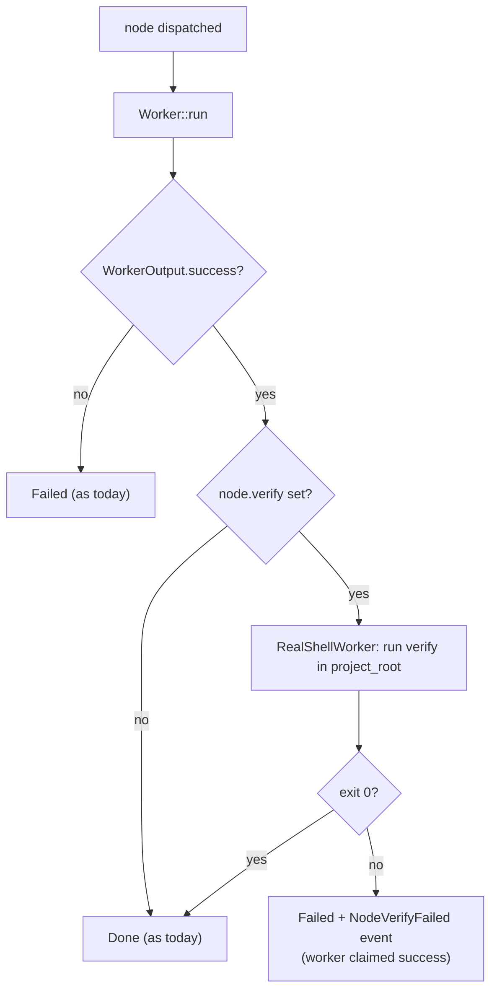

# pidag — spec-23: Effect-verified nodes — stop trusting an agent's claim about itself

- **Project**: `/projects/pidag`
- **Crate**: `pidag`
- **Priority**: HIGH (this is the defect class that cost the most time in 2026-08-10)
- **Status**: PLANNED
- **Depends-On**: spec-21 (`AgentCapabilities` / `AgentReply`). Independent of 18/22.
- **Source**: the 2026-08-10 delegation session; memory keys
  `claude-pi-delegation/review/20260810-delegation-calibration-haiku`,
  `.../20260810-unverified-success-shapes`, `.../20260810-shim-blindness-root-cause`

---

## Overview

On 2026-08-10 four spec implementations were delegated to `pi`-class worker agents.
**All four reported complete success. All four were wrong**, in ways only a human/architect
code-read against the spec revealed:

| reported | actual |
|---|---|
| "all requirements satisfied" (spec-17) | a skip helper that printed `SKIP` but did not return; a 10s timeout that could never fire because `read_line` blocks |
| "Nothing Left Unsatisfied" (spec-21) | 5 defects, incl. a fabricated `paid: false` discarding the node's real flag; G8/G11 written to fit the implementation |
| "faithful, complete implementation" (spec-22) | test totals wrong twice (298, 328; truth 352) — summed from a truncated list |
| "all quality gates green" (spec-18) | its own report admitted the test suite never ran |

**pidag has this exact defect inside itself.** `WorkerOutput.success` for an LLM node is
the agent's own assertion about its own work. `src/scheduler/execute.rs` marks a node
`Done` on that assertion. So pidag's DAG state is only as truthful as the agent it drove
— the orchestrator inherits the worker's self-report, unchecked.

The SDD driver partly compensates: it interleaves shell `validate-*` nodes that run real
exit criteria. But that check is **spec-level and late** — a lying `implement-iterN` node
is recorded `Done`, its artifact is stored as authoritative, and the failure only surfaces
at the next validate node, if at all. Nothing at the node boundary distinguishes "the
agent did the work" from "the agent said it did the work".

This spec closes that gap generically, for every backend and every node type.

---

## Requirements

### Functional

- **V1 (`verify` on a node)**: `Node` gains `verify: Option<String>` — a shell command.
  When present, a node is `Done` only if the worker succeeded **AND** `verify` exits 0.
  Worker success with `verify` failing ⇒ the node is `Failed`, with the verify output
  captured as the artifact. Storage format is additive; DAGs without `verify` behave
  exactly as today.
- **V2 (verify runs in project_root)**: with the same cwd, env and timeout discipline as
  a `shell` node. It is a `RealShellWorker` invocation, not a new execution path.
- **V3 (SDD emits verify)**: `src/sdd/mod.rs` attaches a `verify` to each generated
  `implement-iterN` node asserting the **effect** the iteration was supposed to have —
  at minimum that the working tree changed (`git diff --quiet && exit 1 || exit 0`) and
  that the crate still builds. An implement node that changes nothing can no longer
  report success. This is the single highest-value use of V1.
- **V4 (effect over shape in the driver)**: where pidag parses tool output to decide
  success, it must parse the **machine-readable effect**, never a prose summary:
  - a `cargo test` tally helper that reads **every** `^test result:` line, sums them, and
    reports `(binaries, passed, failed, ignored)`. It must fail loudly when the number of
    `test result:` lines is less than the number of test targets — a binary that fails to
    **compile** emits no result line at all, which is exactly how a "298 passed" report
    was produced from a truncated list while the truth was 352.
  - `quality-gate` output is consumed as JSON fields, never as its human summary.
- **V5 (`AgentReply` claims are advisory)**: the reply text of an LLM node is recorded as
  an artifact but MUST NOT be the sole basis for `Done` when a `verify` is present.
  Explicitly: no scheduler path may promote a node to `Done` on `WorkerOutput.success`
  alone once `verify` is set.
- **V6 (TDD-row traceability)**: `pidag sdd` emits, alongside the DAG, the list of TDD-row
  ids declared in the spec. A `verify` on the final validate node asserts every declared
  id appears in the test output. This catches the two observed failure modes — a test
  renamed to fit the implementation, and a defect/row silently dropped from a list.
- **V7 (report the discrepancy)**: when `verify` fails after worker success, the emitted
  event must state both facts: *worker claimed success, verification failed*. This is the
  signal an operator needs; collapsing it to a generic failure hides the lie.

### Functional — artifact discipline (from the `ed3bc4990bcd` event-log forensics)

A single run's event log, `/projects/chromecast-tv-mirror/.pidag/ed3bc4990bcd.events.jsonl`,
was **900 MB** — a material contributor to the volume hitting 100% full on 2026-08-10.
Reading it established the cause and three further defects:

- **V8 (bound the artifact)**: `NodeDone.output` currently stores the **entire raw `pi`
  stdout** — the full JSONL session transcript (`session`, `agent_start`,
  `message_start`, every delta) — verbatim, as one JSON string on one line. One
  `implement-iter1` node produced hundreds of MB. Store the **assistant's final text**
  plus a bounded head/tail of the raw stream, with an explicit
  `truncated: {original_bytes, kept_bytes}` marker. Default cap: 256 KB per artifact,
  configurable via `[worker] max_artifact_bytes`.
  **Note**: spec-18's `PiBackend` largely fixes this for free by using
  `get_last_assistant_text()` instead of scraping stdout — but the cap must exist
  regardless, because a backend must not be able to blow up the store.
- **V9 (compress the JSONL sink)**: the log gzips **900 MB → 7.5 MB (120×)** — it is
  overwhelmingly repetitive JSON. `JsonlSink` should write `.jsonl.gz`, or rotate and
  compress on run completion. The data has real forensic value (this file is what proved
  Bug A and Bug B), so the answer is to compress it, never to stop writing it.
- **V10 (do not store the same payload twice)**: the artifact is written to both the redb
  `ARTIFACTS_TABLE` and the JSONL sink. With V8's cap this becomes tolerable; without it,
  every oversized artifact is stored twice.
- **V11 (structured run metadata)**: the effective `provider`, `modelId` and
  `thinkingLevel` for each node are currently discoverable only by grepping the raw
  transcript. The same log shows `thinkingLevel: "xhigh"` on `implement-iter1` — the
  setting whose runaway behaviour (`pi_print.rs:120-124`: *"deepseek-v4-flash with xhigh
  thinking never terminates on long implement prompts"*) motivated checkpoint `8120e85`.
  Record `{provider, model, thinking_level}` as structured `NodeDispatched` fields so a
  run's actual settings are inspectable without reading a 900 MB file. This also makes
  spec-18's R5 model-verification result visible in the event stream.

### Non-Functional

- **N1**: DAGs without `verify` are byte-identical in behaviour. No existing test changes.
- **N4**: V8's cap must never truncate the assistant's final text — only the raw stream
  around it. Losing the answer to save bytes would defeat the artifact's purpose.
- **N2**: `verify` failure must not be classified `retryable` — it is a real failure, not
  a transient provider signal, and must not consume the 429 failover chain.
- **N3**: No change to the `Worker` trait signature or to spec-14 gate semantics.

---

## Architecture



The check sits at the node boundary in `src/scheduler/execute.rs`, between "worker
returned" and "record terminal". It is deliberately **not** inside any worker or backend:
a backend must never be able to opt out of being checked.

---

## TDD Contract

| id | test | given | expects |
|----|------|-------|---------|
| V1a | `test_verify_passes_node_done` | worker success, `verify` exits 0 | node `Done` |
| V1b | `test_verify_fails_node_failed` | worker success, `verify` exits 1 | node `Failed`; artifact holds verify output |
| V1c | `test_no_verify_unchanged` | no `verify` field | identical behaviour and events to today (N1) |
| V2 | `test_verify_runs_in_project_root` | `verify` = `test -f marker.txt`, marker in project_root | passes; proves cwd |
| V3 | `test_sdd_emits_verify_on_implement_nodes` | `pidag sdd <spec>` | every `implement-iterN` node carries a non-empty `verify` |
| V4a | `test_tally_sums_all_binaries` | fixture with 30 `test result:` lines | returns 30 binaries and the true total, not a truncated subtotal |
| V4b | `test_tally_detects_missing_result_line` | fixture where a target compiled with an error and emitted no result line | fails loudly, naming the missing target |
| V5 | `test_success_alone_cannot_promote_when_verify_set` | worker `success: true`, `verify` exits 1 | node NOT `Done` (guards the invariant directly) |
| V6 | `test_tdd_row_ids_traced` | spec with rows A1,A2,A3; output mentioning only A1,A2 | verification fails naming A3 |
| V7 | `test_verify_failure_event_states_both_facts` | worker success + verify failure | event distinguishes it from a plain worker failure |
| N2 | `test_verify_failure_not_retryable` | verify exits 1 | `retryable == false`; model chain not advanced |

---

## Exit Criteria

```bash
cd /projects/pidag
grep -q "verify" src/core/dag.rs                       # V1 field exists
grep -q "verify" src/scheduler/execute.rs              # checked at the node boundary
grep -q "verify" src/sdd/mod.rs                        # V3: SDD emits it
cargo test 2>&1 | grep -E "^test result:"              # every binary ok
cargo clippy -p pidag -- -D warnings
cargo fmt --check

# V4a behavioural check: the tally must not be fooled by a truncated list
pidag tally-tests _tmp/fixtures/test-output-30-binaries.txt | grep -q "binaries=30"
```

**Prose criterion**: construct a DAG whose LLM node is served by a `MockBackend`
configured to report success while changing nothing, with `verify` asserting a file
exists. The run MUST end with that node `Failed`. If it ends `Done`, this spec has not
been implemented, regardless of the unit tests.

---

## Guardrails

- **Do NOT** make `verify` mandatory. Most nodes will not have one; the default path must
  stay exactly as it is (N1).
- **Do NOT** implement `verify` inside a worker or an `AgentBackend`. It belongs in the
  scheduler, above the layer being checked. A component must not be able to verify itself
  — that is the whole point of the spec.
- **Do NOT** treat a verify failure as retryable (N2).
- **Do NOT** change spec-14 gate semantics. `gate` (conditional fire/skip) and `verify`
  (effect check) are orthogonal and must not be conflated.
- No new dependencies.

---

## Files to Modify

| File | Change |
|------|--------|
| `src/core/dag.rs` | `Node.verify: Option<String>` (serde-default, additive) |
| `src/scheduler/execute.rs` | Run `verify` between worker return and terminal record (V1, V5, V7); `NodeVerifyFailed` event |
| `src/core/event.rs` | `NodeVerifyFailed { node_id, worker_claim, verify_output }` |
| `src/sdd/mod.rs` | Attach `verify` to `implement-iterN` nodes (V3) |
| `src/cli/tally.rs` | **NEW** — `pidag tally-tests` (V4) |
| `src/bin/pidag.rs` | Register the `tally-tests` subcommand |
| `tests/effect_verify_tests.rs` | **NEW** — V1-V7, N2 |
| `_tmp/fixtures/` | Test-output fixtures for V4a/V4b |
| `src/worker/mod.rs` | V8 — cap artifact bytes, emit `truncated{}` marker |
| `src/core/config.rs` | V8 — `[worker] max_artifact_bytes` (default 256 KB) |
| `src/core/event.rs` | V9/V11 — gzip sink; structured `{provider, model, thinking_level}` on `NodeDispatched` |

---

## Why this is worth building

pidag's premise is that Claude Code plans and `pi` workers execute. That premise only
holds if the orchestrator can tell whether a worker actually did the work. Today it
cannot — it asks, and believes the answer. Every hour lost on 2026-08-10 traces to a
component being believed instead of checked, at four different levels: the quality gate
believed a masked exit code, the scheduler believed a worker, the architect believed an
agent's report, and the test suite believed a shim it wrote itself.

`verify` is the one mechanism that makes "did the work happen?" a property of the DAG
rather than a matter of trust.

## Memory

Store on completion: `pidag/specs/23-effect-verified-nodes`,
`claude-pi-delegation/fix/20260810-effect-verified-nodes`.
