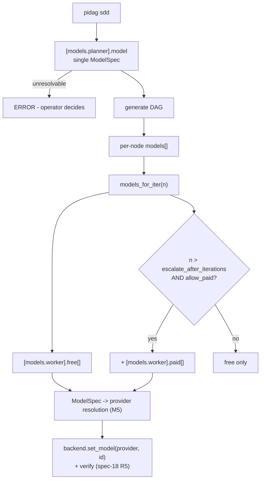

# pidag — spec-24: Model roles (planner vs worker) and worker free→paid escalation

- **Project**: `/projects/pidag`
- **Crate**: `pidag`
- **Priority**: HIGH — today's live failures were all symptoms of this
- **Status**: PLANNED
- **Depends-On**: spec-18 (`PiBackend` provider resolution) — same code path.
- **Supersedes the model half of**: `92-configurable-models`
- **User direction (2026-08-10)**: *"planner is a single deliberate choice, worker
  escalates free to paid"*

---

## Overview

Model selection is currently one `ModelsConfig { free: Vec<String>, paid: Vec<String> }`
doing several jobs badly.

**The conceptual bug, visible in the source**: `ModelsConfig::default()` is documented at
`src/core/config.rs:16` as *"GLM 5.2 (NVIDIA) as the primary free **planner** model"* —
but `models_for_iter()` feeds that list to **worker** nodes (`implement-iterN`). One
struct, labelled planner, used as worker. There is otherwise **no planner concept in the
code at all**: `grep -rn "planner" src/` returns exactly one comment.

This is not academic. On 2026-08-10 a live `pidag sdd --run` dispatched
`implement-iter1` with `nvidia/z-ai/glm-5.2` — a planner-intended model that does not
exist in the installed `pi` — purely because that is the built-in worker default.

Four further defects in the same area:

1. **Provider is expressed three different ways**: a `provider/model` string prefix, the
   `PI_PROVIDER` env var, and (added today) a `[worker] provider` config key. A bare
   model name like `deepseek-v4-flash` carries no provider, so `PiBackend` passed an
   empty one and `pi` rejected `/deepseek-v4-flash`. Three mechanisms for one field.
2. **Escalation is hardcoded**: `models_for_iter()` appends the paid chain at
   `iteration >= 3`. The threshold is a magic number in code, not policy.
3. **Thinking level is orthogonal to the model but has no home** — it lives in
   `PI_THINKING` alone, so "use the cheap model at low thinking, the strong model at high"
   is inexpressible. The 900 MB event log (`thinkingLevel: xhigh`) is what that costs.
4. **`pidag serve` / `pidag mcp` structurally cannot spend paid** — `allow_paid` is
   hardcoded `false` (`src/rpc/handlers.rs`, spec-22), so a spec that needs escalation
   cannot run over RPC at all.

---

## Design

### Roles are asymmetric, by decision

- **Planner — a single deliberate choice.** One model, chosen per run. **No chain, no
  escalation, no automatic fallback.** If the planner model is unavailable, that is an
  error the operator should see and decide about, not something pidag silently routes
  around. Planning is cheap relative to implementation and its quality sets the ceiling
  for everything downstream.
- **Worker — an escalating chain.** `free[]` tried in order, then `paid[]` once policy
  permits, gated by `--allow-paid`. This is where volume and cost live.

### A model is a record, not a string

```toml
[models.planner]
model = { provider = "nvidia", id = "z-ai/glm-5.2", thinking = "high" }

[models.worker]
free = [
  { provider = "deepseek", id = "deepseek-v4-flash", thinking = "low" },
  { provider = "deepseek", id = "deepseek-v4-pro" },
]
paid = [
  { provider = "deepseek", id = "deepseek-chat" },
]

[models.policy]
escalate_after_iterations = 2   # paid enters the chain from iteration N+1
require_allow_paid = true       # --allow-paid still gates actual spend
```

`thinking` is per-model and optional, falling back to `PI_THINKING` then `low`.

---

## Requirements

### Functional

- **M1 (`ModelSpec`)**: `{ provider: Option<String>, id: String, thinking: Option<ThinkingLevel> }`.
  `paid` is **not** a field — it is implied by which list the spec appears in, so the two
  can never disagree.
- **M2 (planner role)**: `[models.planner] model` is a single `ModelSpec`. `pidag sdd`
  uses it for planning/generation. If it cannot be resolved, **fail with a clear error** —
  never fall back to a worker model or a built-in default.
- **M3 (worker role)**: `[models.worker] free[] / paid[]`. `models_for_iter(n)` returns
  free, then paid when policy allows. Per-node `models` in the DAG JSON still wins over
  everything (existing spec-92 R6).
- **M4 (policy is data)**: `escalate_after_iterations` (default 2, preserving today's
  "paid from iteration 3") and `require_allow_paid` (default true) come from
  `[models.policy]`, not from a literal in `models_for_iter`.
- **M5 (one provider mechanism)**: `ModelSpec.provider` is the single source of truth.
  Resolution order when it is absent: `PI_PROVIDER` → query the backend's model registry
  (`get_available_models`, spec-18) → **error**. Never an empty provider, never a guess.
  `[worker] provider` (added ad hoc today) is folded into this and removed.
- **M6 (back-compat)**: a bare string in `free`/`paid` still parses, meaning
  `ModelSpec { provider: None, id: <string>, thinking: None }`. Existing
  `.pidag/config.toml` files keep working unchanged. A `provider/model` or
  `provider:model` prefix is split via the existing `split_provider_model()`.
- **M7 (defaults stop lying)**: `ModelsConfig::default()` gains a correct planner default
  and a **worker** default that is actually a worker model. The current default —
  a planner model used as the worker chain — is removed. If no sensible universal default
  exists, the honest default is empty plus a clear "configure `[models.worker]`" error.
- **M8 (thinking per model)**: `ModelSpec.thinking`, when set, is applied via the
  backend's `set_thinking_level` (capability-gated per spec-21) before the prompt.
- **M9 (RPC spend policy — resolves spec-22's open item)**: `dag.submit` accepts an
  optional `allowPaid` boolean (default `false`) and threads it into `scheduler.run()`.
  The response continues to echo the applied policy (`"allowPaid": <bool>`), so the
  caller always sees what was used.

### Non-Functional

- **N1**: Existing configs and DAGs behave identically unless they opt into the new
  tables. Every existing test passes unchanged.
- **N2**: No change to the `Worker`/`AgentBackend` traits or the scheduler's retry and
  failover behaviour — this spec changes *which* models are offered, not how failover
  walks the chain.

---

## Architecture



---

## TDD Contract

| id | test | given | expects |
|----|------|-------|---------|
| M1 | `test_modelspec_parses_record_and_string` | `{provider,id,thinking}` and a bare `"deepseek-v4-flash"` | both parse; bare gives `provider: None` |
| M2a | `test_planner_is_single_choice` | `[models.planner]` set | `sdd` uses exactly that model; no chain built |
| M2b | `test_planner_unresolvable_is_error` | planner model not resolvable | clear error; **no fallback** to a worker model or default |
| M3 | `test_worker_chain_free_then_paid` | free=[A,B], paid=[C], iteration 3, allow_paid | order is A,B,C |
| M4a | `test_escalate_after_iterations_respected` | `escalate_after_iterations = 1` | paid appears from iteration 2, not 3 |
| M4b | `test_require_allow_paid_blocks_paid` | policy true, `--allow-paid` absent | paid never enters the chain |
| M5a | `test_provider_resolution_order` | `PI_PROVIDER` set + registry available | env wins; serialise with `ENV_LOCK` |
| M5b | `test_absent_provider_is_error_not_empty` | no provider anywhere | error naming the model; **never** an empty provider |
| M6 | `test_legacy_string_config_still_parses` | today's `free = ["deepseek-v4-flash"]` | parses; behaviour unchanged (N1) |
| M7 | `test_default_worker_is_not_a_planner_model` | `ModelsConfig::default()` | worker default is not `nvidia/z-ai/glm-5.2` |
| M8 | `test_thinking_per_model_applied` | free[0] with `thinking="low"` | `set_thinking_level(Low)` called before prompt |
| M9 | `test_dag_submit_allow_paid_param` | `dag.submit` with `allowPaid: true` | threaded into `scheduler.run(true)`; response echoes `allowPaid: true` |

---

## Exit Criteria

```bash
cd /projects/pidag
grep -q "struct ModelSpec" src/core/config.rs
grep -q "planner" src/core/config.rs                    # a real field, not just a comment
grep -q "escalate_after_iterations" src/core/config.rs
! grep -q 'free: vec!\["nvidia/z-ai/glm-5.2"' src/core/config.rs   # M7: default no longer lies
! grep -rq "pub provider: Option<String>" src/core/config.rs        # M5: [worker] provider folded in
cargo test --no-fail-fast 2>&1 | grep -E "^test result:"           # every binary ok
cargo clippy -p pidag -- -D warnings
cargo fmt --check
```

**Prose criterion**: with a `[models.worker]` naming only models that exist in the
installed backend, a live `pidag sdd <spec> --run` must dispatch `implement-iter1` with
one of those models — never with a planner model and never with an unresolvable provider.
This is the exact failure observed on 2026-08-10 and it must be impossible afterwards.

---

## Guardrails

- **Do NOT give the planner a fallback chain.** The user's decision is explicit: a single
  deliberate choice. An unresolvable planner model is an error, not a routing problem.
- **Do NOT break bare-string configs** (M6/N1). Every `.pidag/config.toml` in this
  workspace uses them today.
- **Do NOT change how failover walks the chain** — only what the chain contains.
- **Do NOT reintroduce a second provider mechanism.** `ModelSpec.provider` is the only one.
- **Do NOT flip the RPC default to `allowPaid: true`.** Safe-by-default stands; M9 only
  makes it expressible and visible.
- No new dependencies.

---

## Files to Modify

| File | Change |
|------|--------|
| `src/core/config.rs` | `ModelSpec`, `[models.planner]`, `[models.worker]`, `[models.policy]`; fold in `[worker] provider`; fix the lying default (M7) |
| `src/sdd/mod.rs` | Use the planner model for generation (M2) |
| `src/backend/pi.rs` | Provider resolution reads `ModelSpec.provider` first (M5); apply per-model thinking (M8) |
| `src/rpc/handlers.rs` | `allowPaid` request param threaded to `scheduler.run()` (M9) |
| `src/cli/sdd.rs` | `--planner-model` override; keep `--model` as the worker override |
| `tests/model_roles_tests.rs` | **NEW** — M1-M9 |
| `specs/92-configurable-models.md` | Mark the model-selection half `SUPERSEDED-BY 24` |

---

## Migration

Existing configs keep working (M6). To adopt, replace:
```toml
[models]
free = ["deepseek-v4-flash", "deepseek-v4-pro"]
paid = ["deepseek-chat"]
```
with the `[models.worker]` / `[models.planner]` / `[models.policy]` form above. `pidag
attach` should emit the new template (`Config::default_config_toml()`).

## Memory

Store on completion: `pidag/specs/24-model-roles-and-escalation`,
`claude-pi-delegation/decision/20260810-planner-single-worker-escalates`.
