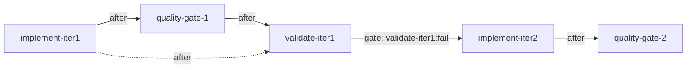

# pidag — spec-25: Ordering-only edges (`after`) so `validate-iterN` always runs

- **Project**: `/projects/pidag`
- **Crate**: `pidag`
- **Priority**: HIGH — the SDD recovery loop still dead-ends in production
- **Status**: PLANNED
- **Depends-On**: spec-14 (conditional gates) — extends its semantics, must not regress them.
- **Source**: live run `ed3bc4990bcd` on `/projects/chromecast-tv-mirror`, 2026-08-10
- **User direction (2026-08-10)**: *"validate should run regardless"*

---

## Overview

spec-14 fixed **Bug A**: a failing `validate-iterN` used to block its gated fix node
`implement-iterN+1`, so no recovery iteration ever ran. Gates now fire correctly.

The live chromecast run shows the **sibling defect, one node upstream**:

```
implement-iter1  Done      (agent turn completed)
quality-gate-1   FAILED    (fmt false; tests/cast_tv_tests.rs absent)
validate-iter1   BLOCKED   <-- never ran
implement-iter2  never evaluated
DagDone          failed_nodes: [quality-gate-1, validate-baseline]
```

The gate on `implement-iter2` is `validate-iter1:fail`. But `validate-iter1` depends on
`quality-gate-1`, which failed, so `validate-iter1` is blocked and **the gate never gets a
chance to evaluate**. The recovery loop is strangled before spec-14's logic is reached.

This is wrong by design intent. A failing quality gate is *precisely* the signal that a
fix iteration is needed. The current topology treats it as fatal.

### Why not simply drop the edge

The obvious fix — make `validate-iterN` depend on `implement-iterN` instead, letting the
quality gate run in parallel — is wrong for a concrete reason. Both nodes shell out to
`cargo`. Running them concurrently in one target directory produces exactly the failure
already observed in this workspace:

```
error: linking with `cc` failed ... collect2: fatal error: ld terminated with signal 7
```

So the **ordering must be preserved**; only the *failure propagation* must change. That
distinction is the spec.

---

## Design: two kinds of edge

| edge | meaning | dependent runs when |
|---|---|---|
| `depends_on` (existing) | **requires** — a real data/success dependency | all deps `Done` (or gate-satisfied per spec-14) |
| `after` (**new**) | **ordering only** — "run after this, whatever happened" | all listed nodes are **terminal** in any state (`Done`, `Failed`, `Skipped`) |

`after` is additive and orthogonal to spec-14's `gate`. A node may carry both.

### Applied to the SDD chain

`validate-iterN` becomes the **arbiter**: it has no hard dependencies and always runs
once the work ahead of it has settled.



- `quality-gate-N`: `after: [implement-iterN]`
- `validate-iterN`: `after: [implement-iterN, quality-gate-N]`, **no `depends_on`**
- `implement-iterN+1`: unchanged — `depends_on: [validate-iterN]`, `gate: "validate-iterN:fail"`

Consequences, all intended:
- `implement-iterN` **fails** ⇒ `validate-iterN` still runs, reports criteria unmet, gate
  fires, fix iteration runs. (Today this also dead-ends.)
- `quality-gate-N` **fails** ⇒ `validate-iterN` still runs. The observed bug, fixed.
- `validate-iterN` **passes** ⇒ the gated fix node is skipped (spec-14 A2). Unchanged.

---

## Requirements

### Functional

- **T1 (`Node.after`)**: `after: Vec<String>` on `Node`, serde-default empty. Additive —
  DAG JSON without it parses and behaves exactly as today.
- **T2 (readiness)**: a node is dispatchable when **both** hold: every `depends_on` is
  satisfied under existing rules (including spec-14 gate evaluation), **and** every `after`
  entry has reached a terminal state (`Done`, `Failed`, or `Skipped`). An `after` entry's
  *outcome* never blocks and never propagates failure.
- **T3 (no false blocking)**: a node whose only unsatisfied edges are `after` must never be
  recorded `Blocked`. `Blocked` remains reserved for genuine `depends_on` failure.
- **T4 (validation)**: `dag.validate()` treats `after` edges as graph edges for
  **cycle detection** and dangling-reference checks. An `after` pointing at a non-existent
  node is an error, as with `depends_on`.
- **T5 (SDD emits the new shape)**: `src/sdd/mod.rs` generates `quality-gate-N` with
  `after: [implement-iterN]` and `validate-iterN` with
  `after: [implement-iterN, quality-gate-N]` and **no** `depends_on`. `implement-iterN+1`
  keeps its `depends_on` + `gate` exactly as spec-14 left them.
- **T6 (serial execution preserved)**: `after` guarantees the dependent starts only once
  the listed nodes are terminal, so `quality-gate-N` and `validate-iterN` never run
  concurrently. This is what prevents the concurrent-`cargo` linker failure; it must be
  covered by a test asserting non-overlapping execution windows.
- **T7 (accounting)**: a `validate-iterN` that runs and fails is a normal `Failed` node.
  `DagDone`'s `failed_nodes` must not double-count, and a DAG whose final validate passes
  after an earlier failure is still an overall success — the recovery loop working is the
  point.
- **T8 (checkpoint/resume)**: `after` edges reconcile on resume (spec-08/10) — a node whose
  `after` set was already terminal before an interruption stays ready.

### Non-Functional

- **N1**: DAGs without `after` are byte-identical in behaviour. No existing test changes.
- **N2**: spec-14 gate semantics (A1-A6) are untouched. If gate behaviour must change to
  make this work, stop and escalate — that means the model is wrong.
- **N3**: No change to the `Worker`/`AgentBackend` traits or the store schema.

---

## TDD Contract

| id | test | given | expects |
|----|------|-------|---------|
| T1 | `test_after_field_optional` | DAG JSON with no `after` | parses; identical behaviour (N1) |
| T2a | `test_after_failed_dep_still_runs` | n1 `Failed`; n2 `after:[n1]` | n2 **dispatched** |
| T2b | `test_after_done_dep_runs` | n1 `Done`; n2 `after:[n1]` | n2 dispatched |
| T2c | `test_after_skipped_dep_runs` | n1 `Skipped` (spec-14 gate); n2 `after:[n1]` | n2 dispatched |
| T2d | `test_after_waits_for_terminal` | n1 running; n2 `after:[n1]` | n2 **not** dispatched until n1 terminal |
| T3 | `test_after_never_marks_blocked` | n1 `Failed`; n2 `after:[n1]` | n2 never recorded `Blocked` |
| T4a | `test_after_cycle_detected` | n1 `after:[n2]`, n2 `after:[n1]` | `validate()` errors |
| T4b | `test_after_dangling_ref_detected` | `after:["ghost"]` | `validate()` errors |
| T5 | `test_sdd_emits_after_edges` | `pidag sdd <spec>` | `validate-iterN` has `after:[implement-iterN, quality-gate-N]` and empty `depends_on`; `implement-iterN+1` keeps its gate |
| T6 | `test_after_serialises_execution` | qg and validate both shell nodes recording timestamps | execution windows do **not** overlap |
| T7 | `test_recovery_loop_completes` | `validate-iter1` fails ⇒ gate fires ⇒ `implement-iter2` runs ⇒ `validate-iter2` passes | DAG overall success; `implement-iter2` was dispatched |
| T8 | `test_after_reconciles_on_resume` | interrupt after qg terminal, resume | validate runs; not re-blocked |

**T7 is the keystone** — it is the end-to-end proof that the recovery loop, which has
never once completed in this project, now does.

---

## Exit Criteria

```bash
cd /projects/pidag
grep -q "pub after" src/core/dag.rs
grep -q "after" src/scheduler/execute.rs
grep -q "after" src/sdd/mod.rs
cargo test --no-fail-fast 2>&1 | grep -E "^test result:"     # every binary ok
cargo clippy -p pidag -- -D warnings
cargo fmt --check

# Generated SDD chain has the new shape
pidag sdd specs/01-cast-tv-terminal.md --project-root /projects/chromecast-tv-mirror
python3 - <<'PY'
import json; d=json.load(open('/projects/chromecast-tv-mirror/.pidag/01-cast-tv-terminal.json'))
v=[n for n in d['nodes'] if n['id']=='validate-iter1'][0]
assert v.get('depends_on') in ([], None), v
assert set(v.get('after',[])) == {'implement-iter1','quality-gate-1'}, v
print('OK')
PY
```

**Prose criterion (the real test)**: re-run the live chromecast spec. With
`quality-gate-1` failing exactly as it does today, `validate-iter1` **must execute** and
`implement-iter2` **must dispatch**. A run that still ends with `validate-iter1 BLOCKED`
has not implemented this spec, whatever the unit tests say.

---

## Guardrails

- **Do NOT** change spec-14 gate semantics. `gate` answers *"should this fire?"*; `after`
  answers *"is it my turn yet?"*. Keep them separate — conflating them recreates Bug A.
- **Do NOT** make `after` imply `depends_on`. An `after` node must run even when the node
  it follows failed; that is the entire purpose.
- **Do NOT** parallelise `quality-gate-N` with `validate-iterN` as a "simplification". Both
  invoke `cargo` against one target directory and will race the linker (observed:
  `ld terminated with signal 7`). T6 exists to prevent this regression.
- **Do NOT** repurpose `Blocked` for `after`-waiting. `Blocked` is a terminal failure state
  with meaning to the UI and to resume.
- No new dependencies.

---

## Files to Modify

| File | Change |
|------|--------|
| `src/core/dag.rs` | `Node.after: Vec<String>` (serde default); include in `validate()` cycle/dangling checks (T4) |
| `src/scheduler/execute.rs` | Readiness accounts for `after` terminal-state satisfaction (T2, T3) |
| `src/sdd/mod.rs` | Emit the new chain shape (T5) |
| `src/sdd/resume.rs` | Reconcile `after` on resume (T8) |
| `src/ui/render.rs` | Render `after` edges distinctly (dashed) in mermaid output |
| `tests/ordering_edges_tests.rs` | **NEW** — T1-T8 |

---

## Why this matters beyond the bug

pidag's premise is a self-healing implement→validate→fix loop. That loop has **never
completed a single recovery iteration** in this project: first because gates were not
evaluated at all (spec-14 Bug A), then because the quality gate strangled the chain before
the gate was reached (this spec). Making `validate` an always-running arbiter is what turns
the recovery loop from a diagram into a mechanism.

## Memory

Store on completion: `pidag/specs/25-ordering-edges-and-validate-always-runs`,
`claude-pi-delegation/fix/20260810-quality-gate-strangles-recovery-loop`.
