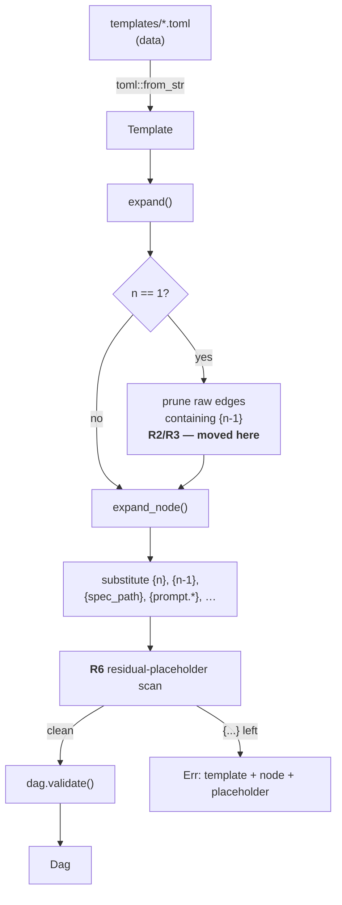

# pidag — spec-27: Workflow template repair — make spec-26 actually load and generalise

- **Project**: `/projects/pidag`
- **Crate**: `pidag`
- **Priority**: P0 — the shipped built-in templates do not parse; `pidag sdd` is broken on the default path
- **Status**: PLANNED
- **Repairs**: spec-26 (`35eb35d`), which was committed while `cargo test` had never run
- **Depends-On**: nothing new. spec-23 (`verify`) and spec-25 (`after`) are already in place.
- **Escalates-To**: spec-29 (runtime output interpolation) — see Guardrail G6

> **Execution context: run this ENTIRELY INSIDE the `pidag-runner` container**, in
> `/projects/pidag`. That is where the Rust toolchain, the live repo (`52b260e`) and the
> quality gate are. Get there with `make shell` from the Mac, or
> `podman exec -it pidag-runner /bin/bash` on `lnx`.
>
> Do **not** apply this spec to the Mac checkout or to `[CTR] /opt/pidag-src` — the latter
> is a read-only Aug-6 snapshot with no `src/workflow/` at all. See spec-28's
> "Execution contexts" section for the full three-machine map and the source-divergence
> prerequisite. No rebuild or `make deploy` is required by this spec.

---

## Overview

spec-26 moved workflow topology out of Rust and into TOML. The layering is right and the
engine was correctly left untouched. But the spec was accepted on the strength of
`fmt`/`check`/`clippy` passing; `cargo test` never executed. Three defects survived, and
the first one makes the feature completely non-functional.

**D1 — the built-in templates are not valid TOML.** TOML v1.0.0 has no `null` type.
`src/workflow/templates/sdd.toml:13` and five lines in `research.toml` use `type = null` /
`iterations = null`. `toml::from_str` rejects them, so `WorkflowEngine::load_builtin`
returns `Err` for **both** shipped workflows:

```
Failed to parse workflow sdd: TOML parse error at line 13, column 16
13 |   type       = null
   |                ^
invalid string, expected `"`, `'`
```

This is invisible to the compiler because it is a data file parsed at runtime — which is
exactly how it passed three static gates and reached `main`. `serde` already maps a
**missing** key to `None` for `Option<T>` fields, so the fix is deletion, not substitution.

**D2 — the `{n-1}` edge-drop only works by accident.** spec-26's design states that edges
referencing `{n-1}` are dropped when `n == 1`, and that this is what makes iteration 1
unconditional "without a special case". The implementation instead substitutes first and
then string-matches the **result** for `"iter0"` (`src/workflow/mod.rs:136,140`). It works
for `sdd` solely because its node ids happen to contain the text `iter`. A template using
`review-{n-1}` expands to `review-0`, is not pruned, and dies in `dag.validate()` as a
dangling edge. The generality W5a claims is not there.

**D3 — `research` is a shape, not a working workflow.** It interpolates
`{{investigate-1.output}}`, but no such substitution exists anywhere in pidag — verified:
`grep -rn '{{' src/ --include=*.rs` finds only a doc comment on `mcp_call` args
(`src/core/dag.rs:71`). That literal text is passed to the model verbatim. Separately, the
fan-in uses `after`, which `src/scheduler/execute.rs:98,149` satisfies on any **terminal**
state — so synthesis proceeds even when all three investigations failed. W7 is the
falsifiability test for the whole design; it must be honest.

**D4 (documentation only) — a wrong exit criterion.** spec-26 requires
`grep -q "max_iterations" src/workflow/mod.rs`. It fails, but the code is *correct*:
resolution is CLI > config > template > 3 at `src/sdd/mod.rs:183-190`, which is exactly
W3. The criterion named the wrong file. Amend the criterion; do not move the code.

**What is NOT wrong.** `tests/workflow_tests.rs` is sound — W2 and W7 load the real
built-ins via the empty-tmpdir fallback and would have caught D1 on the first run. W4 holds
(`grep -c 'implement-iter[0-9]' src/sdd/*.rs` is 0). N2 holds — no workflow knowledge leaked
into `scheduler/` or `core/`. Do not "fix" any of these.

---

## Requirements

### Functional

- **R1 (templates parse)**: every built-in template deserialises into `Template`.
  `null` is removed from all `.toml` files under `src/workflow/templates/`; optional fields
  are expressed by **omitting the key**, never by a placeholder value.
- **R2 (prune before substitute)**: when `n == 1`, `depends_on`, `after` and `gate` entries
  are dropped based on the **raw template text** containing `{n-1}`, before any substitution
  occurs. No expanded-id string matching (`"iter0"`) anywhere.
- **R3 (gate pruning is targeted)**: a `gate` is cleared at `n == 1` **only if** it
  references `{n-1}`. A gate that does not reference the previous iteration survives.
  (Today `expanded.gate = None` is unconditional at `src/workflow/mod.rs:137`.)
- **R4 (`research` fan-in is a real dependency)**: `synthesize` uses `depends_on` on the
  three `investigate-*` nodes, so it does not run when they fail. `validate-research`
  **keeps** `after` — it is spec-25's always-runs arbiter, and that is correct.
- **R5 (no dead template syntax)**: `{{investigate-N.output}}` is removed from
  `research.toml`. Until spec-29 lands, the synthesis prompt must not promise an
  interpolation pidag cannot perform. Shipping syntax that silently does nothing is worse
  than not shipping the feature.
- **R6 (unknown placeholders are loud) — REVISED 2026-08-12. The original wording was
  wrong and the implementation built from it is a P0 defect. Read this whole item.**

  **What went wrong.** R6 originally said to scan for residual braces *after* expansion.
  That is unsound: `substitute()` replaces `{prompt.tdd_contract}` and friends with **the
  user's own spec text**, so the post-substitution scan inspects user content. Every spec
  in this repo contains literal braces (16 in spec-26, 34 in spec-27 — JSON, Rust, `{n}`),
  so the shipped guard makes `pidag sdd` fail on realistic input. The test suite misses it
  because every fixture uses brace-free minimal spec text. **The architect specified this
  incorrectly; the implementer built what was asked.**

  **The correct design — validate the RAW template, never the substituted output.**
  Placeholder validation belongs *before* substitution, where only template-authored text
  exists:

  - Run the check in `expand()`, iterating `template.nodes` and every `RepeatSection`'s
    nodes, **before** any call to `expand_node`. Both the template name and the node id
    **as the author wrote it** are in scope there, which is what the error must report.
  - For each raw field — `id`, `command`, `prompt`, `gate`, `verify`, and every entry of
    `depends_on` and `after` — mask `{{...}}` spans, then extract each remaining `{...}`
    occurrence and match it against the known vocabulary:
    `{n}`, `{n-1}`, `{spec_path}`, `{project_root}`, `{validate_script}`,
    `{quality_gate_script}`, any `{prompt.<key>}`, any `{models.worker(<...>)}`.
  - Anything outside that set is `PidagError::Parse` naming **template name, authored node
    id, and the placeholder**.
  - **Delete the post-expansion `check_placeholder` calls in `expand_node` entirely.** No
    field of a substituted `Node` is scanned for braces, ever. User content is data, not
    template syntax.

  **Double-brace `{{...}}` stays exempt** — reserved runtime-interpolation syntax for
  spec-29. R8 legitimately authors `{{validate-iter{n-1}.output}}`; note the inner `{n-1}`
  must still validate as known vocabulary after the `{{...}}` span is masked, so mask the
  **outer delimiters only**, not the whole span's interior. Verify this case explicitly.

  **Char-safety is mandatory.** The shipped implementation mixes byte and char indexing:
  `masked.find('{')` returns a byte offset, `field_value.chars().nth(pos)` treats it as a
  char offset, and `&field_value[a..b]` slices bytes — and masking replaced each char of a
  span with a single space, so offsets diverge whenever multibyte characters appear. A
  template containing `—` can panic with "byte index is not a char boundary". Operate on
  `char_indices()` or on `&str` slices derived from `match_indices`, never on mixed units.

- **R6b (the regression this P0 needs)**: generating a DAG from a spec whose sections
  contain literal braces must succeed. This is the test that would have caught the defect.
- **R7 (spec-26 criterion corrected)** — **ARCHITECT-OWNED, NOT PART OF THE IMPLEMENTATION
  TASK.** spec-26's Exit Criteria line `grep -q "max_iterations" src/workflow/mod.rs` names
  the wrong file; the code at `src/sdd/mod.rs:183-190` is correct. This was amended by the
  architect on 2026-08-11. **The implementer must not touch any file under `specs/`** — see
  Guardrail G10.

- **R8 (per-iteration prompt parity — this is spec-26 W2, unmet)**: the `sdd` template must
  restore the pre-spec-26 prompt semantics. Before `35eb35d` the generator emitted **three
  distinct** prompts; spec-26 collapsed them into one, so iterations 2 and 3 now tell the
  worker to *reimplement from scratch* instead of to *repair the reported failures* — a
  silent semantic regression to the self-healing recovery loop.

  | node | required prompt semantics |
  |---|---|
  | `implement-iter1` | "Implement from scratch based on:" + TDD Contract, Architecture, Guardrails, project root |
  | `implement-iter{n}`, n ≥ 2 | "Fix the failures reported in:" + `{{validate-iter{n-1}.output}}` + Guardrails, project root |

  The format cannot express this today. Extend it **minimally and with data only**:
  `repeat` becomes an **array** of sections (`[[repeat]]`, restoring the array-of-tables
  syntax the template originally used), and each section takes an optional
  `start` (`usize`, default `1`) giving the first iteration it applies to. The `sdd`
  template then becomes: `implement-iter1` as a static node; one `[[repeat]] start = 2`
  section for the repair-prompt `implement-iter{n}`; one `[[repeat]] start = 1` section for
  `quality-gate-{n}` and `validate-iter{n}`.

  **Deliberate, documented delta**: the old iteration-3 prompt opened "Final attempt to fix
  remaining failures:" rather than "Fix the failures reported in:". That cosmetic variation
  is **dropped on purpose** — preserving it byte-for-byte would require one section per
  iteration, reintroducing exactly the unrolling spec-26 exists to remove. Parity here means
  parity of *semantics* (repair, referencing the previous validator's output), not of
  wording. If a test pins the iteration-3 wording, **report it — do not delete it** (G3).

- **R9 (a real golden file — spec-26 W2 claimed one and there isn't one)**:
  `test_builtin_sdd_matches_golden` currently asserts only that certain node **ids** exist.
  It compares no prompt, no `depends_on`, no `gate`, no `after`, no `verify` — which is
  precisely why R8's regression passed through it. Replace it with a genuine golden-file
  test: serialize the fully expanded `sdd` DAG at 3 iterations to a checked-in JSON fixture
  (`tests/fixtures/sdd_golden.json`) and assert deep equality.
  The test must build its `TemplateContext` from **fixed literal values** — spec path,
  project root, script paths, prompt sections and a hardcoded `ModelsConfig` — so the golden
  is deterministic and does not drift with `Config::default()`. Any future topology or
  prompt change must then be an explicit, reviewed fixture update.

### Non-Functional

- **N1**: **No engine changes.** `src/scheduler/` and `src/core/` are not modified except
  `src/core/config.rs` if and only if a test requires it. If a fix appears to need the
  scheduler, **stop and escalate** — that is spec-29's territory (G6).
- **N2**: `pidag run <dag.json>` and the DAG JSON format are unchanged.
- **N3**: The full suite must run to completion, not abort early. The `--no-fail-fast`
  change lives in spec-28; if it has not landed yet, run
  `cargo test -j 2 --no-fail-fast` manually so the true failure set is visible.
- **N4**: No new dependencies.

---

## Architecture

The entire change is confined to two data files and one function. Nothing structural moves.



**Key decision — prune moves from `expand()` into the pre-substitution step.** Today
`expand()` calls `expand_node()` (which substitutes) and then filters the result. Invert
it: clone the `TemplateNode`, filter its raw `depends_on`/`after`/`gate` for `{n-1}` when
`n == 1`, then substitute. This deletes the `"iter0"` heuristic entirely and is what makes
R2 general rather than sdd-specific.

**Key decision — R6 is a post-expansion scan, not a parser.** A regex-free
`find('{')`-style scan over the finished `Node` fields is enough. Resist building a
placeholder grammar; spec-26's Guardrail against inventing a templating language still
binds.

**Key decision — `research` loses the output interpolation rather than gaining it.**
Adding `{{node.output}}` requires the scheduler to feed upstream results into a downstream
prompt at execution time, which is a new engine primitive and forbidden by N1/spec-26 N2.
The honest interim shape is three independent investigations, a synthesis node that depends
on their success, and a validator that always runs.

---

## TDD Contract

Tests are added to `tests/workflow_tests.rs` unless stated. Every row must exist as a
distinct `#[test]`.

| id | test | given | expects |
|----|------|-------|---------|
| R1a | `test_all_builtin_templates_parse` | iterate `["sdd","research"]` through `load_builtin` | every one returns `Ok`; failure message names the template |
| R1b | `test_no_null_literal_in_shipped_templates` | scan `src/workflow/templates/*.toml` | zero occurrences of the bare token `null` |
| R2a | `test_prev_edges_dropped_for_generic_ids` | inline template, `depends_on = ["review-{n-1}"]`, `iterations = 2` | `review-1` node at n=1 has **empty** `depends_on`; at n=2 it is `["review-1"]` |
| R2b | `test_no_iter0_heuristic_in_source` | scan `src/workflow/mod.rs` | no literal `"iter0"` |
| R3 | `test_gate_without_prev_ref_survives_iter1` | inline template, `gate = "validate-baseline:fail"` (no `{n-1}`) | node at n=1 **retains** that gate |
| R4a | `test_research_synthesize_uses_depends_on` | built-in `research`, expanded | `synthesize.depends_on` contains all three `investigate-*`; `synthesize.after` is empty |
| R4b | `test_research_validate_keeps_after` | built-in `research`, expanded | `validate-research.after == ["synthesize"]`, `depends_on` empty |
| R5 | `test_no_output_interpolation_syntax_in_templates` | scan `src/workflow/templates/*.toml` | zero occurrences of `.output}}` |
| R6a | `test_unknown_placeholder_is_hard_error` | inline template, `command = "echo {bogus}"` | `expand` returns `Err` whose message contains **the template name (`bad_placeholder`)**, **the authored node id (`test`)**, and `bogus`. The shipped version asserts only `contains("bogus")` — **strengthen it**; it was written to fit an implementation that reports `context.spec_path` as the template name |
| R6b | `test_spec_sections_with_braces_do_not_break_generation` | `SddGenerator::from_spec` on a spec whose TDD Contract contains `{ "json": 1 }`, `{n}` and `Vec<T> { }` | generation **succeeds**, and `implement-iter1.prompt` contains that text verbatim. **This is the P0 regression test** — it must fail against the shipped post-substitution guard |
| R6c | `test_double_brace_with_inner_placeholder_is_valid` | raw template field `"{{validate-iter{n-1}.output}}"` | validates clean: outer `{{ }}` masked, inner `{n-1}` recognised as known vocabulary |
| R6d | `test_unknown_placeholder_in_every_field` | separate inline templates putting `{bogus}` in `id`, `prompt`, `gate`, `verify`, `depends_on`, `after` | each returns `Err` — the check covers all six raw fields, not just `prompt` |
| R6e | `test_multibyte_template_does_not_panic` | template whose prompt contains an em dash `—` **and** a `{bogus}` after it | returns a clean `Err`, **does not panic** (guards the byte/char index mixing) |
| R6f | `test_clean_expansion_has_no_residual_braces` | built-in `sdd` at 3 iterations and built-in `research`, brace-free prompt sections | after masking `{{…}}`, no `{` remains. Retained as a sanity check — it is **not** the guard |
| R8a | `test_implement_iter1_says_from_scratch` | built-in `sdd`, 3 iterations | `implement-iter1.prompt` contains `Implement from scratch` and does **not** contain `{{validate-` |
| R8b | `test_implement_iter2_repairs_from_prev_output` | built-in `sdd`, 3 iterations | `implement-iter2.prompt` contains `Fix the failures reported in` **and** `{{validate-iter1.output}}` (this is `phase4_tests.rs:293`, restored to green without editing it) |
| R8c | `test_implement_iter3_references_iter2_output` | built-in `sdd`, 3 iterations | `implement-iter3.prompt` contains `{{validate-iter2.output}}` |
| R8d | `test_repeat_start_offsets_iterations` | inline template, two `[[repeat]]` sections with `start = 1` and `start = 3`, 3 iterations | the `start = 3` section produces exactly one node (n=3); the `start = 1` section produces three |
| R8e | `test_repeat_start_defaults_to_one` | inline template, `[[repeat]]` with no `start` | behaves exactly as `start = 1` |
| R9 | `test_builtin_sdd_matches_golden` | **replaces the existing id-only test**; built-in `sdd`, 3 iterations, fixed context | expanded DAG deep-equals `tests/fixtures/sdd_golden.json` |
| W7′ | `test_research_template_expands` | **existing test** | update **only** the two `synthesize.after` assertions to `depends_on` per R4a; leave every other assertion alone |

**W7′ is a deliberate, authorised test edit.** The existing assertions encode the
implementation's `after` choice, which R4 overturns. This is the *only* pre-existing
assertion you may change. Changing any other test to make a failure go away is a spec
violation — see G3.

---

## Exit Criteria

```bash
cd /projects/pidag

# R1 — templates parse; no null literals
! grep -rn '= *null' src/workflow/templates/
[ "$(grep -rc 'null' src/workflow/templates/ | awk -F: '{s+=$2} END{print s+0}')" = "0" ]

# R2 — the heuristic is gone
! grep -n 'iter0' src/workflow/mod.rs

# R5 — research.toml carries no dead interpolation syntax
! grep -n '\.output}}' src/workflow/templates/research.toml

# R8 — sdd.toml DOES carry it (spec-29 IOU), and uses array repeat sections with start
grep -q 'validate-iter{n-1}.output' src/workflow/templates/sdd.toml
grep -q '^\[\[repeat\]\]' src/workflow/templates/sdd.toml
grep -q 'start' src/workflow/templates/sdd.toml

# R6 — validation happens on the raw template, never on substituted output
! grep -n 'check_placeholder(&prompt' src/workflow/mod.rs
grep -n 'fn validate_placeholders\|placeholder' src/workflow/mod.rs | head

# R9 — the golden fixture exists and is non-trivial
test -f tests/fixtures/sdd_golden.json
[ "$(jq '.nodes | length' tests/fixtures/sdd_golden.json)" -ge 10 ]
jq -e '.nodes[] | select(.id=="implement-iter2") | .prompt | contains("Fix the failures")' tests/fixtures/sdd_golden.json

# R7 — spec-26's criterion corrected
grep -q 'max_iterations' src/sdd/mod.rs
grep -q 'src/sdd/mod.rs' specs/26-declarative-workflow-templates.md

# Full gate, run to completion
bash deploy/scripts/quality-gate.sh .
cargo test -j 2 --no-fail-fast 2>&1 | grep -E '^test result:'

# Behavioural — built-ins load and render through the real CLI
cargo build --release -p pidag
install -m755 target/release/pidag /root/.local/bin/pidag
install -m755 target/release/pidag /projects/.local/bin/pidag
pidag workflows | grep -q research
pidag workflows show sdd | grep -q 'implement-iter3'
pidag workflows show research | grep -q synthesize
```

**Prose criteria** (all must hold; each is checkable by reading the diff):

1. `cargo test --no-fail-fast` reports **33 or more test binaries** and **zero failures**.
   The healthy pre-spec-26 baseline was 33 binaries / 396 passed / 1 ignored; the count may
   only go **up**. Paste every `^test result:` line raw — do not sum them.
2. `pidag workflows show research` renders a graph in which three `investigate-*` nodes have
   no dependencies, `synthesize` depends on all three, and `validate-research` follows
   `synthesize` via an ordering edge.
3. `git diff --stat` touches **no** file under `src/scheduler/` and **no** file under
   `/projects/_upstream/`.
4. The only pre-existing assertions modified anywhere in `tests/` are the two
   `synthesize.after` lines named in W7′.

---

## Guardrails

- **G1 — never modify `/projects/_upstream/`.** Read-only reference on the user's own fork
  and active branch. An upstream commit on 2026-08-10 had to be reverted. If pidag needs a
  capability the SDK lacks, work around it on pidag's side.
- **G2 — no `Co-Authored-By:` trailer; no mention of Claude, Anthropic or any AI tool in a
  commit message.** Harnesses append this by default; suppress it. Eleven commits had to be
  rewritten with `filter-branch`.
- **G3 — do not edit a test to make a failure disappear.** The sole authorised assertion
  change is W7′. If any other test fails, the *implementation* is wrong. Report it; do not
  reshape the test around the code.
- **G4 — never `rm -rf` a `.pidag/` directory.** `mv .pidag .pidag.prev-$(date +%H%M%S)`.
- **G5 — install to BOTH `/root/.local/bin/pidag` and `/projects/.local/bin/pidag`.**
  `/root` precedes `/projects` on PATH and shadows it; a fix was once "verified" against a
  stale binary this way.
- **G6 — do not implement `{{node.output}}`.** It needs the scheduler to pass upstream
  results into downstream prompts at run time. That is a new engine primitive, forbidden by
  N1. Remove the syntax (R5) and leave it to spec-29.
- **G7 — do not invent a templating language.** spec-26's substitution set is the whole
  surface. R6 *detects* unknown placeholders; it does not add new ones.
- **G10 — the implementer must NOT modify any file under `specs/`.** Specs are
  architect-owned: they are the contract being implemented, not an artefact of the
  implementation. An implementer that edits the spec can make any failure disappear by
  rewriting the requirement. If a spec looks wrong, incomplete or self-contradictory,
  **stop and report it** — that is valuable and has already happened twice on this repair
  (a missing `[[repeat]]` fix, and the prompt-parity regression). It is the architect who
  then amends the spec.
- **G8 — clippy gate is `cargo clippy -p pidag -- -D warnings`**, never `--all-targets`
  (13 pre-existing test-file errors, out of scope — audit P8).
- **G9 — report raw output, never summed totals.** Paste every `^test result:` line
  verbatim. Totals have been misreported twice on this project by summing a truncated list.

### Error handling expectations

- A template that fails to parse yields `PidagError::Parse` naming the **template** and the
  underlying TOML error with line/column. Never a partially-built DAG (spec-26 N3).
- An unknown placeholder (R6) yields `PidagError::Parse` naming template, node id and
  placeholder — reported against the id **the author wrote**, not a post-expansion id.
- A dangling `depends_on`/`after` target still surfaces through `dag.validate()` with the
  template name prefixed, as spec-26 W5b already requires.

---

## Files to Modify

| File | Change |
|------|--------|
| `src/workflow/templates/sdd.toml` | delete `type = null` (line 13) |
| `src/workflow/templates/research.toml` | delete `iterations = null` and all four `type = null`; `synthesize` → `depends_on` (R4a); strip `{{investigate-N.output}}` from the synthesis prompt (R5) |
| `src/workflow/mod.rs` | move `{n-1}` pruning pre-substitution and delete the `"iter0"` match (R2); make gate pruning conditional (R3); add the residual-placeholder scan (R6) |
| `tests/workflow_tests.rs` | add R1a/R1b/R2a/R2b/R3/R4a/R4b/R5/R6a/R6b; edit **only** the two `synthesize.after` assertions (W7′) |
| `tests/fixtures/sdd_golden.json` | **NEW** — golden DAG fixture (R9) |

**`specs/` is off-limits to the implementer (G10).** The spec-26 Exit Criteria amendment
(R7) is architect-owned and was already applied.

**Out of scope, deliberately**: `--no-fail-fast` in `deploy/scripts/quality-gate.sh` and the
container tooling additions — those are spec-28. Template-level `retry`/`timeout` are
expressible by neither spec-26 nor this one; recorded as a known gap, not fixed here.

## Memory

Store on completion: `workspace/specs/pidag-27-workflow-template-repair`,
`claude-pi-delegation/fix/20260811-toml-has-no-null`.
