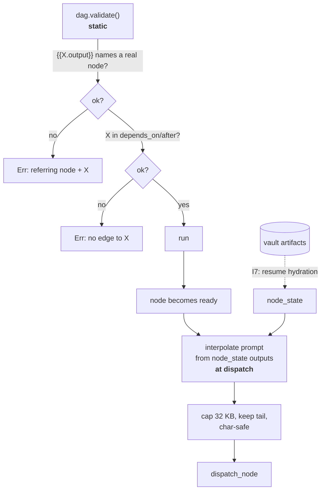

# pidag — spec-29: Runtime output interpolation — let the fix node see what failed

- **Project**: `/projects/pidag`
- **Crate**: `pidag`
- **Priority**: P0 — the self-healing recovery loop currently repairs **blind**.
- **Status**: PLANNED
- **Reserved since**: spec-27 (Guardrail G6 deferred this deliberately)
- **Depends-On**: spec-31 (complete). The engine primitive it adds is the last piece the
  loop needs to be functional rather than merely correct.

> **Execution context: entirely inside the `pidag-runner` container**, in `/projects/pidag`.
> No rebuild required to develop; a rebuild + dual install is required before any live run
> (audit S-7: `pidag sdd --run` resolves `pidag` via `PATH`, so a stale install silently
> runs old code).

---

## Overview

The 2026-08-12 bloodtest proved the recovery loop dispatches correctly: `validate-iter1`
failed, the gate fired, `implement-iter2` ran, `validate-iter2` passed, `implement-iter3`
was skipped. What it also revealed is what `implement-iter2` was actually told:

```
Fix the failures reported in:
{{validate-iter1.output}}

Guardrails:

Project root: .
```

**That placeholder is never substituted.** Verified: `grep -rn 'output}}' src/ --include=*.rs`
finds nothing outside the template files. The model receives the literal string
`{{validate-iter1.output}}` and never learns what failed. The fix node is a *retry*, not a
*repair* — it must re-derive the failure or guess.

The bloodtest masked this because its repair is trivial and self-describing ("write
`FIXED.txt`", stated in the spec text the node already receives). On any real spec the fix
node is asked to correct failures it cannot see.

This syntax has been dead since before spec-26 — the pre-`35eb35d` hardcoded generator
emitted the same literal. So it is not a regression; it is a promise the codebase has never
kept, now the single thing standing between a loop that *runs* and a loop that *works*.

**`research.toml` needs the same primitive**: its `synthesize` node had
`{{investigate-N.output}}` stripped by spec-27 R5 precisely because nothing implemented it.
Fan-in cannot combine results without this.

---

## Requirements

### Functional

- **I1 (the primitive)**: in a node's `prompt`, the token `{{<node_id>.output}}` is replaced
  at **dispatch time** with the captured output of `<node_id>`. Substitution happens in the
  scheduler, immediately before the node is dispatched — outputs do not exist at
  template-expansion time, which is why this could not live in spec-26's expander.

- **I2 (works for failed nodes)**: the output of a node in **any** terminal state is
  available — `Done`, `Failed`, `Blocked`. The motivating case is a *failed* validator; an
  implementation that only exposes successful nodes' output solves nothing.

- **I3 (statically validated references)**: `dag.validate()` rejects a DAG in which any
  `{{X.output}}` names a node id that does not exist, reporting the referring node and `X`.
  Node ids are known statically, so this must not wait for run time.

- **I4 (references require a direct edge)**: a node may only reference the output of a node
  listed in its own `depends_on` or `after`. Referencing an unrelated node is a
  **validation error** naming both nodes.
  Rationale: without an edge there is no guarantee the referenced node has run, or run
  *yet*. The alternative — silently synthesising an implicit edge — hides topology, which
  is exactly what spec-26 set out to make explicit. `sdd.toml` already satisfies this
  (`implement-iter{n}` depends on `validate-iter{n-1}`), as does `research.toml`'s
  `synthesize`.

- **I5 (only this token, nothing else)**: inside `{{ }}` the **only** accepted form is
  `<node_id>.output`. Anything else is a validation error. This closes spec-27's recorded
  known gap, where placeholders nested inside a `{{...}}` span were skipped rather than
  validated, so `{{validate-iter{bogus}.output}}` passed silently.

- **I6 (bounded size)**: an interpolated output is capped at **32 KB**. When the output
  exceeds the cap, keep the **tail** and prefix it with a marker naming how many bytes were
  dropped, e.g. `[… 51234 bytes truncated …]\n`.
  Rationale for keeping the tail rather than the head: validator and build output
  accumulates, and the conclusion — the assertion, the summary, the failing case — is at the
  end. Truncation must respect char boundaries; a byte slice panics on multibyte input, a
  defect this codebase has now produced twice (spec-27 R6, spec-31 R5.3).

- **I7 (resume hydrates outputs from the vault) — CORRECTED 2026-08-12, read before
  implementing.** On resume, nodes seeded from a checkpoint get `output: None`
  (`execute.rs` checkpoint-replay block, six sites), so `{{X.output}}` would resolve to
  empty exactly when resuming — the case this feature exists to serve.

  **The hydration must happen in `sdd::resume::load_checkpoint`, NOT in the scheduler.**
  `Scheduler` holds **no store handle** — verified: `grep -n 'Store' src/scheduler/mod.rs`
  matches only a doc comment — so it cannot call `get_artifact`. `load_checkpoint` already
  receives `&dyn Store`.

  Therefore:
  1. Add `pub outputs: HashMap<String, String>` to `Checkpoint` (`src/scheduler/mod.rs`).
  2. In `load_checkpoint`, populate it via `store.get_artifact(run_id, node_id)` for every
     terminal node it records (completed, failed, blocked).
  3. In the `execute.rs` replay block, seed each `NodeState.output` from `cp.outputs`
     instead of hardcoding `None`.

  **Do NOT give `Scheduler` a store handle** to work around this — that widens the
  constructor and every call site, and is not needed.

- **I10 (the worker must actually receive the interpolated prompt) — ADDED 2026-08-12
  after a live run proved I1 alone is insufficient. This is the requirement that makes
  the feature work; without it everything else is dead code.**

  Interpolating `node.prompt` in the scheduler has **no effect**, because the `Worker`
  trait never sees the node:

  ```rust
  async fn run(&self, node_id: &str, model: &str, attempt: usize) -> Result<WorkerOutput, PidagError>;
  ```

  Each worker holds its **own snapshot of the prompts, captured at construction** —
  `RealShellWorker::new(dag, _)` builds `commands: HashMap<String, String>`, and
  `PiPrintWorker` / `A2aWorker` keep a `prompts` map the same way. At dispatch the worker
  looks its command up by id from that stale snapshot and ignores whatever the scheduler
  computed.

  Verified live, zero tokens: a DAG where `b` has `prompt = "echo SAW: {{a.output}}"` and
  `depends_on = ["a"]` executed **`echo SAW: {{a.output}}`** — the literal. Note the
  failure mode is the *literal placeholder surviving*, not an empty substitution, which is
  the signature of the interpolation result being discarded rather than resolving to
  nothing.

  **The fix**: `Worker::run` takes the prompt explicitly.

  ```rust
  async fn run(&self, node_id: &str, prompt: &str, model: &str, attempt: usize)
      -> Result<WorkerOutput, PidagError>;
  ```

  `dispatch_node` passes `node.prompt` (already interpolated). Every implementation uses
  the passed prompt in place of its captured map: `McpCallWorker`, `AgentWorker`,
  `TypeDispatchWorker`, `RealShellWorker`, `PiPrintWorker`, `DelayMockWorker`, `A2aWorker`.
  Constructor-time prompt snapshots (`commands`, `prompts`) are **deleted** — a worker
  holding its own copy of DAG state is the defect, not an implementation detail.

  Keep `node_id` in the signature: workers use it for logging and session naming.

- **I11 (a test that would have caught this)**: an end-to-end test asserting on what the
  **worker actually received**, not on `interpolate_outputs` in isolation. Use a recording
  mock worker that captures the prompt passed to `run`, execute a two-node DAG through a
  real `Scheduler`, and assert the captured prompt contains the upstream output and no
  `{{`. The existing acceptance test calls the function directly, which is why 477 green
  tests coexisted with a feature that never worked.

- **I8 (absent output substitutes empty)**: if the referenced node has no captured output —
  skipped by a gate, or genuinely silent — substitute the **empty string**. Do not inject
  explanatory prose such as `(no output)`; the surrounding prompt text carries the meaning
  and the engine should not editorialise into a model's context.

- **I9 (the templates use it)**:
  - `sdd.toml` keeps `{{validate-iter{n-1}.output}}` on the repair nodes — it now resolves.
  - `research.toml` restores output references on `synthesize`, which spec-27 R5 stripped
    because nothing implemented them.

### Non-Functional

- **N1**: prompts containing no `{{...}}` are byte-identical to today. Existing DAG JSON
  behaves unchanged.
- **N2**: substitution applies to `prompt` **only** — not `verify`, `verify_pre`, `gate`,
  `id`, or edge lists. A shell node's command lives in `prompt` and is therefore included,
  which is intended.
- **N3**: no new runtime dependencies.
- **N4**: no scheduler restructuring beyond what the substitution needs. Index-based node
  identity and a `SchedulerState` struct are later phases.
- **N5**: the gate stays green — currently **460 passed / 0 failed / 1 ignored** across 37
  binaries. The count may only go up.

---

## Architecture



**Key decision — validate statically, substitute dynamically.** Everything checkable without
running (does the node exist, is there an edge, is the token well-formed) is checked in
`dag.validate()`. Only the value itself is deferred to dispatch. This is what makes a
malformed reference a load-time error rather than a silently empty prompt.

**Key decision — an edge is required, not synthesised.** Referencing a node's output without
depending on it is a bug in the DAG, not a request for an implicit edge. Inferring edges
would make topology depend on prompt text, which is precisely the coupling spec-26 removed.

**Key decision — keep the tail on truncation.** Opposite of the 8 KB error truncation
elsewhere in `execute.rs`, which keeps the head. Justified because this text is *input to a
model that must act on it*, and the actionable part of validator and compiler output is at
the end. Note the difference explicitly in the code comment so the next reader does not
"fix" the inconsistency.

**Explicitly out of scope**: any other interpolation source (`{{X.status}}`, `{{X.model}}`,
environment, files). If a second source is ever wanted it gets its own spec. The whole point
of the `{{ }}` namespace being narrow is that I5 can reject everything else.

---

## TDD Contract

| id | test | given | expects |
|----|------|-------|---------|
| I1 | `test_output_interpolated_at_dispatch` | node B with `prompt = "saw: {{a.output}}"`, A a shell node echoing `HELLO` | B's dispatched prompt contains `saw: HELLO` and no `{{` |
| I2 | `test_failed_node_output_is_available` | A fails with stderr `BOOM`; B gated on `a:fail` references `{{a.output}}` | B's prompt contains `BOOM` — **the motivating case** |
| I3 | `test_unknown_node_reference_is_validation_error` | `{{nosuch.output}}` | `dag.validate()` errors naming the referring node and `nosuch` |
| I4a | `test_reference_without_edge_is_validation_error` | B references `{{a.output}}`, B has no `depends_on`/`after` on A | validation error naming both |
| I4b | `test_reference_via_after_edge_is_allowed` | B has `after = ["a"]` and references `{{a.output}}` | validates cleanly |
| I5a | `test_malformed_double_brace_is_error` | `{{a.status}}`, `{{a}}`, `{{}}` | each a validation error |
| I5b | `test_nested_placeholder_inside_double_brace_is_error` | `{{validate-iter{bogus}.output}}` | validation error — **closes spec-27's recorded known gap** |
| I6a | `test_large_output_truncated_to_cap` | A emits 100 KB | interpolated value ≤ 32 KB and starts with the truncation marker |
| I6b | `test_truncation_keeps_the_tail` | A emits 100 KB ending in `THE-END` | interpolated value contains `THE-END` |
| I6c | `test_truncation_is_char_safe` | A emits >32 KB of a 3-byte UTF-8 character | no panic; value is valid UTF-8 |
| I7 | `test_resume_hydrates_output_from_vault` | run A to completion, checkpoint, resume; B references `{{a.output}}` | B's prompt contains A's output, **not** empty — fails if hydration is missing |
| I8 | `test_skipped_node_output_substitutes_empty` | A skipped by a gate; B references `{{a.output}}` | the token is replaced by an empty string, and no `{{` remains |
| I9a | `test_sdd_repair_node_receives_validator_output` | built-in `sdd`, `validate-iter1` failed with known text | `implement-iter2`'s dispatched prompt contains that text — **the whole point of this spec** |
| I9b | `test_research_synthesize_receives_investigations` | built-in `research` | `synthesize`'s prompt contains all three investigate outputs |
| N1 | `test_prompt_without_tokens_is_unchanged` | prompt with no `{{` | byte-identical after interpolation |

**I9a is the acceptance test.** If it passes, the loop repairs with sight. Everything else is
mechanism.

---

## Exit Criteria

```bash
cd /projects/pidag

# the primitive exists and is wired at dispatch
grep -q 'output}}' src/scheduler/execute.rs
grep -qE 'fn (interpolate_outputs|substitute_node_outputs)' src/scheduler/execute.rs

# static validation lives in the DAG, not only at run time
grep -q 'output}}' src/core/dag.rs

# templates use it again
grep -q 'validate-iter{n-1}.output' src/workflow/templates/sdd.toml
grep -q '\.output}}'                 src/workflow/templates/research.toml

# spec-27's known gap is closed: nested placeholders inside {{ }} are no longer skipped
! grep -q 'skipped, not validated' HANDOFF.md

# golden fixture regenerated deliberately
jq -e '.nodes[]|select(.id=="implement-iter2")|.prompt|contains("{{validate-iter1.output}}")' \
   tests/fixtures/sdd_golden.json

# full gate. NOTE: quality-gate.sh discards subcommand output (run_check redirects to
# /dev/null), so it can NEVER show test counts. Run cargo test directly for those.
bash deploy/scripts/quality-gate.sh . ; echo "GATE EXIT=$?"
env PIDAG_REQUIRE_PI=1 cargo test -j 2 --no-fail-fast 2>&1 | grep -E '^test result:'
```

**Prose criteria**:

1. `cargo test` reports **≥ 460 passed, 0 failed** across ≥ 37 binaries. Paste every
   `^test result:` line raw; do not sum them.
2. **I9a and I7 were each confirmed failing before the change**, with the failure output
   quoted. Both target behaviour that exists today (the prompt is emitted with a literal
   placeholder; checkpoint nodes are seeded with `output: None`), so fail-first is
   well-posed here — unlike a test for a function being introduced, where it is not.
3. The golden fixture diff is shown and explained.
4. A live `pidag sdd --run` on `_tmp/bug-a-bloodtest/` shows `implement-iter2`'s prompt
   containing `validate-iter1`'s real output rather than the literal token. **Rebuild and
   dual-install first** (audit S-7). Fixture prerequisites: `git init` inside the fixture
   (`_tmp` is gitignored by the parent repo, so git reports nothing for changes there), and
   move `FIXED.txt` aside or `validate-iter1` passes and the gate never fires.
5. `git diff --stat` touches nothing under `specs/` or `/projects/_upstream/`.

---

## Guardrails

- **G1 — NEVER modify any file under `specs/`.** Specs are architect-owned. If this spec is
  wrong, incomplete or self-contradictory, **stop and report**; the architect amends it.
  (CLAUDE.md hard rule 7 — this has been valuable five times across specs 27, 28 and 31.)
- **G2 — NO WORKHORSE MAY COMMIT.** Leave everything in the working tree. (Hard rule 8.)
- **G3 — NEVER modify `/projects/_upstream/`.**
- **G4 — no `Co-Authored-By:` trailer; never mention Claude, Anthropic or any AI tool in a
  commit message.**
- **G5 — do NOT invent a general templating language.** `{{<node_id>.output}}` is the entire
  surface. I5 exists to reject everything else; adding a second form makes that rejection
  impossible to state.
- **G6 — do NOT synthesise implicit edges** from a reference (I4). Topology must not depend
  on prompt text.
- **G7 — do NOT interpolate into `verify`, `verify_pre`, `gate`, `id` or edge lists** (N2).
  Those are validated by spec-27's raw-template guard, which assumes braces are placeholders
  and would now conflict.
- **G8 — do NOT edit a test to make a failure disappear.** The only authorised fixture change
  is the golden regeneration.
- **G9 — do NOT restructure the scheduler** into a state struct or index-based identity;
  those are later phases with their own specs.
- **G10 — never `rm -rf` a `.pidag/` directory.** `mv .pidag .pidag.prev-$(date +%H%M%S)`.
- **G11 — install to BOTH** `/root/.local/bin/pidag` and `/projects/.local/bin/pidag` if you
  rebuild. `/root` shadows `/projects` on PATH.
- **G12 — report raw output, never summed totals.** Paste every `^test result:` line
  verbatim; copy, do not retype.
- **G13 — clippy clean at `cargo clippy -p pidag -- -D warnings`**, never `--all-targets`.

### Error handling expectations

- An unknown or unreachable node reference is a **validation error before execution**, never
  an empty substitution at run time (I3, I4). Silently emitting an empty prompt is how this
  defect survived in the first place.
- Truncation never panics on multibyte input (I6c). Use the existing
  `truncate_at_char_boundary` helper rather than a byte slice — the same defect has now
  appeared twice in this file.
- A missing vault artifact on resume degrades to an empty string (I8) but must be
  **reported** in the run log, not swallowed — it means the fix node is flying blind again.

---

## Files to Modify

| File | Change |
|------|--------|
| `src/core/dag.rs` | static validation of `{{X.output}}`: node exists (I3), edge exists (I4), form is well-defined (I5) |
| `src/scheduler/execute.rs` | interpolate at dispatch from `node_state` outputs; 32 KB tail-keeping char-safe cap (I1, I2, I6); seed replayed `NodeState.output` from `cp.outputs` (I7) |
| `src/scheduler/mod.rs` | `Checkpoint` gains `outputs: HashMap<String, String>` (I7) |
| `src/sdd/resume.rs` | `load_checkpoint` populates `outputs` via `store.get_artifact` (I7) |
| `src/workflow/templates/sdd.toml` | keep `{{validate-iter{n-1}.output}}` — it now resolves (I9) |
| `src/workflow/templates/research.toml` | restore output references on `synthesize` (I9) |
| `tests/fixtures/sdd_golden.json` | regenerate — explained, not silent |
| `tests/output_interpolation_tests.rs` | **NEW** — the TDD Contract above |

**Not modified**: anything under `specs/`, `deploy/`, `/projects/_upstream/`.

## Memory

Store on completion: `workspace/specs/pidag-29-runtime-output-interpolation`,
`claude-pi-delegation/fix/20260812-fix-node-can-finally-see-the-failure`.
