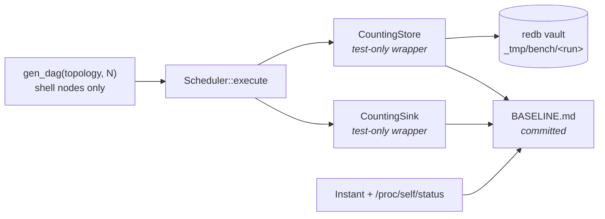

# pidag — spec-30: Performance baseline harness — measure before optimising

- **Project**: `/projects/pidag`
- **Crate**: `pidag`
- **Priority**: HIGH — prerequisite. Without it, specs for the runtime and scheduler work
  are unfalsifiable: "faster" becomes an assertion rather than a measurement.
- **Status**: PLANNED
- **Depends-On**: nothing.
- **Blocks**: the off-runtime-blocking phase and the index-identity phase. Both claim large
  throughput wins; neither can be accepted without a before/after number.
- **Source**: the 2026-08-12 codebase audit (findings P0-2, P0-3, P1-1 through P1-8).

> **Execution context: entirely inside the `pidag-runner` container**, in `/projects/pidag`.
> No rebuild, no `make deploy`, no lnx involvement. See spec-28 for the three-machine map.

---

## Overview

The audit found eight performance defects, several claiming order-of-magnitude impact:
`Dag::get_node` is an O(n) scan called O(n) times; every store write is a synchronous fsync
on a Tokio worker thread; a `NodeDone` event costs four durable commits; the event sink is a
single global mutex held across that I/O.

Every proposed fix is plausible. **None is currently measurable.** This project's history is
specifically a history of plausible-sounding claims that turned out wrong — "parallel
linking is the bottleneck" was diagnosed, acted on, and later found to be false; the real
cause was process-table exhaustion. A performance change accepted on reasoning alone would
repeat that.

**The key enabling fact: this can be measured for zero LLM tokens.** A DAG made entirely of
`type = "shell"` nodes exercises the full scheduler, ready queue, gate/`after` logic, event
pipeline and redb store at any width — with no model call anywhere. Cost is CPU time, not
API spend.

This spec delivers the harness and a recorded baseline. It changes **no** production code.

---

## Requirements

### Functional

- **B1 (synthetic DAG generator)**: a helper that builds a `Dag` of N shell nodes in a
  chosen topology, with no LLM nodes and no `pi` invocation. Required topologies:
  - `wide` — N independent nodes, no edges. Isolates dispatch and event throughput.
  - `chain` — N nodes in a single dependency line. Isolates per-completion bookkeeping;
    this is the shape where O(n²) node lookup bites hardest.
  - `sdd_like` — N/3 iterations of the implement → quality-gate → validate shape, using
    real `after` edges and a `gate`. Represents actual workload.
  Each node's command must be trivial and deterministic (`true`, or an `echo`), so the
  measurement reflects pidag's overhead and not the child's work.

- **B2 (the benchmark binary)**: `benches/scheduler_bench.rs` **or** an ignored test
  (`#[ignore]`) — see the Architecture note. It runs each topology at N ∈ {50, 200, 500}
  and reports, per run: wall-clock duration, peak RSS, node count, and the counts in B3.

- **B3 (store and event instrumentation)**: the harness reports
  - number of redb **write transactions** committed,
  - number of **events emitted**,
  - total **bytes written** to the vault.
  These are the numbers the store and event-pipeline work will move. Wall-clock alone is too
  noisy on a shared container to prove those changes.
  **Instrumentation must be test-only** — a counter behind `#[cfg(test)]`, a wrapper
  `Store` implementation, or a debug-only atomic. It must not add a field, a branch, or an
  allocation to the production path.

- **B4 (a committed baseline record)**: `benches/BASELINE.md`, checked in, recording for
  every topology × N: the measured numbers, the date, the commit hash, and the host
  (container, CPU count, whether the box was otherwise idle). Without the host recorded the
  numbers are not comparable later.

- **B5 (repeatability)**: three consecutive runs of the same configuration must agree within
  **±20 %** on wall-clock and **exactly** on the transaction/event counts. If wall-clock
  cannot meet that on this box, say so in `BASELINE.md` and treat the counters as the
  primary metric — they are deterministic and immune to noise.

- **B6 (a documented invocation)**: one command, recorded in `BASELINE.md`, that reproduces
  the whole baseline. A benchmark nobody can re-run is a screenshot.

### Non-Functional

- **N1**: **Zero production code changes.** `git diff` must touch only `benches/`, `tests/`,
  and `Cargo.toml` (for a `[[bench]]` entry or `dev-dependencies`). If measuring something
  requires a production change, STOP and report — that is a spec revision, not a licence.
- **N2**: **Zero LLM tokens and zero `pi` invocations.** No node in any generated DAG may be
  an LLM node. Assert this in a test (B7 below).
- **N3**: The benchmark must not run as part of `bash deploy/scripts/quality-gate.sh .`.
  The gate already takes minutes; a 500-node benchmark in it would make the common path
  worse. Use `benches/` (which `cargo test` does not run) or `#[ignore]`.
- **N4**: Writes go under `_tmp/`, never `/tmp/`. Each run uses a fresh vault directory so
  numbers are not polluted by a prior run's rows.
- **N5**: No new runtime dependencies. A dev-dependency for the harness is acceptable, but
  prefer `std::time::Instant` and reading `/proc/self/status` for RSS over pulling in a
  benchmark framework.

---

## Architecture



**Key decision — instrument by wrapping, not by editing.** `CountingStore` implements the
existing `Store` trait, delegates to `RedbStore`, and increments atomics. `CountingSink`
does the same for `EventSink`. Both live in the harness. This satisfies N1 absolutely: the
production types are untouched, and the counters cannot drift into the shipping binary.

**Key decision — `benches/` over `#[ignore]`d tests.** `cargo test` does not build or run
`benches/`, which satisfies N3 without relying on anyone remembering `--ignored`. If a
`[[bench]]` target proves awkward without a framework, an `#[ignore]`d test in
`tests/perf_baseline.rs` is an acceptable fallback — but then N3 must be verified explicitly,
because an accidentally un-ignored test silently adds minutes to every gate run.

**Key decision — counters are the primary metric.** Wall-clock on a shared container with a
volume at 85 % is noisy. Write-transaction and event counts are deterministic: they will not
vary between runs, and they are precisely what the store and pipeline changes target. A
change that cuts write transactions per `NodeDone` from four to one is *provable* even if
wall-clock is in the noise.

**Explicit non-goal**: this spec does not optimise anything. It must not "fix while
measuring". Any temptation to fix a hot spot found here belongs in its own spec — otherwise
the baseline is taken against already-modified code and measures nothing.

---

## TDD Contract

| id | test | given | expects |
|----|------|-------|---------|
| B1a | `test_gen_wide_has_no_edges` | `gen_dag(Wide, 50)` | 50 nodes, every `depends_on` and `after` empty, `dag.validate()` Ok |
| B1b | `test_gen_chain_is_linear` | `gen_dag(Chain, 50)` | node *i* depends on *i-1*; node 0 has no deps; `dag.validate()` Ok |
| B1c | `test_gen_sdd_like_shape` | `gen_dag(SddLike, 9)` | 3 iterations; each `validate-*` has two `after` entries; each gated node carries a `gate`; `dag.validate()` Ok |
| B7 | `test_generated_dags_contain_no_llm_nodes` | all three topologies at N=50 | every node has `node_type == Some("shell")` and an empty `models` list — **guards N2, the zero-token guarantee** |
| B3a | `test_counting_store_counts_write_txns` | `CountingStore` wrapping a real store, 3 `put_run` calls | write counter == 3 |
| B3b | `test_counting_sink_counts_events` | `CountingSink`, a run over `gen_dag(Wide, 10)` | event counter equals the emitted event count; ≥ 1 per node |
| B5 | `test_counters_are_deterministic` | `gen_dag(Chain, 50)` executed twice with fresh vaults | both runs report **identical** write-txn and event counts |
| N3 | `test_benchmark_excluded_from_gate` | the gate script and bench target | `cargo test` does not execute the benchmark — assert the bench lives under `benches/`, or that the perf test carries `#[ignore]` |

Note B3b and B5 execute a real scheduler run and so are slower than a unit test; keep N small
(≤ 50) in the TDD tests. The large-N runs belong to the benchmark, not the suite.

---

## Exit Criteria

```bash
cd /projects/pidag

# N1 — no production code touched
! git diff --name-only | grep -qE '^src/'

# B2/N3 — the benchmark exists and the gate does not run it
test -f benches/scheduler_bench.rs || test -f tests/perf_baseline.rs
bash deploy/scripts/quality-gate.sh .          # must still pass, and must not run the bench

# B4 — the baseline is recorded and specific
test -f benches/BASELINE.md
grep -qE '\b(wide|chain|sdd_like)\b' benches/BASELINE.md
grep -qE '\b(50|200|500)\b'          benches/BASELINE.md
grep -q  'write transactions'        benches/BASELINE.md
grep -q  'events'                    benches/BASELINE.md
git log -1 --format=%H | cut -c1-7 | xargs -I{} grep -q {} benches/BASELINE.md   # commit recorded

# B6 — the documented command actually reproduces it
grep -qE 'cargo (bench|test)' benches/BASELINE.md

# N2 — no pi processes were spawned during the benchmark
# (run the bench, then confirm; requires procps)
pgrep -f 'mode rpc' || echo "no pi processes — expected"
```

**Prose criteria**:

1. `benches/BASELINE.md` records, for each of the nine topology × N combinations: wall-clock,
   peak RSS, write-transaction count, event count, and vault bytes. Report the **raw** table;
   do not summarise it into an average.
2. The recorded write-transaction count for the `sdd_like` topology is stated **per
   `NodeDone` event**, not only in total — that is the specific number the store work must
   reduce, and the audit predicts it is 4. **If it is not 4, say so** — the audit finding
   would then be wrong and must be corrected before the store spec is written.
3. Three consecutive runs are reported, showing wall-clock spread and identical counters
   (B5). If wall-clock spread exceeds ±20 %, state that plainly and record why the counters
   are the primary metric.
4. The host is recorded: CPU count, container, whether anything else was running. A number
   without a host is not a baseline.
5. `git diff --stat` shows no file under `src/`.

---

## Guardrails

- **G1 — never modify `/projects/_upstream/`.** Read-only reference on the user's own fork
  and active branch.
- **G2 — no `Co-Authored-By:` trailer; never mention Claude, Anthropic or any AI tool in a
  commit message.**
- **G3 — NO WORKHORSE MAY COMMIT.** Leave everything in the working tree; the architect
  commits after reading the diff. (CLAUDE.md hard rule 8.)
- **G4 — NEVER modify any file under `specs/`.** If this spec is wrong or unachievable,
  **stop and report**; the architect amends it. (CLAUDE.md hard rule 7.)
- **G5 — DO NOT OPTIMISE ANYTHING.** This spec measures. If you find a hot spot, **write it
  down in the report** and leave the code alone. A baseline taken against code you just
  changed measures nothing, and the whole point of this spec is to make the next phase
  falsifiable.
- **G6 — do not add instrumentation to production types.** No counter field on `RedbStore`,
  no branch in `Scheduler::execute`. Wrap, don't edit (N1).
- **G7 — no LLM nodes, no `pi` invocation, no network.** If a benchmark seems to need a real
  model, it is measuring the wrong thing.
- **G8 — never `rm -rf` a `.pidag/` directory.** Bench vaults live under `_tmp/`; those may
  be removed freely, but nothing outside `_tmp/`.
- **G9 — do not add the benchmark to the quality gate** (N3). The gate is already minutes
  long and is run on every verification round.
- **G10 — report raw output, never summed totals.** Paste every `^test result:` line and the
  full benchmark table verbatim.
- **G11 — clippy clean at `-D warnings`**; the gate enforces it.

### Error handling expectations

- If the box is too loaded for a stable wall-clock, **report that** and record the counters;
  do not quietly run until a nice-looking number appears.
- If disk headroom on `/projects` drops below 5 GB during a run, abort and report. This
  volume has hit 100 % before and taken other services down with it.
- If any generated DAG fails `dag.validate()`, that is a **finding about the generator**, not
  something to work around by loosening the topology.

---

## Files to Modify

| File | Change |
|------|--------|
| `benches/scheduler_bench.rs` | **NEW** — generator, counting wrappers, the three topologies, N sweep, reporting |
| `benches/BASELINE.md` | **NEW** — committed baseline record (B4) |
| `tests/perf_harness_tests.rs` | **NEW** — the TDD Contract rows above |
| `Cargo.toml` | `[[bench]]` entry and/or dev-dependencies, if required |

**Not modified**: anything under `src/`, `specs/`, `deploy/`.

## Memory

Store on completion: `workspace/specs/pidag-30-performance-baseline-harness`,
`claude-pi-delegation/experiment/20260812-scheduler-baseline`.
