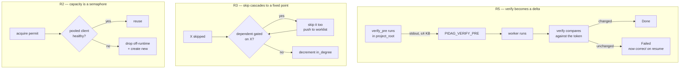

# pidag — spec-31: Correctness phase 1 — recovery integrity, run fencing, pool bounds

- **Project**: `/projects/pidag`
- **Crate**: `pidag`
- **Priority**: P0 — R5 is a correctness hole in the self-healing loop that **fails open**,
  marking work `Done` that never happened.
- **Status**: PLANNED
- **Source**: the 2026-08-12 codebase audit — findings R-1, R-2, R-3, P0-1, P0-5, P0-6.
- **Depends-On**: nothing. Independent of spec-30 (baseline harness).
- **Deliberately excluded**: every performance finding. This spec changes behaviour that is
  *wrong*, not behaviour that is *slow*. Mixing the two makes both unverifiable.

> **Execution context: entirely inside the `pidag-runner` container**, in `/projects/pidag`.
> The installed binary was rebuilt from `762d522` on 2026-08-11 13:49 and is current. No
> `make deploy`, no image rebuild. See spec-28 for the three-machine map.

---

## Overview

Five defects, unrelated in mechanism, united by consequence: each lets pidag report success
for something that did not happen, or lets two actors collide unnoticed.

**R5 is the reason this spec exists.** Every `implement-iter*` node carries
`verify = "git diff --quiet && exit 1 || exit 0"` — which passes **if and only if the working
tree is dirty**. Its entire purpose (spec-23) is catching a worker that claims success while
changing nothing. On resume that predicate is *already satisfied*, because a crashed
implement node leaves exactly the dirt it tests for. A resumed node that does nothing at all
still verifies green, is marked `Done`, and satisfies the gate. The guarantee that exists to
detect empty work is void in precisely the scenario recovery exists to handle.

The other four:

- **R1** — `pidag workflows` prints usage instead of listing workflows. spec-26's own exit
  criterion `pidag workflows | grep -q research` fails against the shipped binary. Verified
  live 2026-08-11.
- **R2** — the pi client pool's capacity check declines to increment a counter and then
  creates a client anyway; `created` is never decremented. The cap is decorative.
- **R3** — the gate-skip cascade propagates exactly one level, by its own admission
  ("single level covers the shallow SDD graph"). spec-26 exists so pidag can run any graph.
- **R4** — `PidLock` is implemented, tested, and never called by `run` or `sdd`. Two
  concurrent resumes of the same run dispatch the same nodes into the same tree.

**R1 and R4 share a shape worth naming**: both are complete, unit-tested implementations that
nothing calls. That is spec-18's defect exactly, where `PiBackend` was finished, tested, and
unreachable. No test in this repo invokes a CLI entry point.

---

## Requirements

### R1 — `pidag workflows` lists workflows

- **R1.1**: `pidag workflows` with **no arguments** lists available workflows. The current
  guard at `src/cli/workflows.rs:6` treats an empty argument list as a help request, so the
  listing branch is unreachable through the documented invocation.
- **R1.2**: `pidag workflows --help` and `-h` still print usage.
- **R1.3**: `pidag workflows show <name>` is unchanged.
- **R1.4**: an **unrecognised** subcommand (`pidag workflows bogus`) is an **error** naming
  the unknown argument, exiting non-zero. Today any junk argument silently lists — that is
  the bug's mirror image and should not be preserved.
- **R1.5 (the part that matters beyond this one command)**: extract argument dispatch into a
  pure, testable function returning an enum:

  ```rust
  enum WorkflowsCommand { List, Help, Show(String), Unknown(String) }
  fn parse_args(args: &[String]) -> WorkflowsCommand
  ```

  The defect is entirely in dispatch, so testing dispatch covers the defect class without
  plumbing stdout capture through the test suite. Printing stays in the caller.

### R2 — the client pool enforces its capacity

- **R2.1**: replace the hand-rolled `created`/`capacity` counter with a
  `tokio::sync::Semaphore` sized to capacity. A permit is acquired before a client is
  created or reused, and **held for the session's lifetime** — released when `PiSession` is
  closed or dropped. Store the `OwnedSemaphorePermit` on `PiSession`.
- **R2.2**: the `created` field is **deleted**. It cannot be maintained correctly — nothing
  decrements it — and a semaphore expresses the invariant directly.
- **R2.3**: when at capacity, `acquire_client` **waits** for a permit. It must not create an
  extra client and must not error; the scheduler's own concurrency limit is what bounds the
  queue.
- **R2.4**: the health check moves **outside** the pool mutex. Today `is_client_healthy`
  performs a `get_state()` RPC round-trip while the mutex is held, serialising every
  concurrent acquire behind it. Pop a candidate under the lock, release, then health-check.
- **R2.5 (the one performance item pulled forward, because it is in the code being changed)**:
  drop an unhealthy client off the runtime — `tokio::task::spawn_blocking(move || drop(c))`.
  Upstream's `Drop for RpcTransportClient` calls `shutdown()`, which does `kill()` then a
  **blocking `child.wait()`**; on a Tokio worker thread that stalls the thread until the
  child dies. **If `RpcTransportClient` is not `Send + 'static`, stop and report** — do not
  work around it. Everything else in P0-2 stays out of this spec.

### R3 — the gate-skip cascade is transitive

- **R3.1**: replace the one-level unrolling at `src/scheduler/execute.rs:598` with a worklist
  drained to a fixed point. Skipping node *X* must release *X*'s dependents, and any
  dependent that is itself skipped must release **its** dependents, without depth limit.
- **R3.2**: the skip rule is unchanged, only its reach. A node *D* with
  `gate = "<X>:fail"` is the fix node for *X*: it **runs** when *X* failed and is **skipped**
  (recorded as a no-op `Done`) when *X* succeeded or was itself skipped.
- **R3.3**: define the operation precisely. `mark_skipped(node)`:
  1. record the node `Done` with `attempts: 0`, mark terminal, emit `NodeDone`;
  2. for each `after`-dependent: decrement `after_pending`, try-enqueue at zero;
  3. for each `depends_on`-dependent *D*: if `D.gate == "<node>:fail"` then
     `mark_skipped(D)` (push to the worklist); otherwise decrement `in_degree` and
     try-enqueue at zero.
- **R3.4**: a node already terminal is never re-processed — the worklist must not loop.
  `dag.validate()` rejects cycles, but the worklist must be robust to a repeated push.

### R4 — a run is fenced against concurrent execution

- **R4.1 — CORRECTED 2026-08-12, read this before implementing.** The lock is taken in
  **`src/cli/run.rs` ONLY**. It must **NOT** be taken in `src/cli/sdd.rs`.

  The original wording said both, which would deadlock every SDD run.
  `pidag sdd --run` does not execute the scheduler itself: it spawns `pidag run` as a
  **subprocess** with the same `--run-id` (`src/cli/sdd.rs:206-214`). If the parent held the
  lock, the child would be refused it, and `PidLock::acquire` returns `Ok(None)` meaning
  "a live owner exists, stand down" — so every `pidag sdd --run` would abort immediately.

  `run.rs` is the process that opens the vault and runs the scheduler, so locking there
  fences both entry points. `sdd` inherits the fencing through its child.

  **If you find any other path that executes a scheduler without going through
  `run.rs` — stop and report it.** That is a gap in this analysis, not something to patch
  around.
- **R4.2**: the lock is **per `run_id`**, not per vault — e.g.
  `<vault_dir>/.locks/<run_id>.pid`. A vault-wide lock would prevent `pidag ui` from serving
  while a run executes, and prevent two *different* runs in one project. Both are legitimate
  and must keep working.
- **R4.3**: failure to acquire is a clear error naming the holding PID and the run id,
  exiting non-zero. `PidLock::acquire` already reclaims stale holders; that behaviour is
  inherited, not reimplemented.
- **R4.4**: the lock is released on normal exit and on error. `PidLock`'s existing `Drop`
  covers this.

### R5 — verify measures a delta, not a state

- **R5.1 (new engine primitive)**: add `verify_pre: Option<String>` to `Node`. When present,
  the scheduler runs it as a shell command in `project_root` **before** dispatching the node,
  captures its **stdout**, and exposes that value to the `verify` command as the environment
  variable `PIDAG_VERIFY_PRE`.
- **R5.2**: the engine stays domain-agnostic. It runs an arbitrary command and passes an
  opaque string; it must **not** know about git, hashes, or working trees. The template
  decides what the token means. (spec-26 N2 in spirit: the scheduler must stay ignorant of
  what a quality gate is.)
- **R5.3**: captured stdout is trimmed of trailing whitespace and **capped at 4 KB**. A
  larger value is truncated, since it becomes an environment variable.
- **R5.4**: if `verify_pre` exits non-zero, the node **fails** before dispatch with an error
  naming the node and the command's output. A baseline that cannot be established must not
  silently degrade into "no baseline", because that reproduces exactly the bug being fixed.
- **R5.5 (backward compatibility)**: `verify_pre` absent ⇒ `PIDAG_VERIFY_PRE` unset ⇒ every
  existing `verify` command behaves exactly as today. Existing DAG JSON parses unchanged
  (`#[serde(default)]`).
- **R5.6 (the template fix)**: `src/workflow/templates/sdd.toml` uses the new primitive on
  every implement node:

  ```toml
  verify_pre = "git status --porcelain | sha256sum"
  verify     = "test \"$(git status --porcelain | sha256sum)\" != \"$PIDAG_VERIFY_PRE\""
  ```

  This asserts the tree changed **during this node**, which is what spec-23 always meant.
  On resume the baseline is recomputed at re-dispatch, so a prior attempt's dirt is folded
  into the baseline and the node must make a *new* change to pass — which also gives R-1 its
  side-effect fence.
- **R5.7**: `tests/fixtures/sdd_golden.json` **will change** as a result of R5.6. That is an
  intentional, reviewed fixture update, exactly as spec-27 R9 requires. Regenerate it and
  **state in the report what changed** — do not update it silently.

### Non-Functional

- **N1**: no performance work beyond R2.4 and R2.5. If a change looks like an optimisation,
  it belongs to a later phase.
- **N2**: existing DAG JSON and `pidag run` behave identically for DAGs without
  `verify_pre` (R5.5).
- **N3**: no new runtime dependencies.
- **N4**: tests writing files use `_tmp/`, never `/tmp/`.
- **N5**: the quality gate stays green — currently **437 passed / 0 failed / 1 ignored**
  across 35 binaries. The count may only go **up**.

---

## Architecture



**Key decision — R5 adds a field, not a mode.** The alternative was a `verify_mode` enum
teaching the engine about "delta" semantics. Passing an opaque token through an environment
variable keeps the engine ignorant: it runs a command, keeps a string, sets a variable. All
meaning lives in the template, which is where spec-26 put topology and where this belongs
too.

**Key decision — the lock is per run id, not per vault.** Coarser locking would be simpler
and would break two workflows that currently work: the UI serving during a run, and two
different runs in one project. Correctness must not cost either.

**Key decision — the semaphore replaces the counter rather than fixing it.** `created` has no
correct maintenance point: clients leave the pool by being dropped, poisoned, or closed, and
threading a decrement through all three is how the bug returns. A permit's lifetime is the
session's lifetime, enforced by the type system.

**Explicitly deferred to later phases**: `spawn_blocking` for the store and for pi RPC
generally (P0-2), one-transaction-per-event (P0-3), surfacing store write failures (P0-4),
index-based node identity, typed node state. R2.5 is the single exception and only because
it is inside code this spec already rewrites.

---

## Delegation stages

Implement and gate in this order. Do not begin a stage until the previous one is green.

| stage | contents | why grouped |
|---|---|---|
| **A** | R1, R4 | Small, independent, no scheduler contact. Both are "implemented but never called" defects. |
| **B** | R2, R3 | Backend and scheduler. Independent of each other but both need careful concurrency review. |
| **C** | R5 | New engine field, template change, golden-fixture regeneration. Largest blast radius, done last against a green tree. |

---

## TDD Contract

Every row is a distinct `#[test]`. Names must match exactly.

| id | test | given | expects |
|----|------|-------|---------|
| R1a | `test_workflows_no_args_lists` | `parse_args(&[])` | `WorkflowsCommand::List` — **fails against current code**, which returns Help |
| R1b | `test_workflows_help_flag_is_help` | `["--help"]`, `["-h"]` | `Help` for both |
| R1c | `test_workflows_show_parses_name` | `["show", "sdd"]` | `Show("sdd")` |
| R1d | `test_workflows_show_without_name_errors` | `["show"]` | `Unknown` or a documented error variant — not a panic |
| R1e | `test_workflows_unknown_subcommand_errors` | `["bogus"]` | `Unknown("bogus")`, **not** `List` |
| R2a | `test_pool_never_exceeds_capacity` | capacity 2, 5 concurrent acquires, no pooled clients | at most 2 clients exist simultaneously; the other 3 wait — **fails against current code** |
| R2b | `test_permit_released_on_session_drop` | capacity 1; acquire, drop, acquire again | the second acquire succeeds without waiting indefinitely |
| R2c | `test_created_field_is_gone` | source scan of `src/backend/pi.rs` | no `created` field remains (R2.2) |
| R2d | `test_health_check_not_under_pool_lock` | source scan | `is_client_healthy` is not called inside the `pool.lock()` scope (R2.4) |
| R3a | `test_skip_cascades_two_levels` | chain: `A` → gated `B` (`A:fail`) → gated `C` (`B:fail`), `A` succeeds | **both** `B` and `C` recorded `Done` with `attempts: 0`; run completes; no node left Pending — **fails against current code** |
| R3b | `test_skip_cascade_releases_after_edges` | as R3a plus `D` with `after = ["C"]` | `D` dispatches |
| R3c | `test_skip_cascade_terminates` | skipped node whose dependent is already terminal | no infinite loop; run completes |
| R4a | `test_second_run_same_id_is_refused` | lock held for `run_id` | second acquire refused, error names the run id and holder PID |
| R4b | `test_different_run_ids_both_proceed` | two distinct run ids, same vault | both acquire — guards R4.2 |
| R4c | `test_lock_released_after_run` | run completes | lock file released; a fresh run with the same id proceeds |
| R5a | `test_verify_pre_absent_behaves_as_before` | node with `verify` and no `verify_pre` | identical to today; `PIDAG_VERIFY_PRE` unset (R5.5) |
| R5b | `test_verify_pre_exposed_as_env` | `verify_pre = "echo TOKEN123"`, `verify` asserting `$PIDAG_VERIFY_PRE` equals `TOKEN123` | node `Done` |
| R5c | `test_verify_pre_output_capped` | `verify_pre` emitting > 4 KB | value truncated to 4 KB (R5.3) |
| R5d | `test_verify_pre_failure_fails_node` | `verify_pre = "exit 3"` | node `Failed` before dispatch; error names the node (R5.4); the worker never ran |
| **R5e** | `test_dirty_tree_at_start_does_not_satisfy_verify` | a temp git repo made dirty **before** the node runs; node does nothing; sdd-style `verify_pre`/`verify` | node **Failed** — **this is the R-2 regression test and it must fail against the current template.** Confirm and report that failure before fixing. |
| R5f | `test_new_change_on_dirty_tree_passes` | same repo, already dirty; node makes an **additional** change | node `Done` — the fix must not make legitimate resume-and-repair impossible |
| N2 | `test_existing_dag_json_without_verify_pre_parses` | a DAG JSON fixture with no `verify_pre` | parses; field defaults to `None` |

**R5e and R5f are the pair that matters.** R5e proves the hole is closed; R5f proves it was
closed without breaking the legitimate case. A fix that passes R5e by rejecting all dirty
trees would break real recovery — that is why both exist.

---

## Exit Criteria

```bash
cd /projects/pidag

# R1 — spec-26 W6's own criterion, which currently FAILS
pidag workflows | grep -q research
pidag workflows | grep -q sdd
pidag workflows bogus 2>&1 >/dev/null; test $? -ne 0        # unknown arg errors
pidag workflows --help | grep -q USAGE

# R2 — the counter is gone, a semaphore replaces it
! grep -n 'created' src/backend/pi.rs
grep -q 'Semaphore' src/backend/pi.rs

# R3 — no one-level unrolling comment survives
! grep -n 'single level' src/scheduler/execute.rs

# R4 — the lock is taken in run.rs ONLY (sdd shells out to it; locking both deadlocks)
grep -q 'PidLock' src/cli/run.rs
! grep -q 'PidLock' src/cli/sdd.rs

# R5 — the primitive exists and the template uses it
grep -q 'verify_pre' src/core/dag.rs
grep -q 'PIDAG_VERIFY_PRE' src/scheduler/execute.rs
grep -q 'verify_pre' src/workflow/templates/sdd.toml
grep -q 'PIDAG_VERIFY_PRE' src/workflow/templates/sdd.toml
jq -e '.nodes[] | select(.id=="implement-iter1") | .verify_pre' tests/fixtures/sdd_golden.json

# full gate
bash deploy/scripts/quality-gate.sh .
```

**Prose criteria**:

1. `cargo test` reports **≥ 437 passed, 0 failed** across ≥ 35 binaries. Paste every
   `^test result:` line raw; do not sum them.
2. **R5e was confirmed to fail before the fix**, and its failure output is quoted in the
   report. A regression test that passes before the change proves nothing — this is the
   third time on this project that this has mattered.
3. **R2a and R3a were likewise confirmed to fail first.** Both target defects that exist in
   the current code; if either passes unchanged, the test does not reach the defect.
4. The golden fixture diff is **shown and explained** — which nodes gained `verify_pre` and
   why (R5.7).
5. `git diff --stat` touches no file under `specs/` and none under `/projects/_upstream/`.
6. `pidag workflows` output is pasted verbatim, showing both `research` and `sdd`.

---

## Guardrails

- **G1 — NEVER modify any file under `specs/`.** Specs are architect-owned. If this spec is
  wrong, incomplete or self-contradictory, **stop and report**; the architect amends it.
  (CLAUDE.md hard rule 7. This has already been valuable three times on specs 27 and 28.)
- **G2 — NO WORKHORSE MAY COMMIT.** Leave everything in the working tree; the architect
  commits after reading the diff. (CLAUDE.md hard rule 8.)
- **G3 — NEVER modify `/projects/_upstream/`.** Read-only reference on the user's own fork
  and active branch. If `RpcTransportClient` lacks something R2.5 needs, **work around it on
  pidag's side or report** — do not add to the SDK.
- **G4 — no `Co-Authored-By:` trailer; never mention Claude, Anthropic or any AI tool in a
  commit message.**
- **G5 — do NOT edit a test to make a failure disappear.** If a pre-existing test fails, the
  implementation is wrong. Report it. The only fixture change authorised anywhere in this
  spec is the golden regeneration required by R5.7, and it must be explained.
- **G6 — do NOT weaken `verify` to make R5e pass.** Deleting the predicate, or making it
  always succeed, satisfies the letter of R5e and destroys the guarantee. R5f exists to
  catch that; if R5f fails, the R5e fix is wrong.
- **G7 — do NOT take a vault-wide lock** (R4.2). It would break the UI serving during a run.
- **G7b — do NOT add a lock to `src/cli/sdd.rs`** (R4.1). It spawns `pidag run` with the same
  run id; locking both ends deadlocks every SDD run. Verify your change by actually invoking
  `pidag sdd` against a trivial spec — a unit test will not catch a cross-process deadlock.
- **G8 — do NOT pull in further performance work.** R2.4 and R2.5 are the entire licence;
  `spawn_blocking` for the store, event batching and index identity are later phases.
- **G9 — never `rm -rf` a `.pidag/` directory.** `mv .pidag .pidag.prev-$(date +%H%M%S)`.
- **G10 — install to BOTH** `/root/.local/bin/pidag` and `/projects/.local/bin/pidag` if a
  binary is rebuilt for the R1 exit criteria. `/root` shadows `/projects` on PATH.
- **G11 — report raw output, never summed totals.** Paste every `^test result:` line.
- **G12 — clippy clean at `cargo clippy -p pidag -- -D warnings`**, never `--all-targets`
  (13 pre-existing test-file errors, out of scope — audit P8).

### Error handling expectations

- `verify_pre` failure ⇒ node `Failed` with the command's stderr/stdout as the artifact,
  before the worker is invoked (R5.4). Never a silent skip.
- Lock acquisition failure ⇒ non-zero exit with a message naming the run id and holder PID.
  Never a silent proceed.
- Pool at capacity ⇒ wait. Never an extra client, never an error (R2.3).
- A skipped node's cascade must never leave a node permanently `Pending`. If the worklist
  terminates with un-dispatched non-terminal nodes, that is a bug in R3, not an acceptable
  outcome.

---

## Files to Modify

| stage | File | Change |
|---|------|--------|
| A | `src/cli/workflows.rs` | extract `parse_args` + `WorkflowsCommand`; fix the empty-args guard; error on unknown (R1) |
| A | `src/cli/run.rs` | acquire per-run `PidLock` for the run's lifetime (R4). **`src/cli/sdd.rs` is NOT modified** — it spawns `pidag run`, so locking both self-deadlocks |
| A | `tests/cli_workflows_tests.rs` | **NEW** — R1a–R1e |
| A | `tests/run_locking_tests.rs` | **NEW** — R4a–R4c |
| B | `src/backend/pi.rs` | semaphore replaces `created`/`capacity`; health check outside the mutex; off-runtime drop (R2) |
| B | `src/scheduler/execute.rs` | worklist-based transitive skip cascade (R3) |
| B | `tests/pi_backend_tests.rs` | R2a–R2d |
| B | `tests/scheduler_tests.rs` | R3a–R3c |
| C | `src/core/dag.rs` | `verify_pre: Option<String>` with `#[serde(default)]` (R5.1) |
| C | `src/scheduler/execute.rs` | run `verify_pre` pre-dispatch, capture stdout, export `PIDAG_VERIFY_PRE` to `verify` (R5.1–R5.4) |
| C | `src/workflow/templates/sdd.toml` | delta-based verify on implement nodes (R5.6) |
| C | `tests/fixtures/sdd_golden.json` | regenerate — **explained, not silent** (R5.7) |
| C | `tests/effect_verify_tests.rs` | R5a–R5f, N2 |

**Not modified**: anything under `specs/`, `deploy/`, `/projects/_upstream/`.

## Memory

Store on completion: `workspace/specs/pidag-31-correctness-phase-1`,
`claude-pi-delegation/fix/20260812-verify-delta-not-state`.
