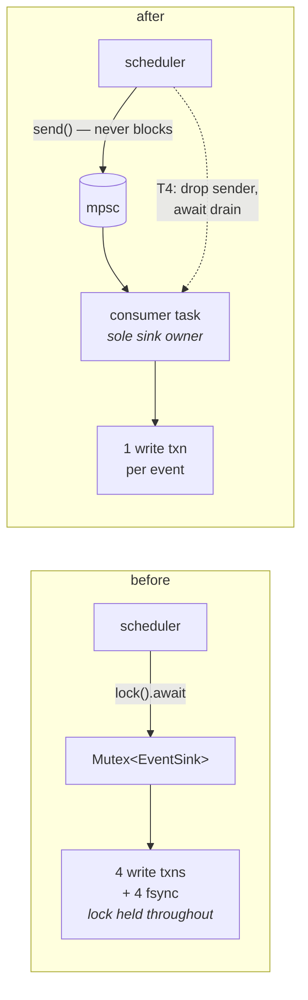

# pidag — spec-32: Store and event pipeline — one transaction per event, and stop swallowing failures

- **Project**: `/projects/pidag`
- **Crate**: `pidag`
- **Priority**: HIGH — P0-4 is a correctness defect (a run reports success while its only
  record silently failed to write). The rest is throughput.
- **Status**: PLANNED
- **Source**: 2026-08-12 codebase audit — P0-3, P0-4, P1-2, P1-6, P1-7, S-6.
- **Depends-On**: **spec-30 (baseline harness) must have run first.** Its measured
  write-transactions-per-`NodeDone` is the number this spec moves; without a before figure
  the acceptance criterion is unfalsifiable.

> **Execution context: entirely inside the `pidag-runner` container**, in `/projects/pidag`.
> No rebuild needed to develop. Note `pidag sdd --run` now resolves `current_exe()`
> (audit S-7, fixed `00c4a77`), so a stale install no longer silently shadows a rebuild.

---

## Overview

`RedbSink::emit` turns one logical state change into four durable commits and two read
transactions, executed synchronously while the global event-sink mutex is held:

```
append_event()        write txn + fsync
put_node_state()      write txn + fsync
put_artifact()        write txn + fsync
get_node_timing()     read txn
put_node_timing()     write txn + fsync
```

Every one is `async fn` wrapping fully synchronous redb, and redb's `WriteTransaction`
defaults to `Durability::Immediate` — `commit()` fsyncs before returning. So a `NodeDone`
parks a Tokio worker thread on four disk syncs while no other event can be emitted.

Worse, **every one of those writes discards its error**. The projection path is built from
`let _ = self.store.put_…().await;` — 12 such discards in `core/event.rs`, 6 more in
`redb_store.rs`. If the vault is full, locked or corrupt, all writes fail silently, the run
completes, and `DagDone` reports success. `.pidag/` is described in this project's own rules
as "the only record of a run", and the code cannot tell you when it stopped being one.

The durability comment at `redb_store.rs:52` justifies the design with "throughput cost is
irrelevant for pidag's ~1-event-per-node workload". That premise is wrong by roughly 4×, and
it was written before the projection logic grew.

**This spec does not touch `spawn_blocking`.** Getting synchronous work off the runtime is
the next phase and a larger change; conflating them would make both unmeasurable.

---

## Requirements

### Functional

- **T1 (one transaction per event)**: projecting a single event performs **exactly one**
  redb write transaction. The read-modify-write of `node_timing` joins that same
  transaction, which also removes a lost-update race between concurrently finishing nodes.
  Target: `sdd_like` write-transactions-per-`NodeDone` drops from the spec-30 baseline
  (predicted 4) to **1**.

- **T2 (write failures are visible)**: a failed vault write is **counted and surfaced**.
  There are **12** discarded results in `src/core/event.rs`, not 2 — ten are wrapped by
  rustfmt as `let _ = self` on one line and `.store.put_...()` on the next. Every one must
  go; matching only the single-line form leaves the defect substantially intact.
  Add a `store_write_failures: usize` to `RunReport`; a non-zero value must appear in
  `pidag show` output and in the `DagDone` path. A run whose vault rejected writes is
  **degraded, not successful** — today it is indistinguishable from a clean run.
  Individual writes may still be non-fatal (a run should not abort because one artifact
  failed to store), but silence is not acceptable.

- **T3 (emission does not block scheduling)**: replace the shared
  `Arc<Mutex<Box<dyn EventSink>>>` with an unbounded `mpsc` channel. The scheduler `send`s
  and moves on; a single consumer task owns the sink. The scheduler must never await disk
  I/O.
  **Ordering must be preserved** — events are a log, and a reordered log is worse than a
  slow one. A single consumer over an ordered channel gives this for free; do not introduce
  concurrency inside the consumer.

- **T4 (the run waits for the log)**: `execute` must not return until the consumer has
  drained. Drop the sender, await the consumer's join handle, and only then build
  `RunReport`. Otherwise a fast run exits with events still queued and the vault is missing
  its tail — trading a visible bug for an invisible one.

- **T5 (buffered JSONL)**: `JsonlSink` wraps its writer in a `BufWriter` and flushes on a
  timer or at drain, not per line. Per-event `flush()` forfeits all buffering; this project
  has already produced a 900 MB event log, so volume is not hypothetical.

- **T6 (stop cloning every event per sink)**: `CompositeSink::emit` clones the `Event` for
  each child. Take `&Event` in the trait, or pass an `Arc<Event>`. Events carrying a node's
  full output make this material.

- **T7 (correct the stale comment)**: `redb_store.rs:52` states the throughput cost is
  irrelevant at ~1 event per node. Replace it with the measured per-event transaction count
  and the reason durability is still `Immediate`. A wrong comment on a performance decision
  is worse than none — it pre-empts the next reader's question, which is exactly how this
  survived.

### Non-Functional

- **N1**: **No `spawn_blocking`, no store-thread offload.** That is the next phase. If a
  change here seems to require it, STOP and report.
- **N2**: durability stays `Immediate`. This spec reduces the *number* of fsyncs, not the
  guarantee. Do not add `set_durability(Eventual)` to make a number look better.
- **N3**: crash-recovery semantics are unchanged — `load_checkpoint` must still reconstruct
  the same state. The checkpoint tests are the guard.
- **N4**: no new runtime dependencies.
- **N5**: the gate stays green — currently **481 passed / 0 failed / 1 ignored** across 39
  binaries. The count may only go up.

---

## Architecture



**Key decision — a channel, not a finer-grained lock.** The problem is not lock contention
but that the scheduler waits on disk at all. A channel removes the wait entirely and gives
the consumer natural batching later, without the scheduler knowing.

**Key decision — one consumer, not a pool.** Event order is the log's meaning. A pool would
reorder under concurrency and no test would reliably catch it.

**Key decision — count failures rather than abort.** A failed artifact write should not kill
a run mid-flight, but it must not vanish either. Counting and surfacing is the smallest
change that makes the failure mode observable, which is the actual defect.

---

## TDD Contract

| id | test | given | expects |
|----|------|-------|---------|
| T1a | `test_node_done_costs_one_write_transaction` | `CountingStore` from spec-30, one `NodeDone` | write-txn count == **1**. **Fails against current code** (baseline predicts 4) |
| T1b | `test_node_timing_read_modify_write_is_atomic` | two nodes finishing concurrently | both timings persist; neither lost |
| T2a | `test_store_write_failure_is_counted` | a store whose `put_artifact` always errors | `RunReport.store_write_failures > 0` |
| T2b | `test_store_write_failure_visible_in_show` | as above | `pidag show` output mentions the degradation |
| T2c | `test_clean_run_reports_zero_failures` | healthy store | `store_write_failures == 0` — guards a counter that only ever increments |
| T3a | `test_scheduler_does_not_await_sink` | a sink that sleeps 200 ms per event, 10-node wide DAG | wall-clock far below 2 s — the scheduler did not serialise behind the sink |
| T3b | `test_event_order_preserved` | 50-node chain | events arrive in dispatch order |
| T4 | `test_all_events_flushed_before_report` | short run, slow sink | every expected event is in the vault when `execute` returns. **Fails if the sender is not dropped and joined** |
| T5 | `test_jsonl_not_flushed_per_line` | 100 events through `JsonlSink` | fewer flushes than events; all content present at drain |
| T6 | `test_event_not_cloned_per_child` | `CompositeSink` with 3 children | trait takes `&Event`/`Arc<Event>` (compile-level or a clone counter) |
| N3 | `test_checkpoint_still_reconstructs` | existing checkpoint tests | unchanged, still green |

**T1a is the acceptance test**, and it is well-posed for fail-first: the four-transaction
behaviour exists today.

---

## Exit Criteria

```bash
cd /projects/pidag

# T1 — one write transaction per event
grep -qE 'begin_write' src/store/redb_store.rs
# and the measured figure, from the spec-30 harness:
#   sdd_like write-txns per NodeDone == 1   (baseline: see benches/BASELINE.md)

# T2 — failures are counted, not discarded
grep -q 'store_write_failures' src/scheduler/mod.rs
# NOTE: rustfmt wraps most of these across two lines as `let _ = self` /
# `.store.put_...()`. There are 12 discards in this file and only TWO match
# `let _ = self.store`, so that narrower pattern would pass while ten survived.
[ "$(grep -c 'let _ = self' src/core/event.rs)" = "0" ]

# T3/T4 — channel-based, and drained before the report
grep -qE 'mpsc' src/scheduler/execute.rs
grep -qE 'await.*(join|drain)' src/scheduler/execute.rs

# T7 — the stale comment is gone
! grep -q 'throughput cost is irrelevant' src/store/redb_store.rs

# N1 — the next phase was NOT pulled forward
! grep -rq 'spawn_blocking' src/store/ src/core/event.rs

bash deploy/scripts/quality-gate.sh . ; echo "GATE EXIT=$?"
env PIDAG_REQUIRE_PI=1 cargo test -j 2 --no-fail-fast 2>&1 | grep -E '^test result:'
```

**Prose criteria**:

1. **Before/after from the spec-30 harness, both quoted**: write transactions per
   `NodeDone` for `sdd_like`, and total write transactions for each topology × N. The
   before figures come from `benches/BASELINE.md`; if they were never recorded, this spec
   cannot be accepted — go run spec-30 first.
2. `cargo test` reports **≥ 481 passed, 0 failed** across ≥ 39 binaries. Paste every
   `^test result:` line raw; do not sum them.
3. **T1a, T2a and T4 were each confirmed failing before the change**, output quoted. All
   three target behaviour that exists today.
4. Wall-clock change is **reported but not claimed as the result**. The counters are the
   result; wall-clock on this box is noise.

---

## Guardrails

- **G1 — NEVER modify any file under `specs/`.** Stop and report if the spec is wrong.
  (CLAUDE.md hard rule 7.)
- **G2 — NO WORKHORSE MAY COMMIT.** (Hard rule 8.)
- **G3 — NEVER modify `/projects/_upstream/`.**
- **G4 — do NOT weaken durability** to improve a number (N2). Reducing fsync *count* is the
  goal; reducing fsync *guarantee* is cheating and silently trades crash-safety for speed.
- **G5 — do NOT introduce `spawn_blocking` or a store thread** (N1). Next phase.
- **G6 — do NOT parallelise the event consumer.** Order is the log's meaning.
- **G7 — do NOT make a failed write abort the run.** Count and surface it (T2). Aborting
  turns a diagnostic gap into an outage.
- **G8 — do NOT edit a test to make a failure disappear.** If the checkpoint tests break,
  the change is wrong: recovery semantics are unchanged by this spec.
- **G9 — do NOT optimise anything else you notice.** Write it in the report. Index-based
  node identity, typed state, and the O(n) `get_node` are later phases with their own
  specs; touching them here makes this spec's measurement meaningless.
- **G10 — never `rm -rf` a `.pidag/` directory.** `_tmp/bug-a-bloodtest/` and
  `_tmp/interp-probe/` hold live run records.
- **G11 — report raw output, never summed totals.** ~39 `^test result:` lines, one per
  binary; copy them, do not retype or aggregate. Seven prior reports got this wrong and one
  reported a total off by 2.
- **G12 — clippy clean at `cargo clippy -p pidag -- -D warnings`.**

### Error handling expectations

- A store write failure increments the counter, is logged with the node id and the
  underlying error, and lets the run continue (T2).
- A full channel cannot occur (unbounded); a **closed** channel means the consumer died and
  must be reported, not ignored — that is the new silent-failure mode this design could
  introduce.
- `execute` returning while events are still queued is a bug, not a race to tolerate (T4).

---

## Files to Modify

| File | Change |
|------|--------|
| `src/core/event.rs` | one write txn per event; `&Event`/`Arc<Event>` in the trait; buffered JSONL; failure counting instead of `let _ =` |
| `src/store/redb_store.rs` | a combined projection write; correct the durability comment (T7) |
| `src/store/mod.rs` | trait support for the combined write |
| `src/scheduler/execute.rs` | mpsc emission; drop sender and await drain before the report |
| `src/scheduler/mod.rs` | `RunReport.store_write_failures` |
| `src/cli/show.rs` | surface degradation in `pidag show` |
| `tests/event_pipeline_tests.rs` | **NEW** — the TDD Contract above |

**Not modified**: anything under `specs/`, `deploy/`, `/projects/_upstream/`.

## Memory

Store on completion: `workspace/specs/pidag-32-store-and-event-pipeline`,
`claude-pi-delegation/fix/20260812-one-txn-per-event`.
