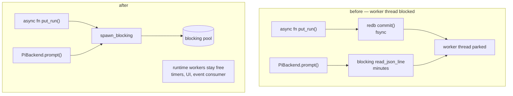

# pidag — spec-33: Get blocking work off the async runtime

- **Project**: `/projects/pidag`
- **Crate**: `pidag`
- **Priority**: HIGH — the largest single throughput item in the audit, and the reason
  `--concurrency` above the core count buys nothing today.
- **Status**: PARTIAL — O1 and O5 landed (`d864ca0`); **O2 withdrawn**, O3 already covered by spec-31 R2.5, O4 rewritten by the architect
- **Source**: 2026-08-12 codebase audit — P0-2, plus the blocking `Drop` noted under R2.5.
- **Depends-On**: **spec-30 (baseline) and spec-32 (event pipeline)**. spec-30 gives the
  before figures; spec-32 removes the fsync noise that would otherwise dominate any
  measurement here.

> **Execution context: entirely inside the `pidag-runner` container**, in `/projects/pidag`.

---

## Overview

Two subsystems present a synchronous body behind an `async fn` face. There is **not one
`spawn_blocking` in the crate**.

- **The store.** Every `Store` method is `async fn`, but `RedbStore` calls redb
  synchronously, and redb's `WriteTransaction` defaults to `Durability::Immediate` —
  `commit()` fsyncs before returning. Each call parks a Tokio worker thread on a disk sync.
- **The pi transport.** `RpcTransportClient` (upstream `sdk.rs:745`) is built on
  `std::process::Command` with blocking `write_all` / `flush` / `read_json_line`. A single
  agent turn — potentially minutes — blocks its worker thread end to end.

Tokio's multi-thread runtime defaults to one worker per core. Once that many nodes are in
flight, nothing is left to poll timers, serve the UI, or drive the event consumer. Raising
`--concurrency` past the core count starves the scheduler's own bookkeeping instead of
increasing parallelism.

A third, narrower case: upstream's `Drop for RpcTransportClient` calls `shutdown()`, which
does `kill()` then a **blocking `child.wait()`**. spec-31 R2.5 already moved the two
discard paths in `PiBackend` to `spawn_blocking`; any remaining drop on a runtime thread has
the same hazard.

---

## Requirements

### Functional

- **O1 (store off-runtime)**: every `RedbStore` method performs its redb work inside
  `tokio::task::spawn_blocking`, or on a dedicated store thread fed by a channel. The
  `Store` trait's async signatures are unchanged; callers are unaffected.
  **Prefer `spawn_blocking`** unless a measurement shows the thread-per-call overhead
  matters — a dedicated thread serialises all store access, which is a behaviour change,
  not just an implementation one.

- **O2 — WITHDRAWN 2026-08-12. The premise was wrong; do not implement as written.**

  This required wrapping `RpcTransportClient` calls in `spawn_blocking` on the
  grounds that the transport is blocking `std::io`. **The SDK's public API is
  `async fn`** — `sdk.rs:686`, `847`, `1043`. The blocking happens *inside* those
  async functions, which is upstream's design and not something a wrapper at the
  call site fixes.

  An implementation attempt contorted around the instruction into
  `spawn_blocking(|| block_in_place(|| Handle::current().block_on(..)))`, which
  **panics at runtime**: `block_in_place` requires a multi-threaded runtime
  *worker* thread, and a `spawn_blocking` task runs on the blocking pool. It
  compiled and the whole suite passed, because nothing drives `PiBackend` against
  a real client. It was reverted.

  If pi RPC blocking is worth addressing, it needs its own spec starting from a
  correct reading of the SDK, and `/projects/_upstream/` remains off-limits.

- **O2 (superseded, retained for context)**: every `RpcTransportClient` call made by `PiBackend` —
  `prompt`, `get_state`, `set_model`, `set_thinking_level`, `new_session`, and the
  `is_client_healthy` probe — runs inside `spawn_blocking`. This is the one that matters:
  it is where minutes of blocking live.

- **O3 (no client dropped on a runtime thread)**: any path that drops an
  `RpcTransportClient` does so inside `spawn_blocking`, because `Drop` blocks on
  `child.wait()`. spec-31 R2.5 covered `acquire_client` and `close`; audit every remaining
  site, including error paths and the pool's own teardown.

- **O4 (concurrency means something)**: with `--concurrency N` and N shell nodes that each
  sleep, wall-clock is approximately the sleep duration, not N × duration, **for N greater
  than the worker-thread count**. This is the observable consequence and the acceptance
  test.

- **O5 (blocking-call audit is enforced)**: a source-scanning test asserts that no `async fn`
  in `src/store/` performs a bare redb call, and that `PiBackend` contains no direct
  `client.<method>()` call outside a `spawn_blocking` closure. Without this the property
  silently rots — it is invisible in review, exactly like the `Command::new("pidag")` case.

### Non-Functional

- **N1**: **no change to durability, ordering, or crash semantics.** This spec moves *where*
  work runs, not *what* it does. Checkpoint and recovery tests are the guard.
- **N2**: `Store`'s public trait signatures are unchanged.
- **N3**: **never modify `/projects/_upstream/`.** The upstream client is blocking by
  design; the fix is to call it from a blocking context, not to change it.
- **N4**: no new runtime dependencies. `spawn_blocking` is in the Tokio features already
  enabled.
- **N5**: the gate stays green. The count may only go up.

---

## Architecture



**Key decision — `spawn_blocking` over a dedicated store thread.** A store thread would
serialise every vault access, which is a semantic change disguised as an optimisation.
`spawn_blocking` keeps redb's own concurrency model intact. Revisit only with a measurement.

**Key decision — the trait signatures do not change.** They are already `async fn`; they
were simply lying. Making them honest is an implementation detail, and keeping the surface
fixed means no call site churns and the diff stays reviewable.

**What this spec is not**: it is not a rewrite of `PiBackend`'s pooling, and not a change to
the `Worker` trait. Both are settled and tested.

---

## TDD Contract

| id | test | given | expects |
|----|------|-------|---------|
| O1 | `test_store_calls_do_not_block_runtime` | a single-worker runtime; a store write concurrent with a timer | the timer still fires on schedule. **Fails today** |
| O2a | `test_pi_rpc_runs_in_blocking_context` | source scan of `src/backend/pi.rs` | no direct `client.` call outside a `spawn_blocking` closure |
| O2b | `test_concurrent_sessions_do_not_serialise` | mock transport sleeping 200 ms, 4 concurrent sessions | wall-clock well under 800 ms |
| O3 | `test_no_client_dropped_on_runtime_thread` | source scan | every `drop(client)` / discard path is inside `spawn_blocking` |
| O4 | `test_concurrency_scales_past_worker_count` | `--concurrency 8`, 8 shell nodes each `sleep 1`, runtime with 2 workers | wall-clock ≈ 1–2 s, not ≈ 8 s. **The acceptance test; fails today** |
| O5 | `test_no_bare_blocking_calls_in_store` | source scan of `src/store/` | no redb call outside a blocking context |
| N1a | `test_checkpoint_semantics_unchanged` | existing checkpoint tests | unchanged, still green |
| N1b | `test_event_order_unchanged` | 50-node chain | order preserved |

**O4 is the acceptance test.** It states the user-visible property — that
`--concurrency` does what its name says — and it fails today.

---

## Exit Criteria

```bash
cd /projects/pidag

grep -rq 'spawn_blocking' src/store/          # O1
grep -q  'spawn_blocking' src/backend/pi.rs   # O2, O3
! grep -rq 'Durability::Eventual' src/        # N1: durability untouched
git diff --name-only | grep -q '_upstream' && echo "VIOLATION" && exit 1   # N3

bash deploy/scripts/quality-gate.sh . ; echo "GATE EXIT=$?"
env PIDAG_REQUIRE_PI=1 cargo test -j 2 --no-fail-fast 2>&1 | grep -E '^test result:'
```

**Prose criteria**:

1. **Before/after from the spec-30 harness**, quoted: wall-clock for `wide` at N=200 and
   N=500, at concurrency 1, 4 and 16. The point of this spec is that the higher concurrency
   figures should now improve; if they do not, **say so** — the finding would be wrong and
   the audit needs correcting rather than the number massaging.
2. **O4 and O1 confirmed failing before the change**, output quoted. Both target behaviour
   that exists today.
3. Test counts pasted raw, per binary, unsummed.
4. Peak RSS reported before and after: `spawn_blocking` grows the blocking pool, and a large
   thread count is a real cost worth seeing rather than discovering later.

---

## Guardrails

- **G1 — NEVER modify any file under `specs/`.** Stop and report instead.
- **G2 — NO WORKHORSE MAY COMMIT.**
- **G3 — NEVER modify `/projects/_upstream/`** (N3). The upstream transport is synchronous
  by design and sits on the user's own fork and active branch. Wrap it; do not change it.
- **G4 — do NOT change durability, ordering or crash semantics** (N1). If a test in
  `checkpoint_resume_tests.rs` or `crash_recovery_tests.rs` fails, the change is wrong.
- **G5 — do NOT change the `Store` or `Worker` trait signatures.** Both are settled.
- **G6 — do NOT rewrite `PiBackend`'s pooling.** The semaphore and health-check placement
  are spec-31 work, tested and committed.
- **G7 — do NOT tune `--concurrency` defaults or worker-thread counts** to make O4 pass.
  The test must pass because blocking work moved, not because the runtime was resized.
- **G8 — do NOT optimise anything else.** Index identity and typed state are later phases;
  touching them here makes this measurement meaningless.
- **G9 — never `rm -rf` a `.pidag/` directory.** `_tmp/bug-a-bloodtest/` and
  `_tmp/interp-probe/` hold live run records.
- **G10 — report raw output, never summed totals.** One `^test result:` line per binary,
  copied not retyped, never aggregated.
- **G11 — clippy clean at `cargo clippy -p pidag -- -D warnings`.**

### Error handling expectations

- A `spawn_blocking` task that panics must surface as a `PidagError`, not a silently
  swallowed `JoinError`. This is a new failure mode the change introduces, and the obvious
  implementation loses it.
- Runtime shutdown with blocking tasks in flight must not hang. If a shutdown path needs a
  timeout, add it deliberately and say so.

---

## Files to Modify

| File | Change |
|------|--------|
| `src/store/redb_store.rs` | every method's redb work inside `spawn_blocking` (O1) |
| `src/backend/pi.rs` | every RPC call and every client drop inside `spawn_blocking` (O2, O3) |
| `tests/blocking_offload_tests.rs` | **NEW** — the TDD Contract above |

**Not modified**: `specs/`, `deploy/`, `/projects/_upstream/`, the `Store`/`Worker` traits.

## Memory

Store on completion: `workspace/specs/pidag-33-off-runtime-blocking`,
`claude-pi-delegation/fix/20260812-spawn-blocking`.
