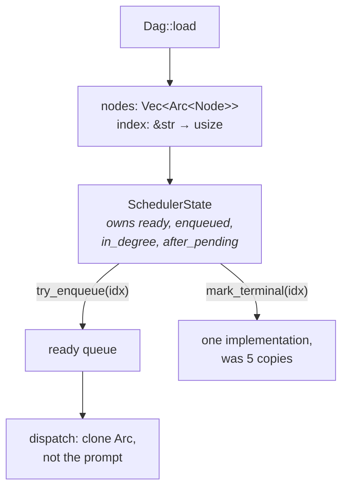

# pidag — spec-35: Index-based node identity and a scheduler state struct

- **Project**: `/projects/pidag`
- **Crate**: `pidag`
- **Priority**: MEDIUM — resolves more audit findings than any other single change, and has
  the largest blast radius of any of them.
- **⚠ PREMISE CORRECTED 2026-08-12 by the spec-30 baseline.** The audit implied the O(n²)
  node lookup would show as superlinear scaling. **It does not, at N ≤ 500.** Measured:
  `chain` goes 537 ms → 5419 ms for 50 → 500 nodes — 10.0× the nodes for 10.1× the time,
  i.e. **linear**. `wide` is 10.0× → 10.5×.

  So the performance justification for this spec is **much weaker than the audit stated**,
  and wall-clock is dominated by per-node process spawn, not by scheduling. Two consequences:
  1. **Do not accept this spec on a wall-clock improvement** — there may be none to find at
     realistic DAG sizes. If the after figures are flat, that is the expected result, not a
     failure of the implementation.
  2. **The justification is now structural, not numeric**: deleting the `try_enqueue!`
     borrow-checker macro, collapsing five copies of the `after_pending` block into one,
     and removing the per-dispatch prompt clone (P1-4, which is a memory cost the baseline
     does show). Those stand on their own.

  This spec should be **re-prioritised below spec-32 and spec-33**, whose gains are
  measurable. Consider deferring it entirely unless DAGs grow well beyond 500 nodes.
- **Status**: PLANNED
- **Source**: 2026-08-12 codebase audit — E-1, plus P1-1, P1-3, P1-4, P1-5, P1-8, S-3, S-4.
- **Depends-On**: **spec-30** (before/after figures), **spec-34** (typed state removes half
  the reason the borrow-checker macro exists). Do **not** start this before both.

> **Execution context: entirely inside the `pidag-runner` container**, in `/projects/pidag`.
> This spec rewrites the scheduler. It is deliberately last.

---

## Overview

Node identity is a `String`, cloned into six parallel maps and compared by content. One
decision produces most of the audit's performance section:

- `Dag::get_node` is `self.nodes.iter().find(|n| n.id == id)` — **O(n)**, called once per
  ready node and once per dependent on every completion, so scheduling is **O(n²)** with a
  string comparison as the inner operation (P1-1).
- The scheduler maintains `node_state`, `in_degree`, `dependents`, `after_dependents`,
  `after_pending` as `HashMap<String, _>`, plus `enqueued`, `terminal_nodes`,
  `terminal_from_checkpoint` as `HashSet<String>`. Every insertion clones an id; every
  lookup hashes a string (P1-8).
- The full `Node` — including a prompt carrying inlined spec sections — is cloned per
  dispatch, per retry, per fallback model (P1-4).
- `format!("{finished_node_id}:fail")` is rebuilt inside the dependent loop and discarded
  after one comparison (P1-3).

And the structural consequence: `execute.rs` is 1,045 lines with a `macro_rules!
try_enqueue` declared inline **because a closure could not borrow `ready`, `enqueued`,
`in_degree` and `after_pending` simultaneously** (S-4). That macro is the compiler pointing
at a missing struct. The same seven-line "decrement `after_pending`" block is copy-pasted at
five sites (S-3).

---

## Requirements

### Functional

- **X1 (indices are identity)**: `Dag` gains a `HashMap<&str, usize>` (or equivalent) built
  once at load. Internally the scheduler addresses nodes by `usize`. `Dag::get_node(&str)`
  remains for external callers and becomes **O(1)**.

- **X2 (nodes are shared, not copied)**: nodes are `Arc<Node>`; dispatch clones the handle,
  not the prompt. This is the change that stops copying spec sections per retry.

- **X3 (parallel maps become vectors)**: `HashMap<String, T>` keyed by id becomes `Vec<T>`
  indexed by position; `HashSet<String>` becomes a bitset or `Vec<bool>`. No id is cloned
  into a collection.

- **X4 (a scheduler state struct)**: extract the ready queue and its invariants into one
  type owning `ready`, `enqueued`, `in_degree`, `after_pending`, with `try_enqueue` and
  `mark_terminal` as **methods**. The `try_enqueue!` macro is **deleted**, and the
  five copy-pasted `after_pending` blocks collapse into one call (S-3, S-4).

- **X5 (gate matching allocates nothing per dependent)**: compare with `strip_suffix(":fail")`
  or a pre-computed value hoisted out of the loop. No `format!` inside the dependent loop.

- **X6 (behaviour is bit-identical)**: this is a representation change. **Every existing
  test passes unmodified**, including the golden fixture, the checkpoint tests, the gate
  cascade tests and the bloodtest fixture's shape. No assertion changes.

- **X7 (the ordering guarantee is preserved explicitly)**: node ordering in `RunReport` and
  in emitted events must be unchanged. The current expansion is iteration-major and the
  golden fixture pins it; indices must not silently reorder anything.

### Non-Functional

- **N1**: the public API — `Dag`, `Node`, `Scheduler::new`, `Store`, `Worker` — is
  unchanged. This is internal.
- **N2**: DAG JSON format unchanged.
- **N3**: no new dependencies. A `Vec<bool>` is an acceptable bitset; do not add `bitvec`
  for this.
- **N4**: gate stays green; count may only go up.

---

## Architecture



**Key decision — a state struct is the point, not a side effect.** The macro exists because
four fields are one cohesive piece of state with two operations on it. Introducing indices
without extracting the struct would keep the macro and the duplication, and lose most of the
value.

**Key decision — `Arc<Node>` rather than borrowing.** Dispatch moves the node into a spawned
task, which needs `'static`. `Arc` is the minimal change; a borrow would force lifetime
plumbing through the task set.

**Key decision — `get_node(&str)` survives.** External callers (CLI, UI, RPC) address nodes
by id and should not learn about indices. It becomes a hash lookup instead of a scan.

**Explicit risk.** This rewrites the component with the least live proof and the most subtle
invariants — checkpoint replay, gate cascades, `after` edges, the skip worklist. It is
sequenced last for that reason. If any behaviour question arises during implementation,
**stop and report** rather than deciding it; the existing behaviour is the specification.

---

## TDD Contract

| id | test | given | expects |
|----|------|-------|---------|
| X1a | `test_get_node_is_constant_time` | 1000-node DAG | lookup does not scan — assert via the index map's presence, or a timing ratio between N and 10N |
| X1b | `test_index_map_matches_nodes` | any DAG | every id maps to the position holding it |
| X2 | `test_dispatch_does_not_clone_prompt` | node with a 1 MB prompt, 3 retries | prompt allocated once (Arc strong-count, or an allocation counter) |
| X3 | `test_no_id_cloned_into_collections` | source scan of `src/scheduler/` | no `HashMap<String,` / `HashSet<String>` for node identity |
| X4a | `test_try_enqueue_macro_is_gone` | source scan | no `macro_rules! try_enqueue` in `execute.rs` |
| X4b | `test_mark_terminal_has_one_implementation` | source scan | the `after_pending` decrement appears once, not five times |
| X5 | `test_no_format_in_dependent_loop` | source scan | no `format!` inside the gate-matching loop |
| X6 | `test_entire_existing_suite_unmodified` | the suite | passes with **no** assertion changed |
| X7a | `test_node_order_unchanged` | built-in `sdd`, 3 iterations | order identical to `tests/fixtures/sdd_golden.json` |
| X7b | `test_event_order_unchanged` | 50-node chain | emitted order unchanged |
| X8 | `test_gate_cascade_still_transitive` | the spec-31 R3 chain (A → gated B → gated C) | B and C both `Done` with `attempts: 0`, C never dispatched |
| X9 | `test_checkpoint_replay_unchanged` | existing checkpoint tests | unchanged |

**X6 is the acceptance criterion.** Any assertion that needs changing means behaviour moved,
and the change is wrong.

---

## Exit Criteria

```bash
cd /projects/pidag

! grep -q 'macro_rules! try_enqueue' src/scheduler/execute.rs      # X4a
! grep -qE 'HashMap<String,|HashSet<String>' src/scheduler/execute.rs   # X3
grep -q 'Arc<Node>' src/core/dag.rs                                # X2
grep -qE 'struct (SchedulerState|ReadyQueue)' src/scheduler/       # X4
[ "$(grep -c 'find(|n| n.id == id)' src/core/dag.rs)" = "0" ]      # X1

bash deploy/scripts/quality-gate.sh . ; echo "GATE EXIT=$?"
env PIDAG_REQUIRE_PI=1 cargo test -j 2 --no-fail-fast 2>&1 | grep -E '^test result:'
```

**Prose criteria**:

1. **Before/after from the spec-30 harness**, quoted: `chain` at N = 50, 200, 500. Note
   the baseline is already **linear** at these sizes (see the premise correction above), so
   **a flat wall-clock result is expected and acceptable**. Report peak RSS as well — the
   per-dispatch prompt clone is a real memory cost the baseline does measure, and that is
   where an improvement should actually appear.
2. **Not one assertion changed** (X6). State this explicitly and list every test file
   touched with the reason.
3. `execute.rs` line count before and after. It is 1,045 today; the extraction should reduce
   it materially.
4. Raw per-binary `^test result:` lines, unsummed.
5. Peak RSS before and after — `Arc` and vectors should reduce it; a rise means something is
   being retained that was not before.

---

## Guardrails

- **G1 — NEVER modify any file under `specs/`.** Stop and report.
- **G2 — NO WORKHORSE MAY COMMIT.**
- **G3 — NEVER modify `/projects/_upstream/`.**
- **G4 — do NOT change any assertion** (X6). Literal-construction updates are expected;
  a changed assertion means behaviour moved.
- **G5 — do NOT change public API or the DAG JSON format** (N1, N2).
- **G6 — do NOT "fix" behaviour you find odd.** The existing behaviour is the
  specification for this spec. Anything that looks wrong goes in the report as a finding,
  not into the diff. This component has subtle invariants — checkpoint replay, gate
  cascades, `after` edges, the skip worklist — and each was hard-won.
- **G7 — do NOT reorder nodes or events** (X7). The golden fixture pins ordering.
- **G8 — STOP AND REPORT on any behavioural ambiguity** rather than deciding it. This is the
  component with the least live proof; a guess here is expensive.
- **G9 — never `rm -rf` a `.pidag/` directory.**
- **G10 — report raw output, never summed totals.** One line per binary, copied not
  retyped, never aggregated.
- **G11 — clippy clean at `-D warnings`.**

---

## Files to Modify

| File | Change |
|------|--------|
| `src/core/dag.rs` | `Vec<Arc<Node>>` + index map; O(1) `get_node` |
| `src/scheduler/execute.rs` | index addressing; state struct; macro deleted; `mark_terminal` unified |
| `src/scheduler/mod.rs` | `SchedulerState` / `ReadyQueue` |
| `tests/scheduler_identity_tests.rs` | **NEW** — the TDD Contract |

## Memory

Store on completion: `workspace/specs/pidag-35-index-identity`,
`claude-pi-delegation/fix/20260812-index-based-node-identity`.
