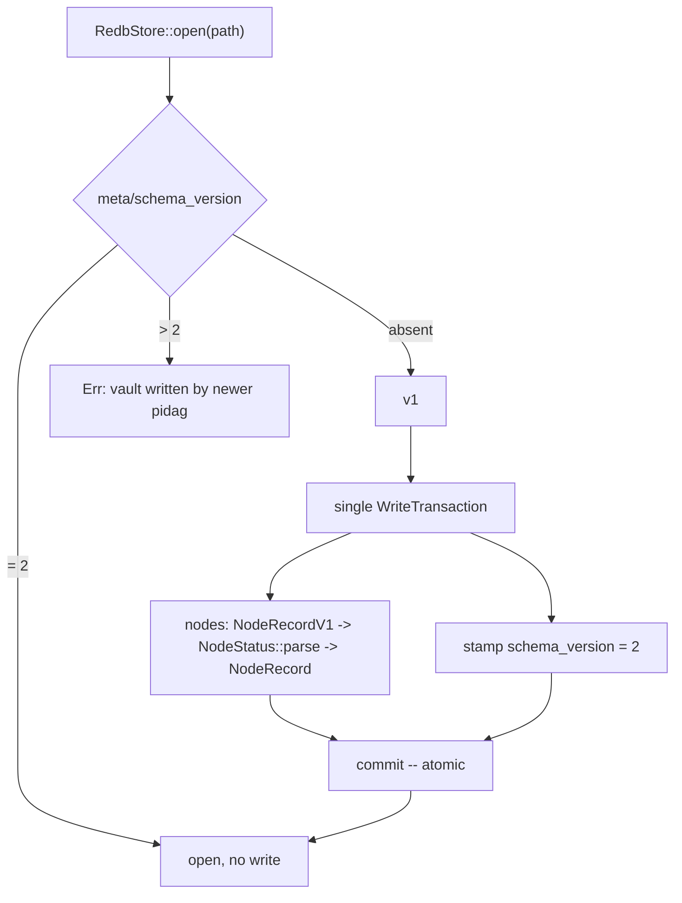

# pidag — spec-36: Vault schema versioning and v1 migration

- **Project**: `/projects/pidag`
- **Crate**: `pidag`
- **Priority**: **P0 — a shipped data-loss defect.** Every vault written before spec-34 is
  unreadable by the current build. `.pidag/` is the only record of a run.
- **Status**: IMPLEMENTED, pending V6 withdrawal cleanup — see V6 below
- **Source**: 2026-08-12. Found by repairing the spec-34 compatibility guard, which had
  been silently disabled by the spec-34 commit itself.
- **Depends-On**: none. This is a defect fix and precedes further feature work.

> **Execution context: entirely inside the `pidag-runner` container**, in `/projects/pidag`.

---

## Overview

spec-34 changed one serialized field from `String` to the `NodeStatus` enum:

| struct | field | before | after |
|--------|-------|--------|-------|
| `NodeRecord` (`nodes` table) | `state` | `String` | `NodeStatus` |

(An earlier draft of this spec listed the `events` table too. That was wrong — see the
V6 withdrawal.)

The store serializes with **bincode**, which is not self-describing. A `String` is written as
a u64 length prefix followed by bytes; an enum is written as a u32 variant index. They are
different encodings of the same field, so old records do not decode:

```
Store("Deserialization failed: invalid value: integer `6`, expected variant index 0 <= i < 5")
```

`6` is the byte length of `"Failed"` being read as a variant index.

spec-34 carried `#[serde(rename_all = "PascalCase")]` and the doc comment *"Five states with
wire-format compatibility to existing strings."* **That claim is false.** `rename_all` governs
field and variant *names*, and bincode never emits names. The attribute is inert here. It was
written alongside `NodeStatus::parse`, whose comment says *"for deserialization from legacy
data"* — that function is dead code; nothing calls it. The migration it was written for was
never built.

**Why this went undetected.** spec-34 required a compatibility guard, and one was built:
`tests/fixtures/legacy_vault/legacy.redb`, captured pre-change in commit `81d1aa3` expressly
so `test_legacy_vault_still_loads` would prove compatibility held. But the generator
`gen_legacy_vault_fixture` was a plain `#[tokio::test]` with no `#[ignore]`, so it ran on
every `cargo test` and **rewrote the fixture using the current build**. The refactor commit
`a69f454` swept the regenerated fixture in alongside the change it was meant to police. From
that moment the guard read back what the current build had just written: it could not fail.
Restoring the genuine pre-change blob (`cd51a39`) makes it fail immediately.

This is the seventh instance of the pattern in `docs/FINDINGS.md`: *an acceptance test must
assert on what the consumer received, not on what the producing function returned.* Here the
producer and the consumer had become the same build.

**Decision: migrate, do not declare v1 unsupported.** spec-34 explicitly promised wire
compatibility (its Y2b: *"must PASS after the change to prove wire compatibility is
maintained"*). Checkpoint/resume across an upgrade is a headline feature, and the project's
own hard rules treat `.pidag/` as irreplaceable. Failing cleanly would be cheaper (~2 hours
against ~1 day) but would deliver less than what was already claimed to be delivered.

---

## Requirements

### Functional

- **V1 (version stamp)**: the vault carries an explicit schema version in a `meta` table under
  key `schema_version`, as a u32. Vaults written from now on stamp version **2**.

- **V2 (absent means v1)**: a vault with no `meta` table, or no `schema_version` key, is
  version **1**. This is the only way to recognise an existing vault, since nothing was
  stamped before this spec.

- **V3 (migrate on open)**: `RedbStore::open` detects version 1 and migrates to version 2
  before returning. A version-2 vault opens with no migration and no write. An unknown
  version **greater** than 2 is a hard error naming both versions — a newer pidag wrote it,
  and guessing would corrupt it.

- **V4 (migration is atomic)**: the entire migration — every `nodes` record and the version
  stamp — commits in a **single redb write transaction**. A crash
  mid-migration must leave a vault that is still cleanly version 1, never a half-converted
  one. There is no intermediate state that any code needs to recognise.

- **V5 (nodes table converted)**: each v1 `nodes` record decodes into a frozen `NodeRecordV1`
  whose `state` is `String`, converts via `NodeStatus::parse`, and re-encodes as the current
  `NodeRecord`. All other fields round-trip byte-identically.

- **V6 — WITHDRAWN 2026-08-12. The premise was wrong; do not implement as written.**

  This required migrating the `events` table via a frozen `EventV1`, on the stated
  grounds that spec-34 changed an `Event` variant's `state` from `String` to
  `NodeStatus`. **It did not.** The `state:` assignments spec-34 changed in
  `src/core/event.rs` are inside `RedbSink`'s handler, where it constructs
  `NodeRecord` values to write into the **nodes** table. The persisted `Event`
  enum has no `state` field in any of its nine variants, so the events wire
  format never changed and there is nothing to migrate.

  The implementation attempt confirmed this empirically against the committed
  fixture — every event decoded cleanly against the *current* `Event` type — and
  reported the discrepancy rather than papering over it. It nonetheless built
  `EventV1` as instructed: a hand-maintained frozen duplicate of a live
  nine-variant enum performing a pure structural copy. That is permanent
  maintenance cost and a standing drift hazard for no benefit, and the migration
  rewrote the largest table in the vault to achieve nothing.

  **Remove `EventV1` and the events pass.** Retain the guarantee as an assertion
  instead — see V6' — because "events are unaffected" is precisely the claim that
  justifies not touching them.

- **V6' (events are provably unaffected)**: after a v1 vault migrates, every event still
  decodes as the current `Event`, and **sequence numbers and ordering are preserved
  exactly** — replay order is the vault's meaning. This is a read-only assertion over the
  events table; the migration must not write to it.

- **V7 (unknown status is an error)**: a v1 status string that `NodeStatus::parse` rejects
  aborts the migration with an error naming the run, the node and the offending string. It
  must **not** silently default to `Pending` — that would fabricate a resumable state for a
  node that had failed.

- **V8 (the guard is real again)**: `gen_legacy_vault_fixture` is `#[ignore]`d, and
  `tests/fixtures/legacy_vault/legacy.redb` is the genuine pre-spec-34 blob
  `cd51a399ba5dea8c415bac66c0084d4f168044c0`. A test asserts the fixture's hash, so a future
  regeneration fails loudly instead of silently voiding the guard.

- **V9 (the false claim is removed)**: the `NodeStatus` doc comment no longer asserts
  wire-format compatibility with strings. It states that the encoding is a bincode variant
  index and points to this spec.

### Non-Functional

- **N1**: migration of the committed fixture is not measurably slow; a vault of a few hundred
  nodes migrates well under a second. No streaming design is required at this size.
- **N2**: no new runtime dependencies.
- **N3**: **never modify `/projects/_upstream/`.**
- **N4**: the gate stays green. Test count may only go up.
- **N5**: no change to the `Store` trait signatures. `open` already returns `Result`.

---

## Architecture



**Key decision — a version stamp, not format sniffing.** bincode is not self-describing;
`deserialize_any` is unsupported. There is no way to try one shape and fall back. An explicit
version is the only correct mechanism, and its absence is itself the v1 signal.

**Key decision — a frozen mirror type.** `NodeRecordV1` describes a format that already
exists in the world and can never change. It must **not** be derived from, aliased to, or
refactored alongside the live type — that is precisely how the original break happened. It
lives in `src/store/legacy.rs` with a comment saying so. Only tables whose format actually
changed get a mirror; adding one speculatively is cost without benefit (see the V6
withdrawal).

**Key decision — migrate on open, including read paths.** `pidag show` against a v1 vault
will rewrite it. The alternative — a read-only compatibility path — means maintaining two
readers forever. One-shot migration is the smaller permanent cost, but it must be stated in
the changelog because it means a v1 vault stops being readable by older pidag builds.

**What this spec is not**: it is not a general migration framework. It is one hop, v1 to v2.
The version stamp is what makes the next hop cheap; building the framework now is speculation.

---

## TDD Contract

| id | test | given | expects |
|----|------|-------|---------|
| V1 | `test_new_vault_stamps_version_2` | a freshly created vault | `meta/schema_version` == 2 |
| V2 | `test_absent_version_is_v1` | vault with no `meta` table | detected as version 1 |
| V3a | `test_legacy_vault_still_loads` | the committed fixture (v1) | migrates; `list_nodes` returns alpha=Done, beta=Failed, gamma=Blocked. **Fails today** |
| V3b | `test_v2_vault_opens_without_writing` | a v2 vault, file mtime+hash captured | opening does not modify the file |
| V3c | `test_future_version_is_rejected` | `schema_version` = 99 | `Err` naming both 99 and 2; no write |
| V4 | `test_migration_is_atomic` | migration interrupted before commit | vault still reads as valid v1; no partial conversion |
| V5 | `test_node_fields_roundtrip` | fixture | `node_id`, `model`, `attempt`, `timestamp` byte-identical pre/post |
| V6'a | `test_events_untouched_by_migration` | the committed v1 fixture | every event decodes as the current `Event`; the migration issues **no write** to the events table |
| V6'b | `test_event_seq_preserved` | v1 vault with events | same seq values, same order, post-migration |
| V7 | `test_unknown_status_aborts` | v1 record with `state = "Zorp"` | `Err` naming run, node and `"Zorp"`; **not** defaulted to Pending |
| V8a | `test_fixture_hash_is_pinned` | the committed fixture | sha256 matches the pinned constant |
| V8b | `test_generator_is_ignored` | source scan of `tests/gen_legacy_vault.rs` | `#[ignore]` present on the generator |
| V9 | `test_no_false_compat_claim` | source scan of `src/scheduler/mod.rs` | no "wire-format compatibility to existing strings" |
| N4 | existing checkpoint/resume/crash tests | unchanged | still green |

**V3a is the acceptance test.** It is the guard spec-34 was supposed to have. It fails today
against the genuine fixture, which is the whole reason this spec exists.

**V8a is the guard on the guard.** Without it the fixture can be silently regenerated again
and every other test here becomes decorative.

---

## Exit Criteria

```bash
cd /projects/pidag

# V8: the fixture is the genuine pre-spec-34 artifact, unmodified
test "$(git hash-object tests/fixtures/legacy_vault/legacy.redb)" \
     = "cd51a399ba5dea8c415bac66c0084d4f168044c0" || { echo "FIXTURE WRONG"; exit 1; }
grep -q '#\[ignore\]' tests/gen_legacy_vault.rs || { echo "GENERATOR NOT IGNORED"; exit 1; }

# V9: the false claim is gone
! grep -rq 'wire-format compatibility to existing strings' src/

# V1/V3: versioning and migration exist
grep -q 'schema_version' src/store/redb_store.rs
test -f src/store/legacy.rs

# N3: upstream untouched
git diff --name-only | grep -q '_upstream' && { echo "VIOLATION"; exit 1; }

bash deploy/scripts/quality-gate.sh . ; echo "GATE EXIT=$?"

# the acceptance test, named explicitly
cargo test -p pidag --test typed_state_tests test_legacy_vault_still_loads -- --exact --nocapture

# the fixture must be byte-identical AFTER the whole suite has run
test "$(git hash-object tests/fixtures/legacy_vault/legacy.redb)" \
     = "cd51a399ba5dea8c415bac66c0084d4f168044c0" || { echo "SUITE MUTATED FIXTURE"; exit 1; }

env PIDAG_REQUIRE_PI=1 cargo test -p pidag -j 2 --no-fail-fast 2>&1 | grep -E '^test result:'
```

**Prose criteria**:

1. **`GATE EXIT=0`**, and every block above exits 0 with no `FIXTURE WRONG`, `GENERATOR NOT
   IGNORED`, `SUITE MUTATED FIXTURE` or `VIOLATION` line.
2. **V3a quoted failing before the change and passing after**, both outputs pasted. It must
   fail with the `integer 6` bincode error beforehand — if it fails some other way, stop and
   report, because the diagnosis in this spec is then incomplete.
3. **The fixture hash is `cd51a399…` before AND after a full suite run.** Paste both.
4. Test counts pasted raw, one `^test result:` line per binary, **unsummed**.
5. Confirm in prose that `NodeStatus::parse` is now actually called by the migration, with the
   call site quoted. It was dead code carrying a promise; this spec is where the promise is
   kept or the function is deleted.

---

## Guardrails

- **G1 — NEVER modify any file under `specs/`.** Stop and report instead.
- **G2 — NO WORKHORSE MAY COMMIT.** Leave work in the tree.
- **G3 — NEVER modify `/projects/_upstream/`.**
- **G4 — NEVER regenerate `tests/fixtures/legacy_vault/legacy.redb`,** and never run
  `gen_legacy_vault_fixture` with `--ignored`. It is the only genuine pre-change artifact in
  existence; the copy in the preserved history is the sole backup. If the migration seems to
  need a different fixture, **stop and report** — wanting to change the fixture is the exact
  impulse that caused this defect.
- **G5 — do NOT make V3a pass by weakening it.** Not by loosening an assertion, not by adding
  a skip, not by catching the error. It must pass because the data migrates.
- **G6 — `NodeRecordV1` is frozen.** Do not derive it from the live type, do not add
  fields, do not "keep it in sync". Its entire purpose is to stop changing.
- **G7 — do NOT default an unrecognised status** (V7). Fabricating `Pending` for a node that
  failed produces a wrong resume, which is worse than refusing to open.
- **G8 — do NOT change the `Store` trait, event ordering, or durability.** Migration writes
  once at open; it is not a change to the write path.
- **G9 — do NOT build a general migration framework.** One hop, v1 to v2.
- **G10 — never `rm -rf` a `.pidag/` directory.** Move it aside with `mv`.
- **G11 — report raw output, never summed totals.**
- **G12 — clippy clean at `cargo clippy -p pidag -- -D warnings`.**

### Error handling expectations

- A migration failure must leave the vault **openable as v1** and return an error that names
  the vault path and the failing record. Losing a run's history to a failed migration is the
  worst outcome available here.
- The version-too-new error must name both the found version and the supported one, so the
  user knows to upgrade rather than to delete the vault.
- Migration errors must be distinguishable from ordinary deserialization errors in the
  message; "Deserialization failed" alone is what made this defect hard to read.

---

## Files to Modify

| File | Change |
|------|--------|
| `src/store/legacy.rs` | **NEW** — frozen `NodeRecordV1` (V5). **No `EventV1`** — V6 withdrawn |
| `src/store/redb_store.rs` | `meta` table, version detect, atomic migration in `open` (V1–V5, V7) |
| `src/scheduler/mod.rs` | correct the `NodeStatus` doc comment (V9) |
| `tests/gen_legacy_vault.rs` | `#[ignore]` — already applied, keep (V8b) |
| `tests/typed_state_tests.rs` | open a copy under `_tmp/`, not the fixture — already applied |
| `tests/vault_migration_tests.rs` | **NEW** — the TDD Contract above |

**Not modified**: `specs/`, `deploy/`, `/projects/_upstream/`, the `Store` trait, the
fixture itself.

## Memory

Store on completion: `workspace/specs/pidag-36-vault-schema-versioning`,
`claude-pi-delegation/fix/20260812-vault-v1-migration`.
