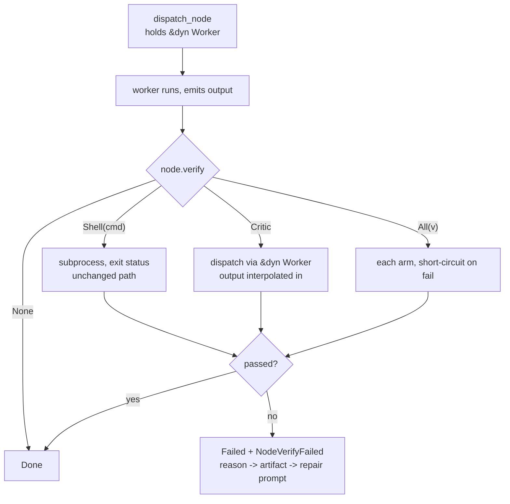

# pidag — spec-37: `verify` becomes a critic

- **Project**: `/projects/pidag`
- **Crate**: `pidag`
- **Priority**: HIGH — `docs/ARCHITECTURE.md` §4 identifies this as the single highest-value
  change available, at 2–3 days.
- **Status**: IMPLEMENTED and verified 2026-08-12. Gate green. **Caveat**: the critic
  has only been exercised against a scripted worker and a deterministic `pi` shim —
  this container has no model credentials, so the wiring is proven end to end but the
  critic's judgement has never faced a live model. See Exit Criterion 3.
- **Source**: `docs/ARCHITECTURE.md` §3–4. Closes the 21% verification gap in the MAST
  taxonomy, and composes with the 42% specification gap.
- **Depends-On**: spec-29 (runtime output interpolation) — landed. spec-36 (vault schema
  versioning) — landed, and its lesson is a requirement here (C8).

> **Execution context: entirely inside the `pidag-runner` container**, in `/projects/pidag`.

---

## Overview

`Node.verify` is a real verification seam, but the weakest possible kind: it runs a shell
command and gates the node on its exit status. Every published high-stakes pattern uses a
**model** as critic — the producer emits, a critic reviews, output ships only if the critic
passes.

A shell `verify` can prove a file changed, that it compiles, that tests pass. It cannot catch
*"the code compiles and the tests pass, but it does not do what the spec asked."* That is
exactly the failure mode this codebase produced seven times in one session — see
`docs/FINDINGS.md`. A critic that reads the spec's Exit Criteria and judges the work against
them is the check that would have caught them.

The wiring already exists. `verify` runs inside `dispatch_node`, which already holds
`&dyn Worker`; the retry/fallback machinery, event log, artifact store and gate semantics all
apply unchanged. The work is to widen one field and route one of its arms to a worker instead
of a subprocess.

**Two hazards, both learned the hard way in this codebase, are requirements here:**

1. **This is a wire-format change.** `Node` is serialized into `RunMeta.dag_json` in every
   vault, and authored as TOML in `src/workflow/templates/`. Widening `Option<String>` to an
   enum is the same class of change that made every pre-spec-34 vault unopenable (spec-36).
   JSON and TOML are self-describing, so this one is recoverable — but only if the new type
   is *specified* to accept the old shape. C2 and C8 exist for this reason.

2. **The verify path cannot currently reach a worker.** `apply_verify_check` is an
   associated function taking `(node, state, worker_output, verify_pre_token)` — no worker
   handle. Its caller `dispatch_node(&node, worker: &dyn Worker, allow_paid)` has one. The
   worker must be threaded through. This is called out because "a requirement placed in a
   module with no access to what it needed" is a recorded past failure in this project.

**Fail closed.** A critic whose verdict cannot be parsed must fail the node. An earlier
`verify` defect in this codebase failed *open* — it was void on resume and silently passed.
A critic that treats "I could not tell" as "pass" is worse than no critic, because it
launders an unverified result as a verified one.

---

## Requirements

### Functional

- **C1 (the type)**: `Node.verify` becomes `Option<Verify>` where

  ```
  enum Verify {
      Shell(String),                                  // today's behaviour, unchanged
      Critic { prompt: String, models: Vec<ModelRef> },
      All(Vec<Verify>),                               // every arm must pass
  }
  ```

- **C2 (old DAGs keep working — backward compatible deserialization)**: a bare string
  deserializes as `Verify::Shell`. `"verify": "test -f out.txt"` in an existing
  `RunMeta.dag_json`, and `verify = "test -f out.txt"` in a workflow TOML, must both still
  load and behave **exactly** as today. Use `#[serde(untagged)]` or a hand-written
  `Deserialize`; whichever is chosen, C8's fixture is what proves it.

- **C3 (a critic dispatches a worker)**: `Verify::Critic` runs its prompt through
  `&dyn Worker` — the same trait, retry and model-fallback machinery as a normal node — not
  through a subprocess. The producing node's output is available to the critic prompt via the
  spec-29 interpolation already built.

- **C4 (verdict parsing, fail-closed)**: the critic's reply yields pass/fail plus a reason.
  The accepted form is specified and narrow — a leading `PASS` or `FAIL` token. **Anything
  that does not parse is a FAIL**, with the raw reply preserved as the reason. A critic that
  errors, times out, or exhausts its model fallbacks is also a FAIL. There is no input that
  produces a silent pass.

- **C5 (the reason flows)**: the critic's reason is carried on `NodeVerifyFailed` and stored
  as the node's artifact, so a downstream repair node can interpolate it. A verdict with no
  reason attached is useless for repair, which is the whole point of having one.

- **C6 (`All` semantics)**: every arm must pass; evaluation **short-circuits on the first
  failure**, and the reported reason names *which* arm failed. Cheap arms should be ordered
  first by the DAG author — the engine does not reorder.

- **C7 (paid-model discipline)**: a `Critic` whose models are all paid is subject to the same
  `allow_paid` gate as any other dispatch. A critic must never silently spend where a normal
  node would refuse.

- **C8 (wire compatibility is proven, not asserted)**: a committed fixture holds a
  pre-spec-37 `dag_json` with a string `verify`, and a test loads it and asserts it behaves
  as `Verify::Shell`. **The fixture's hash is pinned in the test**, and whatever generates it
  is `#[ignore]`d. This requirement exists verbatim because spec-34 made this exact claim
  without this exact guard, and the guard it did build was regenerated by the change it was
  guarding.

- **C9 (`verify_pre` is unchanged)**: it stays shell-only, and keeps its current
  `PIDAG_VERIFY_PRE` contract. Widening it is not in scope, and the delta-vs-state semantics
  it encodes are settled.

- **C10 (visible cost)**: a critic dispatch emits the same events as any other model call, so
  it appears in the event log, the UI and the run report. A verification step that spends
  tokens invisibly is not acceptable.

### Non-Functional

- **N1**: **every existing DAG behaves identically.** Existing `verify` strings, gate
  semantics, retry counts and event ordering are unchanged. This is the guard on the whole
  spec.
- **N2**: no change to the `Worker` or `Store` trait signatures.
- **N3**: no new runtime dependencies.
- **N4**: **never modify `/projects/_upstream/`.**
- **N5**: the gate stays green; the test count may only go up.
- **N6**: no hardcoded absolute paths anywhere — use `env!("CARGO_MANIFEST_DIR")`, and `_tmp/`
  for scratch. Absolute paths were removed from this suite for breaking CI.

---

## Architecture



**Key decision — widen the field, do not add a second one.** A parallel `critic` field beside
`verify` would double the gate logic and allow contradictory configurations. One field with
an enum keeps a single decision point, and `All` covers "shell *and* critic".

**Key decision — the critic is a worker dispatch, not a new subsystem.** It inherits retry,
model fallback, event emission and the paid-model gate for free. Building a separate path
would duplicate all four and drift from them.

**Key decision — thread the worker into `apply_verify_check`.** The alternative, giving the
verify path its own worker handle, creates a second dispatch surface with its own lifetime
and its own bugs. The caller already has one; pass it down.

**Key decision — fail closed on an unparseable verdict.** Stated as a decision because the
obvious implementation (`reply.contains("PASS")`) fails open on a critic that says "this does
not PASS", and because a prior `verify` defect in this codebase failed open on resume.

**What this spec is not**: it is not ensemble adjudication (`for_each` fan-out and a `quorum`
helper are the *next* items in `docs/ARCHITECTURE.md` §5, and are expressible today with
`after` edges and three hand-written nodes). It is not a change to `verify_pre`. It is not
DAG-within-DAG composition.

---

## TDD Contract

| id | test | given | expects |
|----|------|-------|---------|
| C1 | `test_verify_enum_variants_roundtrip` | each of Shell/Critic/All | serializes and deserializes unchanged |
| C2a | `test_bare_string_verify_deserializes_as_shell` | `"verify": "test -f x"` in JSON | `Verify::Shell("test -f x")` |
| C2b | `test_toml_string_verify_still_loads` | `verify = "..."` in a workflow TOML | loads; template expansion unchanged |
| C3a | `test_critic_dispatches_through_worker` | mock worker, `Verify::Critic` | the worker receives the critic prompt; **no subprocess is spawned** |
| C3b | `test_critic_prompt_receives_node_output` | producing node emits `HELLO`, critic prompt interpolates it | the prompt the worker receives contains `HELLO`, not the placeholder |
| C4a | `test_critic_pass_verdict` | critic replies `PASS - looks right` | node `Done` |
| C4b | `test_critic_fail_verdict` | critic replies `FAIL - missing case` | node `Failed`, reason `missing case` |
| C4c | `test_unparseable_verdict_fails_closed` | critic replies `I am not sure` | node **Failed**, raw reply as reason |
| C4d | `test_verdict_substring_does_not_pass` | critic replies `this does not PASS` | node **Failed**. The naive `contains("PASS")` implementation fails here |
| C4e | `test_critic_worker_error_fails_closed` | worker returns `Err` / exhausts fallbacks | node **Failed**, never Done |
| C5 | `test_critic_reason_reaches_repair_prompt` | critic fails, downstream repair node interpolates the reason | repair prompt contains the reason text |
| C6a | `test_all_requires_every_arm` | `All([Shell(true), Critic(FAIL)])` | node Failed |
| C6b | `test_all_short_circuits` | `All([Shell(false), Critic])` | critic **never dispatched**; reason names the shell arm |
| C7 | `test_paid_critic_respects_allow_paid` | critic with only paid models, `allow_paid=false` | not dispatched; node Failed, not silently passed |
| C8 | `test_legacy_dag_json_verify_string` | committed pre-spec-37 `dag_json` fixture | loads; verify behaves as `Verify::Shell`. Fixture hash pinned |
| C10 | `test_critic_emits_events` | a critic dispatch | appears in the event log like any model call |
| N1a | `test_existing_shell_verify_unchanged` | the existing verify test suite | unchanged, still green |
| N1b | `test_verify_pre_unchanged` | existing `verify_pre` tests | unchanged, still green |

**C4d is the acceptance test for fail-closed.** It is the one a plausible implementation gets
wrong, and getting it wrong means the critic launders unverified work as verified.

**C6b matters** because a non-short-circuiting `All` spends a model call on every run where a
free shell check already failed.

---

## Exit Criteria

```bash
cd /projects/pidag

# C1: the type exists with all three arms
grep -q 'enum Verify' src/core/dag.rs
grep -q 'Critic' src/core/dag.rs
grep -q 'All' src/core/dag.rs

# C2: backward-compatible deserialization is deliberate, not accidental
grep -qE 'untagged|impl.*Deserialize.*for Verify' src/core/dag.rs

# C3: the worker is threaded into the verify path
grep -qE 'fn apply_verify_check.*\n?.*worker' src/scheduler/execute.rs || \
  grep -A6 'fn apply_verify_check' src/scheduler/execute.rs | grep -q 'Worker'

# C8: the compatibility fixture is pinned and its generator cannot run by accident
test -n "$(grep -rl 'legacy_dag_json' tests/)" || { echo "NO C8 FIXTURE TEST"; exit 1; }

# N4/N6: no upstream edits, no hardcoded absolute paths reintroduced
git diff --name-only | grep -q '_upstream' && { echo "VIOLATION"; exit 1; }
! grep -rq '/projects/pidag' tests/*.rs benches/*.rs

bash deploy/scripts/quality-gate.sh . ; echo "GATE EXIT=$?"

# the fail-closed acceptance tests, named explicitly
cargo test -p pidag test_unparseable_verdict_fails_closed -- --exact --nocapture
cargo test -p pidag test_verdict_substring_does_not_pass -- --exact --nocapture

env PIDAG_REQUIRE_PI=1 PIDAG_REQUIRE_VALIDATOR=1 cargo test -p pidag -j 2 --no-fail-fast 2>&1 | grep -E '^test result:'
```

**Prose criteria**:

1. **`GATE EXIT=0`**, with no `VIOLATION` or `NO C8 FIXTURE TEST` line.
2. **C4d quoted failing against a naive `contains("PASS")` implementation, then passing.**
   Write the naive version first, watch it fail, then fix it — and paste both. This is the
   requirement most likely to be satisfied in appearance only.
3. **A real run, quoted**: a two-node DAG where a shell worker writes a file that does not
   satisfy the stated intent, and a critic catches it. Paste the `NodeVerifyFailed` event
   with its reason. A passing unit suite is not evidence the seam works — that is the
   documented recurring failure of this codebase.
4. **Confirm no subprocess is spawned for a `Critic` verify** (C3a), and say how it was
   confirmed.
5. Test counts pasted raw, one `^test result:` line per binary, **unsummed**.

---

## Guardrails

- **G1 — NEVER modify any file under `specs/`.** If this spec is wrong, incomplete or
  self-contradictory, **STOP and report it** — the architect amends it. Two requirements in
  this project were withdrawn because a workhorse reported a bad premise instead of coding
  around it (spec-33 O2, spec-36 V6). Those reports were the most valuable output of the run.
- **G2 — NO WORKHORSE MAY COMMIT.** Leave work in the tree.
- **G3 — NEVER modify `/projects/_upstream/`.**
- **G4 — do NOT let any verdict path default to pass** (C4). Not on a parse failure, not on a
  worker error, not on a timeout, not on an empty reply. If you find yourself writing an
  `unwrap_or(true)` in the verdict path, that is the bug this spec exists to prevent.
- **G5 — do NOT break existing DAGs** (N1, C2). A bare string `verify` must keep working. If
  making the enum parse cleanly seems to require changing existing templates or specs, STOP —
  that means C2 is not satisfied.
- **G6 — do NOT add a second `critic` field** beside `verify`. One field, one decision point.
- **G7 — do NOT change `verify_pre`** (C9), the `Worker`/`Store` traits (N2), or the gate and
  retry semantics.
- **G8 — do NOT build `for_each`, `quorum`, or ensemble adjudication here.** They are the next
  spec. Widening scope makes this one unreviewable.
- **G9 — do NOT regenerate any pinned fixture**, and never run an `#[ignore]`d generator with
  `--ignored`. See `docs/FINDINGS.md`.
- **G10 — never `rm -rf` a `.pidag/` directory.** Move it aside with `mv`.
- **G11 — report raw output, never summed totals.**
- **G12 — clippy clean at `cargo clippy -p pidag -- -D warnings`.**
- **G13 — no hardcoded absolute paths.** `env!("CARGO_MANIFEST_DIR")` for repo paths, `_tmp/`
  for scratch.

### Error handling expectations

- Every failure in the critic path — worker error, timeout, exhausted fallbacks, unparseable
  reply, empty reply — produces a **node failure with a reason that names the cause**. The
  reason is what the repair node reads; "verify failed" alone is not actionable.
- A `Critic` blocked by `allow_paid` must say so explicitly, not fail with a generic message.
  It is a configuration problem, not a verification result.
- The distinction between "the critic ran and said FAIL" and "the critic could not run" must
  survive into the event log. They demand different responses from a human reading the trace.

---

## Files to Modify

| File | Change |
|------|--------|
| `src/core/dag.rs` | `Verify` enum + backward-compatible `Deserialize` (C1, C2) |
| `src/scheduler/execute.rs` | thread `worker`/`allow_paid` into `apply_verify_check`; Critic and All arms (C3, C6, C7) |
| `src/core/event.rs` | carry the critic reason on `NodeVerifyFailed` (C5) |
| `src/workflow/mod.rs` | template `verify` accepts the widened shape, string still valid (C2b) |
| `tests/fixtures/legacy_dag/` | **NEW** — pinned pre-spec-37 `dag_json` fixture (C8) |
| `tests/verify_critic_tests.rs` | **NEW** — the TDD Contract above |

**Not modified**: `specs/`, `deploy/`, `/projects/_upstream/`, `verify_pre`, the `Worker` and
`Store` traits.

## Memory

Store on completion: `workspace/specs/pidag-37-verify-critic`,
`claude-pi-delegation/phase/20260812-critic`.
