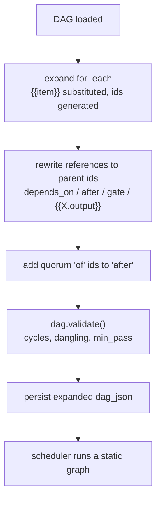

# pidag — spec-38: `for_each` fan-out and `quorum` adjudication

- **Project**: `/projects/pidag`
- **Crate**: `pidag`
- **Priority**: HIGH — `docs/ARCHITECTURE.md` §5. The pattern the failure research supports:
  several models reviewing in parallel, then a cheap vote.
- **Status**: SPECIFIED — not yet dispatched
- **Source**: `docs/ARCHITECTURE.md` §5–6 (`for_each` 1 d, quorum 1 d), audit C-2.
- **Depends-On**: spec-37 (critic) — landed. Its verdict parser is reused here, deliberately.

> **Execution context: entirely inside the `pidag-runner` container**, in `/projects/pidag`.

---

## Overview

The ensemble topology is already expressible today:

```
implement → ┌ critic-a (model 1) ┐
            ├ critic-b (model 2) ┤ → adjudicate → gate → repair
            └ critic-c (model 3) ┘
```

Every primitive exists — `after` edges, gates, and since spec-37 a verdict format. Two things
are missing, and both are ergonomic rather than structural:

- **The width is copy-paste, not data.** The `research` template hardcodes three branches. To
  review with four models you edit the template.
- **Adjudication costs a model call.** Counting three `PASS`/`FAIL` verdicts is arithmetic;
  spending a model on it is both slower and less reliable than the votes it is counting.

Nodes voting is cheaper and more reliable than one model self-reviewing, and it is the
cheapest available answer to *"who checks the checker"*.

**The graph stays static.** `for_each` expands at **load time**, before validation, into
ordinary nodes. Nothing decides the topology during the run. This is not an implementation
detail — `docs/ARCHITECTURE.md` §1 argues pidag's central asset is that its orchestrator does
not reason during execution, and ICML 2026 identifies the runtime-deciding orchestrator as
the origin of failure. A `for_each` that expanded during execution would import the dominant
failure mode deliberately.

**Three premises, verified against the code before this spec was written** (two prior specs
had requirements withdrawn for unverified premises):

1. `interpolate_outputs` reads the whole `node_state` map and works for **any terminal state
   — Done, Failed or Blocked**. A quorum node can therefore read the outputs of critics that
   *failed*, which is the normal case.
2. `after` edges wait for nodes to be terminal **in any state**, whereas `depends_on` blocks a
   dependent when its predecessor fails. Quorum must use `after`. Using `depends_on` would
   block the adjudicator exactly when there is something to adjudicate.
3. `[[repeat]]` in `src/workflow/mod.rs` already expands nodes at template-expansion time, so
   build-time expansion is established practice here, not a new concept.

---

## Requirements

### Functional

- **F1 (`for_each` on a node)**: `Node.for_each: Option<Vec<String>>`. A node carrying it
  expands into one node per item. The list is literal values in the DAG; it is not computed,
  not read from a file, and not produced by a model.

- **F2 (`{{item}}` substitution)**: within an expanding node, `{{item}}` is replaced by the
  item's value in `prompt`, `models`, `verify`, `gate` and `id`. Substitution happens at
  expansion time, so no `{{item}}` survives into a validated DAG.

- **F3 (generated ids are stable and legible)**: the child id is `<id>-<item>` with the item
  slugified (lowercase, non-alphanumerics to `-`), falling back to `<id>-<index>` on a
  collision or an empty slug. Ids must be deterministic across runs — resume depends on it.

- **F4 (references to the parent expand too)**: any `depends_on`, `after`, `gate` or
  `{{X.output}}` reference naming the un-expanded parent id resolves to **all** of its
  children. Without this, fan-out is unusable: the adjudicator could not name the set it
  adjudicates.

- **F5 (expand before validate)**: expansion runs at DAG load, **before** `dag.validate()`, so
  cycle and dangling-reference checking sees the real executed graph. An empty `for_each` list
  is a validation error, not a silently-vanishing node.

- **F6 (the vault stores the expanded graph)**: `RunMeta.dag_json` holds the expanded DAG. The
  vault is the record of what actually ran, and the event log references child ids; storing
  the unexpanded form would make the two disagree and break resume.

- **F7 (`quorum` node type)**: `node_type = "quorum"` with config naming the nodes to count
  and the threshold — `of: Vec<String>`, `min_pass: usize`. It dispatches **no worker and no
  subprocess**: it reads the recorded outputs of the named nodes and counts them.

- **F8 (verdicts are parsed by spec-37's parser)**: quorum interprets each counted output with
  **the same** verdict parser `Verify::Critic` uses — extracted and shared, not reimplemented.
  Two definitions of "what is a verdict" would drift, and the fail-closed property (a leading
  `PASS`/`FAIL` at a word boundary, everything else FAIL) must hold identically in both.

- **F9 (quorum ordering is automatic)**: each id in `of` is added to the node's `after` set at
  expansion time if not already present. Quorum must not use `depends_on` — see premise 2. An
  id in `of` that names no node is a validation error.

- **F10 (quorum result and reason)**: the node is `Done` when `pass_count >= min_pass`, else
  `Failed`. Its output states the tally and lists each node's verdict, so `gate` works on it
  unchanged and a repair node can interpolate *which* critics objected and why.

- **F11 (`min_pass` is checked)**: `min_pass == 0` or `min_pass > of.len()` is a validation
  error. A quorum that cannot fail, or cannot pass, is a configuration mistake.

### Non-Functional

- **N1**: **every existing DAG behaves identically.** A DAG with no `for_each` and no quorum
  node produces a byte-identical expanded graph. This is the guard on the whole spec.
- **N2**: no change to the `Worker` or `Store` trait signatures, and quorum adds no worker.
- **N3**: no new runtime dependencies.
- **N4**: **never modify `/projects/_upstream/`.**
- **N5**: the gate stays green; the test count may only go up.
- **N6**: no hardcoded absolute paths — `env!("CARGO_MANIFEST_DIR")`, `_tmp/` for scratch.
- **N7**: expansion is O(nodes × items); no quadratic reference rewriting on large fan-outs.

---

## Architecture



**Key decision — expand at load, never at runtime.** The scheduler continues to execute a
fixed topology it did not choose. See the Overview; this is the spec's most important
constraint.

**Key decision — quorum is an engine node type, not a model call.** Counting verdicts is
arithmetic. A model asked to count three votes can miscount, costs a round trip, and needs
its own verification. `node_type = "quorum"` joins `"shell"` and `"llm"` in the existing
dispatch in `src/worker/type_dispatch.rs`.

**Key decision — share spec-37's verdict parser.** Extract it to one place and call it from
both. A second implementation would drift, and the drift would be silent: both would still
compile and both would still pass their own tests.

**Key decision — quorum uses `after`, not `depends_on`.** Verified premise 2. This is the
difference between an adjudicator that runs when critics disagree and one that is Blocked
precisely then.

**What this spec is not**: it is not a budget ceiling (next spec), not `split` narrowing, and
not DAG-within-DAG composition. It does not make `for_each` iterate anything computed — the
list is literal, because a computed width is a runtime topology decision.

---

## TDD Contract

| id | test | given | expects |
|----|------|-------|---------|
| F1 | `test_for_each_expands_to_one_node_per_item` | node with 3 items | 3 nodes, parent absent |
| F2a | `test_item_substituted_in_prompt_and_models` | `{{item}}` in both | each child has its own value |
| F2b | `test_no_item_placeholder_survives_expansion` | any `for_each` DAG | no `{{item}}` anywhere post-expansion |
| F3a | `test_child_ids_are_slugified` | items `GPT-4o`, `claude 5` | `n-gpt-4o`, `n-claude-5` |
| F3b | `test_child_ids_are_deterministic` | same DAG expanded twice | identical ids, identical order |
| F3c | `test_id_collision_falls_back_to_index` | items slugifying identically | distinct ids, no panic |
| F4a | `test_depends_on_parent_expands_to_children` | `adjudicate.after = [critic]` | after = all 3 children |
| F4b | `test_output_reference_to_parent_expands` | `{{critic.output}}` downstream | resolves to all children |
| F5a | `test_expansion_precedes_validation` | child creating a cycle | validation catches it |
| F5b | `test_empty_for_each_is_an_error` | `for_each: []` | validation error, node does not vanish |
| F6 | `test_vault_stores_expanded_dag` | run a `for_each` DAG | `dag_json` contains child ids, not the parent |
| F7a | `test_quorum_dispatches_no_worker` | quorum node, mock worker | worker **never** called; no subprocess |
| F7b | `test_quorum_passes_at_threshold` | 2 PASS, 1 FAIL, `min_pass=2` | `Done` |
| F7c | `test_quorum_fails_below_threshold` | 1 PASS, 2 FAIL, `min_pass=2` | `Failed` |
| F8a | `test_quorum_uses_shared_verdict_parser` | source scan | one definition, called from both sites |
| F8b | `test_quorum_unparseable_verdict_counts_as_fail` | outputs `hmm`, `PASS`, `PASS`, `min_pass=3` | `Failed`. Fail-closed holds here too |
| F9a | `test_quorum_of_ids_added_to_after` | quorum with `of` and no `after` | after ⊇ of |
| F9b | `test_quorum_counts_failed_critics` | all 3 critics `Failed` | quorum still **runs** and reports 0 passed. **The premise-2 test** |
| F10 | `test_quorum_output_lists_each_verdict` | mixed verdicts | output names each node and its verdict |
| F11 | `test_min_pass_bounds_are_validated` | `min_pass=0`; `min_pass=4` of 3 | both validation errors |
| N1 | `test_dag_without_for_each_is_unchanged` | existing DAG fixtures | expanded graph byte-identical to input |

**F9b is the acceptance test.** It is the one the obvious implementation gets wrong — wiring
quorum through `depends_on` blocks the adjudicator exactly when critics fail, which is the
only time adjudication matters. It must run and report `0 passed`, not be Blocked.

**F7a matters** because a quorum that quietly dispatches a model defeats the entire point.

---

## Exit Criteria

```bash
cd /projects/pidag

grep -q 'for_each' src/core/dag.rs                    # F1
grep -q '"quorum"' src/worker/type_dispatch.rs        # F7
grep -qE 'min_pass' src/core/dag.rs                   # F11

# F8: exactly ONE verdict parser, shared -- not reimplemented
test "$(grep -rc 'fn parse_critic_verdict' src/ | grep -v ':0$' | wc -l)" = "1" \
  || { echo "VERDICT PARSER DUPLICATED"; exit 1; }

# F9: quorum must not be wired through depends_on
! grep -A 10 'quorum' src/core/dag.rs | grep -q 'depends_on.push'

# N4/N6
git diff --name-only | grep -q '_upstream' && { echo "VIOLATION"; exit 1; }
! grep -rq '/projects/pidag' tests/*.rs benches/*.rs

bash deploy/scripts/quality-gate.sh . ; echo "GATE EXIT=$?"

# the acceptance tests, named explicitly
cargo test -p pidag test_quorum_counts_failed_critics -- --exact --nocapture
cargo test -p pidag test_quorum_dispatches_no_worker  -- --exact --nocapture

env PIDAG_REQUIRE_PI=1 PIDAG_REQUIRE_VALIDATOR=1 cargo test -p pidag -j 2 --no-fail-fast 2>&1 | grep -E '^test result:'
```

**Prose criteria**:

1. **`GATE EXIT=0`**, with no `VIOLATION` or `VERDICT PARSER DUPLICATED` line.
2. **F9b quoted failing against a `depends_on` wiring, then passing with `after`.** Wire it
   the wrong way first and watch the adjudicator go Blocked — that is the defect this
   requirement exists to prevent, and seeing it fail is the only proof the test can detect it.
3. **A real run, quoted**: the ensemble topology from the Overview — one producing node, three
   critics fanned out by `for_each` over three model names, a quorum adjudicator, a gate, and
   a repair node. Paste the run report and the quorum node's output. A passing unit suite is
   not evidence the seam works; that is this codebase's documented recurring failure.
4. **Confirm no worker and no subprocess is dispatched for a quorum node** (F7a), and say how.
5. **Quote the expanded `dag_json` for a `for_each` node** (F6), showing child ids and the
   rewritten references.
6. Test counts pasted raw, one `^test result:` line per binary, **unsummed**.

---

## Guardrails

- **G1 — NEVER modify any file under `specs/`.** If this spec is wrong, incomplete or
  self-contradictory, **STOP and report it**. Two requirements in this project were withdrawn
  because a workhorse reported a bad premise instead of coding around it; those reports were
  the most valuable output of their runs.
- **G2 — NO WORKHORSE MAY COMMIT.** Leave work in the tree.
- **G3 — NEVER modify `/projects/_upstream/`.**
- **G4 — do NOT expand `for_each` at runtime.** Expansion happens at load, before validation.
  The scheduler must keep executing a topology it did not choose. This is the spec's central
  constraint, not a preference.
- **G5 — do NOT give quorum a worker, a model, or a subprocess** (F7a). It is arithmetic.
- **G6 — do NOT reimplement the verdict parser** (F8). Extract spec-37's and call it. Two
  copies drift silently and both keep passing their own tests.
- **G7 — do NOT wire quorum through `depends_on`** (F9). It must run when its critics fail.
- **G8 — do NOT change `Verify`, the critic path, `verify_pre`, or the `Worker`/`Store`
  traits.** spec-37 is settled and tested.
- **G9 — do NOT make `for_each` iterate anything computed** — no file reads, no model output,
  no globs. A computed width is a runtime topology decision, which G4 forbids.
- **G10 — do NOT regenerate any pinned fixture** and never run an `#[ignore]`d generator with
  `--ignored`. `tests/fixtures/legacy_vault/legacy.redb` must still hash to
  `cd51a399ba5dea8c415bac66c0084d4f168044c0`.
- **G11 — never `rm -rf` a `.pidag/` directory.** Move it aside with `mv`.
- **G12 — report raw output, never summed totals.**
- **G13 — clippy clean at `cargo clippy -p pidag -- -D warnings`.**
- **G14 — no hardcoded absolute paths.**

### Error handling expectations

- Every expansion failure — empty `for_each`, an id collision that cannot be resolved, a
  `quorum.of` naming a node that does not exist, `min_pass` out of bounds — is a **validation
  error naming the node and the problem**, raised before the run starts. A DAG that fails to
  expand must not run partially.
- A quorum node whose counted nodes produced no output at all reports `0 passed` and fails.
  It must not error, and it must not pass.
- The distinction between "the critics voted it down" and "the quorum was misconfigured" must
  be visible in the message. They demand different responses from a human reading the trace.

---

## Files to Modify

| File | Change |
|------|--------|
| `src/core/dag.rs` | `for_each`, quorum config, expansion, validation (F1–F5, F9, F11) |
| `src/scheduler/execute.rs` | extract the verdict parser for sharing (F8) |
| `src/worker/type_dispatch.rs` | `"quorum"` arm, dispatching no worker (F7) |
| `src/workflow/mod.rs` | templates may carry `for_each` (F1) |
| `tests/foreach_quorum_tests.rs` | **NEW** — the TDD Contract above |

**Not modified**: `specs/`, `deploy/`, `/projects/_upstream/`, `Verify`, `verify_pre`, the
`Worker` and `Store` traits.

## Memory

Store on completion: `workspace/specs/pidag-38-foreach-and-quorum`,
`claude-pi-delegation/phase/20260812-ensemble`.
