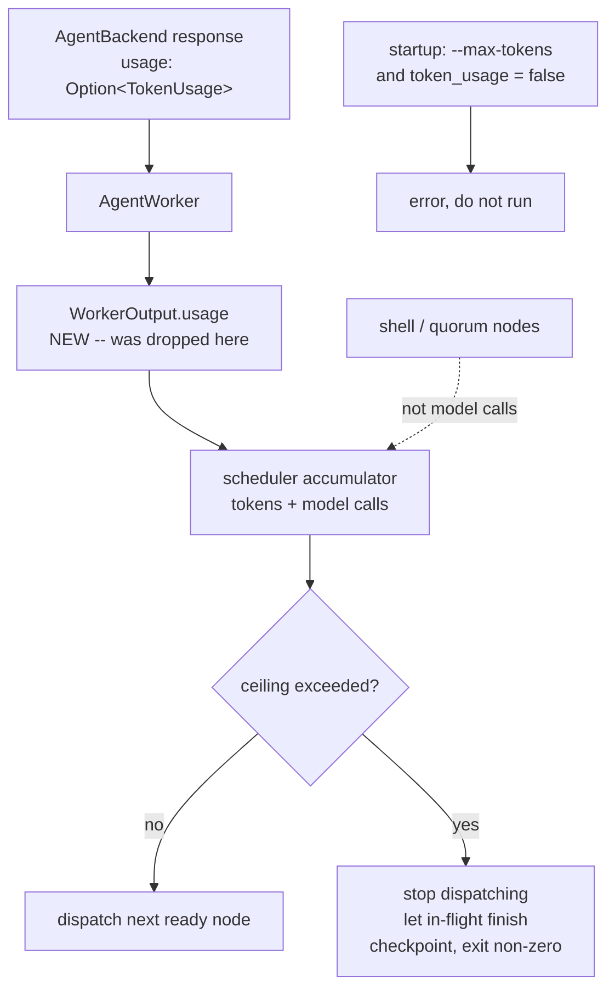

# pidag — spec-39: budget ceilings (`--max-tokens`, `--max-model-calls`)

- **Project**: `/projects/pidag`
- **Crate**: `pidag`
- **Priority**: HIGH — `docs/ARCHITECTURE.md` §6 lists it against "the $50k-at-scale caution".
  `--allow-paid` is a boolean, not a limit: today nothing bounds a run.
- **Status**: SPECIFIED — not yet dispatched
- **Source**: `docs/ARCHITECTURE.md` §6, amended. **The plan's `--max-spend` at 0.5 d was
  wrong** — see "What the plan got wrong" below. Unit confirmed with the user 2026-08-12.
- **Depends-On**: spec-37 (critic) and spec-38 (`for_each`/quorum) — both landed, and both
  multiply the number of model calls a run makes, which is what makes this urgent.

> **Execution context: entirely inside the `pidag-runner` container**, in `/projects/pidag`.

---

## Overview

Nothing bounds a pidag run. `--allow-paid` decides *whether* paid models may be used, not
*how much*. A retry loop, a repair cascade, or a `for_each` ensemble over five models on a
50-node DAG can spend without limit, and the operator finds out afterwards.

### What the plan got wrong

`docs/ARCHITECTURE.md` specified `--max-spend` — a **dollar** ceiling — at 0.5 days. Checking
that against the code before writing this spec found the premise unsupportable:

- **There is no cost data.** `WorkerOutput` carries `success`, `output`, `retryable` and
  nothing else. Every construction site across `shell.rs`, `pi_print.rs` and `agent.rs`
  confirms it.
- **Usage exists one layer down and is discarded.** `AgentBackend`'s response carries
  `usage: Option<TokenUsage>` (`src/backend/mod.rs:100`), gated by the `token_usage`
  capability (`src/backend/capabilities.rs:42`, which `PiBackend` sets true). `AgentWorker`
  adapts the backend to the `Worker` trait and drops it, because `WorkerOutput` has nowhere
  to put it.
- **Dollars would need a price table pidag cannot keep honest.** It goes stale on any
  provider price change, and is simply wrong for the free-tier and self-hosted models pidag
  mostly drives. A ceiling reported in dollars that pidag cannot reconcile against an invoice
  is a number that invites trust it has not earned.

So: **two ceilings, counted in units pidag can actually observe.** Dollars are deliberately
not built.

- **`--max-model-calls N`** — always enforceable. Counts dispatches that consume a model. No
  plumbing, no capability gate, works on every worker path.
- **`--max-tokens N`** — enforced where the backend reports usage. Requires plumbing
  `TokenUsage` from the backend response through `WorkerOutput` to the scheduler.

**Fail closed.** `--max-tokens` against a backend that cannot report usage is a **startup
error**, not a silently unenforced flag. An operator who passes a ceiling and gets an
unbounded run is worse off than one who got an error, because they believe they are covered.
This codebase has shipped that exact shape of defect before.

---

## Requirements

### Functional

- **B1 (usage reaches the scheduler)**: `WorkerOutput` gains `usage: Option<TokenUsage>`.
  `AgentWorker` populates it from the backend response. `RealShellWorker` and `PiPrintWorker`
  set `None` — they have no usage source, and inventing one would be a lie.

- **B2 (`--max-model-calls N`)**: the scheduler aborts the run when the number of dispatches
  that consume a model would exceed `N`. Shell nodes and `quorum` nodes are **not** model
  calls and are not counted.

- **B3 (`--max-tokens N`)**: the scheduler aborts when cumulative `total_tokens` exceeds `N`.

- **B4 (`--max-tokens` fails closed on an unreporting backend)**: if the selected backend's
  `token_usage` capability is false, `--max-tokens` is a **startup error** naming the backend
  and directing the operator to `--max-model-calls`. The run does not start. A node that
  returns `usage: None` from a backend that *claims* the capability is a hard error naming
  the node, not a silent zero — a zero would let an unreporting path spend without limit.

- **B5 (breach behaviour, stated honestly)**: on breach the scheduler dispatches **no further
  nodes** and the run terminates with a distinct non-zero exit status. Nodes already in
  flight are allowed to finish — they cannot be cancelled mid-call — so **the ceiling is a
  bound on what is started, and a run may overshoot by at most the in-flight set**. This is
  a real limitation and must be documented in `--help` and the README, not glossed.

- **B6 (the run is resumable after a breach)**: a breach checkpoints like any other
  termination. The operator raises the ceiling and resumes; nothing is lost.

- **B7 (counters accumulate across resumes)**: the totals persist in the vault and continue
  from where they stopped. A ceiling that reset on resume would bound nothing — a run could
  be resumed indefinitely under a ceiling it had already breached.

- **B8 (critic and verify dispatches count)**: a `Verify::Critic` dispatch is a model call and
  counts toward both ceilings. So does every `for_each` child. **This is the requirement an
  implementation is most likely to miss**, and missing it makes both ceilings meaningless on
  exactly the ensemble topologies spec-37 and spec-38 just enabled.

- **B9 (visible counters)**: cumulative tokens and model calls appear in the run report and in
  the event log, whether or not a ceiling was set. An operator should be able to discover what
  a run costs before choosing a ceiling for it.

- **B10 (no flags means unchanged)**: with neither flag, behaviour is exactly as today —
  unbounded, no new failure modes.

### Non-Functional

- **N1**: **every existing run behaves identically without the new flags.** The guard on the
  whole spec.
- **N2**: no change to the `Worker` trait's method signature or the `Store` trait.
  `WorkerOutput` gains a field, which is a struct change; `Scheduler::run(allow_paid)` may
  widen to carry the ceilings.
- **N3**: no new runtime dependencies, and **no price table**.
- **N4**: **never modify `/projects/_upstream/`.**
- **N5**: the gate stays green; the test count may only go up.
- **N6**: no hardcoded absolute paths — `env!("CARGO_MANIFEST_DIR")`, `_tmp/` for scratch.

---

## Architecture



**Key decision — count what is observable, not what is billed.** Tokens and calls are facts
pidag receives. Dollars are an estimate it cannot reconcile. See the Overview.

**Key decision — the ceiling bounds what is *started*.** Cancelling an in-flight model call
mid-flight is not something the `Worker` trait supports, and adding cancellation is a much
larger change. Bounding dispatch is honest and achievable; the overshoot is disclosed rather
than hidden.

**Key decision — accumulate in the vault, not in memory.** B7. The vault already is the run's
record; a counter that lives only in the process is defeated by the resume path.

**Key decision — `--max-tokens` refuses rather than degrades.** A flag that silently does
nothing on some backends is worse than no flag. Compare `PIDAG_REQUIRE_VALIDATOR`, added for
the same reason: a check that cannot run must say so.

**What this spec is not**: it is not per-node budgets, not scheduling by cost, not a price
table, and not mid-call cancellation.

---

## TDD Contract

| id | test | given | expects |
|----|------|-------|---------|
| B1a | `test_worker_output_carries_usage` | `AgentWorker` over a backend reporting usage | `WorkerOutput.usage` is `Some` with the backend's figures |
| B1b | `test_shell_worker_usage_is_none` | `RealShellWorker` | `usage: None`, not `Some(0)` |
| B2a | `test_model_call_ceiling_aborts` | 5 llm nodes, `--max-model-calls 3` | run aborts; at most 3 dispatched |
| B2b | `test_shell_and_quorum_are_not_model_calls` | 10 shell nodes + a quorum, `--max-model-calls 1` | all complete; no abort |
| B3 | `test_token_ceiling_aborts` | nodes reporting 100 tok each, `--max-tokens 250` | aborts after cumulative exceeds 250 |
| B4a | `test_max_tokens_without_capability_is_startup_error` | backend with `token_usage: false`, `--max-tokens 100` | **startup error** naming the backend and suggesting `--max-model-calls`; run never starts |
| B4b | `test_missing_usage_from_capable_backend_is_an_error` | backend claims capability, returns `usage: None` | hard error naming the node; **not** treated as zero |
| B5a | `test_breach_stops_further_dispatch` | breach mid-run | no node dispatched after the breach |
| B5b | `test_breach_exit_status_is_distinct` | breach | non-zero status distinguishable from an ordinary node failure |
| B6 | `test_run_resumable_after_breach` | breach, then resume with a raised ceiling | completes; no work redone |
| B7 | `test_counters_accumulate_across_resume` | 200 tok, breach at 250, resume | resumed run starts from 200, not 0. **A reset would bound nothing** |
| B8a | `test_critic_dispatch_counts` | node with `Verify::Critic`, `--max-model-calls 1` | the critic's dispatch counts; ceiling trips |
| B8b | `test_for_each_children_count` | `for_each` over 3 models, `--max-model-calls 2` | aborts; the third child is never dispatched |
| B9 | `test_report_shows_counters_without_a_ceiling` | run with no flags | report states tokens and model calls |
| B10 | `test_no_flags_is_unchanged` | existing run fixtures | identical behaviour and exit status |

**B8a is the acceptance test.** Critic and `for_each` dispatches are exactly the calls the
last two specs multiplied, and an accumulator wired only into the main dispatch path misses
them while every other test still passes.

**B7 is the second one to get right.** An in-memory counter passes every single-run test and
bounds nothing in practice.

---

## Exit Criteria

```bash
cd /projects/pidag

grep -q 'usage' src/worker/mod.rs                     # B1
grep -qE 'max_tokens|max-tokens' src/cli/run.rs       # B3
grep -qE 'max_model_calls|max-model-calls' src/cli/run.rs   # B2

# N3: no price table smuggled in
! grep -rqiE 'price_per|cost_per|usd|dollars' src/

# B4: the capability check exists and is a startup error
grep -rq 'token_usage' src/cli/run.rs || grep -rq 'token_usage' src/scheduler/

# N4/N6
git diff --name-only | grep -q '_upstream' && { echo "VIOLATION"; exit 1; }
! grep -rq '/projects/pidag' tests/*.rs benches/*.rs

bash deploy/scripts/quality-gate.sh . ; echo "GATE EXIT=$?"

# the acceptance tests, named explicitly
cargo test -p pidag test_critic_dispatch_counts          -- --exact --nocapture
cargo test -p pidag test_counters_accumulate_across_resume -- --exact --nocapture

env PIDAG_REQUIRE_PI=1 PIDAG_REQUIRE_VALIDATOR=1 cargo test -p pidag -j 2 --no-fail-fast 2>&1 | grep -E '^test result:'
```

**Prose criteria**:

1. **`GATE EXIT=0`**, with no `VIOLATION` line.
2. **A real run, quoted**: a DAG that breaches `--max-model-calls`, showing the abort message,
   the exit status, and then a successful resume with the ceiling raised. A passing unit suite
   is not evidence the seam works — this codebase's documented recurring failure.
3. **B8a quoted failing against an accumulator wired only into the main dispatch path**, then
   passing. Wire it the incomplete way first; the point is to show the test detects it.
4. **The overshoot disclosed** (B5): state the maximum overshoot for a given `--concurrency`,
   and quote where `--help` and the README say so.
5. Test counts pasted raw, one `^test result:` line per binary, **unsummed**.

---

## Guardrails

- **G1 — NEVER modify any file under `specs/`.** If this spec is wrong, incomplete or
  self-contradictory, **STOP and report it**. Three requirements in this project have been
  withdrawn or corrected because a workhorse reported a bad premise instead of coding around
  it; those reports were the most valuable output of their runs.
- **G2 — NO WORKHORSE MAY COMMIT.** Leave work in the tree.
- **G3 — NEVER modify `/projects/_upstream/`.**
- **G4 — do NOT add a price table, a currency, or a dollar estimate** (N3). The unit was
  chosen deliberately; see the Overview.
- **G5 — do NOT let `--max-tokens` silently do nothing** on a backend that cannot report
  usage (B4a). It is a startup error. A flag the operator believes is protecting them, that
  is not, is the worst outcome available here.
- **G6 — do NOT treat a missing `usage` as zero** (B4b). Fail closed, name the node.
- **G7 — do NOT keep the counters only in memory** (B7). They persist in the vault.
- **G8 — do NOT count shell or quorum nodes as model calls** (B2b). They consume no model.
- **G9 — do NOT forget critic and `for_each` dispatches** (B8). They are the calls that matter.
- **G10 — do NOT add mid-call cancellation** to make the ceiling exact. Out of scope; the
  overshoot is disclosed instead.
- **G11 — do NOT change the `Worker` trait method signature or the `Store` trait** (N2).
  Adding a field to `WorkerOutput` is expected and fine.
- **G12 — do NOT regenerate any pinned fixture.** `tests/fixtures/legacy_vault/legacy.redb`
  must still hash to `cd51a399ba5dea8c415bac66c0084d4f168044c0`.
- **G13 — never `rm -rf` a `.pidag/` directory.** Move it aside with `mv`.
- **G14 — report raw output, never summed totals.**
- **G15 — clippy clean at `cargo clippy -p pidag -- -D warnings`.**
- **G16 — no hardcoded absolute paths.**

### Error handling expectations

- The breach message names **which ceiling**, the figure reached, the limit, and the node
  after which it tripped. "Budget exceeded" alone is not actionable.
- A breach must be distinguishable in the event log and the exit status from a node failure.
  They demand different responses: one is raise-and-resume, the other is fix-and-resume.
- The `--max-tokens`-without-capability error names the backend and the alternative flag.
  It is a configuration problem, and the operator needs to know what to do instead.

---

## Files to Modify

| File | Change |
|------|--------|
| `src/worker/mod.rs` | `WorkerOutput.usage` (B1) |
| `src/worker/agent.rs` | populate `usage` from the backend response (B1a) |
| `src/worker/shell.rs`, `src/worker/pi_print.rs` | `usage: None` (B1b) |
| `src/scheduler/execute.rs` | accumulator, ceiling checks, breach path (B2–B5, B8) |
| `src/store/mod.rs`, `src/store/redb_store.rs` | persist counters (B7) |
| `src/cli/run.rs` | `--max-tokens`, `--max-model-calls`, capability check, `--help` (B2–B4) |
| `README.md` | document both flags and the overshoot (B5) |
| `tests/budget_ceiling_tests.rs` | **NEW** — the TDD Contract above |

**Not modified**: `specs/`, `deploy/`, `/projects/_upstream/`, the `Worker` method signature,
the `Store` trait.

## Memory

Store on completion: `workspace/specs/pidag-39-budget-ceilings`,
`claude-pi-delegation/phase/20260812-budget`.
