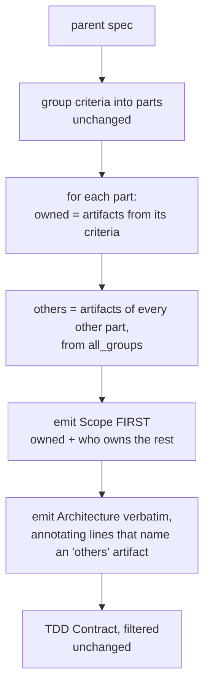

# pidag — spec-40: narrow the Architecture section per split child

- **Project**: `/projects/pidag`
- **Crate**: `pidag`
- **Priority**: MEDIUM — the last item on the `docs/ARCHITECTURE.md` §6 plan, at 0.5 d.
- **Status**: SPECIFIED — not yet dispatched
- **Source**: `docs/ARCHITECTURE.md` §6 ("`split`: narrow Architecture per child"), audit U-2
  remainder, and `docs/FINDINGS.md` ("`split` divided the checklist, not the work").
- **Depends-On**: none. `split` grouping and TDD filtering already landed.

> **Execution context: entirely inside the `pidag-runner` container**, in `/projects/pidag`.

---

## Overview

`split` decomposes a spec into parts. The **TDD Contract is filtered** per child — only the
rows that part owns survive. The **Architecture is not**: it is copied verbatim, followed by

> **Note**: the Architecture above describes the FULL system, including artifacts owned by
> other parts. Build only what Scope lists.

That note is honest and it does not work. `docs/FINDINGS.md` records the outcome: running one
child built the entire system, and running all three cost three times the tokens for one
system. The conclusion drawn there is the premise of this spec:

> **When a spec instructs narrowly but describes broadly, the description wins.**

An implementer reads a full-system Architecture, forms a mental model of the whole thing, and
builds it. A single trailing caveat does not undo several hundred words of design description
that arrived first and read as the brief.

### What this spec does *not* do

It does not delete parts of the Architecture. Design rationale — why a decision was made, what
was rejected — is genuine context a child needs even for the slice it owns, and a heuristic
that drops paragraphs would silently discard exactly the reasoning that prevents a wrong
implementation. **Nothing is removed.** What changes is *ordering* and *attribution*: the
narrow instruction arrives first, and every mention of an artifact this part does not own is
marked, at the point it appears, with the part that does own it.

`generate_child_spec_content` already receives `all_groups: &[Vec<usize>]` — every part's
criteria assignment — so ownership is computable for *all* parts, not just this one. That is
what makes attribution by part number possible rather than a vague "belongs to another part".

---

## Requirements

### Functional

- **S1 (Scope comes first)**: `## Scope (Part N of M)` is emitted **before** `## Architecture`
  in the child spec. The reader must meet the narrow instruction before the broad description.

- **S2 (the heading says what it is)**: the child's Architecture heading reads
  `## Architecture (full system — context, not a build list)`. A reader skimming headings must
  not mistake it for this part's brief.

- **S3 (inline ownership attribution)**: within the copied Architecture, every line naming an
  artifact owned by a **different** part is annotated in place with that part's number, e.g.
  `` `src/store/redb_store.rs` `` → `` `src/store/redb_store.rs` **[Part 2]** ``. Attribution
  appears where the artifact appears, not only in a trailing note.

- **S4 (the other parts are named explicitly)**: the Scope section lists, after this part's
  owned artifacts, the artifacts owned by each other part grouped by part number — "Part 2
  owns: …". "Anything else belongs to another part" is not actionable; a name and a number
  are.

- **S5 (nothing is deleted)**: every line of the parent's Architecture appears in the child.
  Annotation only. A child must never lose design rationale.

- **S6 (single part is a no-op)**: with `total_parts == 1` there is no other part to attribute
  to, so no annotations are added and the Architecture is copied as today. A spec that did not
  need splitting must not acquire split scaffolding.

- **S7 (unattributable lines are left alone)**: a line naming no artifact, or naming an
  artifact no part owns, is copied unchanged. **Do not guess.** A wrong attribution is worse
  than none — it tells an implementer to skip something nobody is building.

### Non-Functional

- **N1**: the parent spec is never modified. `split` reads it and writes children.
- **N2**: existing `split` behaviour is otherwise unchanged — grouping, TDD filtering, criteria
  assignment and filenames all stay as they are. The gate on this spec is that
  `tests/split_tests.rs` and `tests/split_scope_tests.rs` keep passing.
- **N3**: no new runtime dependencies.
- **N4**: **never modify `/projects/_upstream/`.**
- **N5**: the gate stays green; the test count may only go up.
- **N6**: no hardcoded absolute paths — `env!("CARGO_MANIFEST_DIR")`, `_tmp/` for scratch.

---

## Architecture



**Key decision — reorder and attribute, do not filter.** Filtering prose by keyword would drop
design rationale that applies to the whole system, including this part. The failure being
fixed is that the broad description arrives first and unattributed; both of those are fixable
without deleting anything.

**Key decision — attribute by part number, not "another part".** `all_groups` makes the owning
part computable. A child told `` `src/ui/render.rs` **[Part 3]** `` knows the artifact is
someone's responsibility and not an oversight; a child told "belongs to another part" cannot
distinguish that from something nobody owns.

**Key decision — never guess an attribution** (S7). An artifact no part owns is a gap in the
parent spec, and marking it as somebody's would hide that gap.

**What this spec is not**: it is not a change to how criteria are grouped, nor to TDD
filtering, nor a rewrite of `split`'s heuristics. Those landed and are tested.

---

## TDD Contract

| id | test | given | expects |
|----|------|-------|---------|
| S1 | `test_scope_precedes_architecture` | any 2-part split | `## Scope` byte offset < `## Architecture` offset |
| S2 | `test_architecture_heading_marks_context` | any child | heading contains "context, not a build list" |
| S3a | `test_other_part_artifact_is_annotated_inline` | part 1's child; Architecture names an artifact owned by part 2 | that line carries `**[Part 2]**`. **The acceptance test** |
| S3b | `test_own_artifact_is_not_annotated` | Architecture names this part's own artifact | no `[Part N]` marker on it |
| S4 | `test_scope_names_other_parts_artifacts` | 3-part split | Scope lists "Part 2 owns:" and "Part 3 owns:" with artifact names |
| S5 | `test_no_architecture_line_is_lost` | parent Architecture of N lines | every line present in the child, ignoring added annotations |
| S6 | `test_single_part_is_unannotated` | `total_parts == 1` | no `[Part` marker anywhere; Architecture byte-identical to parent's |
| S7a | `test_unowned_artifact_is_not_annotated` | Architecture names an artifact no criterion mentions | line copied unchanged |
| S7b | `test_prose_line_is_not_annotated` | a line naming no artifact | copied unchanged |
| N2 | existing `split_tests.rs`, `split_scope_tests.rs` | unchanged | still green |

**S3a is the acceptance test.** It is the whole point: the attribution must appear *at the
artifact*, because a note at the end is what already exists and what already failed.

**S5 guards the risk this design takes.** Annotating in place means rewriting lines, and a
line-rewriting bug that silently drops content would be worse than the problem being fixed.

---

## Exit Criteria

```bash
cd /projects/pidag

grep -q 'context, not a build list' src/split/mod.rs          # S2
grep -qE 'Part \{\}|\[Part ' src/split/mod.rs                 # S3

# S1: Scope is emitted before Architecture in the generator
test "$(grep -n '## Scope' src/split/mod.rs | head -1 | cut -d: -f1)" \
   -lt "$(grep -n '## Architecture' src/split/mod.rs | head -1 | cut -d: -f1)" \
   || { echo "SCOPE NOT EMITTED FIRST"; exit 1; }

# N4/N6
git diff --name-only | grep -q '_upstream' && { echo "VIOLATION"; exit 1; }
! grep -rq '/projects/pidag' tests/*.rs benches/*.rs

bash deploy/scripts/quality-gate.sh . ; echo "GATE EXIT=$?"

# the acceptance test, named explicitly
cargo test -p pidag test_other_part_artifact_is_annotated_inline -- --exact --nocapture
cargo test -p pidag test_no_architecture_line_is_lost           -- --exact --nocapture

env PIDAG_REQUIRE_PI=1 PIDAG_REQUIRE_VALIDATOR=1 cargo test -p pidag -j 2 --no-fail-fast 2>&1 | grep -E '^test result:'
```

**Prose criteria**:

1. **`GATE EXIT=0`**, with no `VIOLATION` or `SCOPE NOT EMITTED FIRST` line.
2. **A real split, quoted**: run `pidag split` on an actual multi-part spec in `specs/` and
   paste **one complete child spec**. It must be readable as a brief for its part alone — the
   Scope first, the Architecture attributed. This is the criterion that matters; the unit
   tests check mechanics, but only reading the artefact shows whether the problem is fixed.
3. **Quote the same child spec's Architecture section against the parent's**, showing that no
   line was lost (S5) and that annotations landed only on other parts' artifacts.
4. Test counts pasted raw, one `^test result:` line per binary, **unsummed**.

---

## Guardrails

- **G1 — NEVER modify any file under `specs/`.** `split` **reads** parent specs and **writes
  child spec files**, which is its job; that is not a violation. What is forbidden is editing
  an existing spec's content by hand. If this spec looks wrong, **STOP and report it** — four
  requirements in this project have been withdrawn or corrected because a workhorse reported a
  bad premise instead of coding around it.
- **G2 — NO WORKHORSE MAY COMMIT.** Leave work in the tree.
- **G3 — NEVER modify `/projects/_upstream/`.**
- **G4 — do NOT delete or summarise any Architecture content** (S5). Annotation only.
- **G5 — do NOT guess an attribution** (S7). If no part owns the artifact, leave the line alone.
- **G6 — do NOT change criteria grouping, TDD filtering, or `split`'s heuristics** (N2). They
  landed and are tested; this spec touches emission only.
- **G7 — do NOT add split scaffolding when `total_parts == 1`** (S6).
- **G8 — do NOT regenerate any pinned fixture.** `tests/fixtures/legacy_vault/legacy.redb`
  must still hash to `cd51a399ba5dea8c415bac66c0084d4f168044c0`.
- **G9 — never `rm -rf` a `.pidag/` directory.** Move it aside with `mv`.
- **G10 — report raw output, never summed totals.**
- **G11 — clippy clean at `cargo clippy -p pidag -- -D warnings`.**
- **G12 — no hardcoded absolute paths.**

### Error handling expectations

- A parent with no `## Architecture` section produces a child with none — not an empty heading
  and not an error. Many small specs have no Architecture section.
- An artifact name appearing in two parts' criteria is a grouping ambiguity in the parent, not
  something to resolve silently. Annotate with **all** owning parts (`**[Parts 2, 3]**`) so the
  ambiguity is visible to a human rather than arbitrated by the tool.

---

## Files to Modify

| File | Change |
|------|--------|
| `src/split/mod.rs` | emit Scope first; heading text; inline attribution; other-part lists (S1–S7) |
| `tests/split_scope_tests.rs` | the TDD Contract above |

**Not modified**: `specs/` (by hand), `deploy/`, `/projects/_upstream/`, `split`'s grouping
and TDD filtering.

## Memory

Store on completion: `workspace/specs/pidag-40-split-architecture-narrowing`,
`claude-pi-delegation/fix/20260813-split-narrowing`.
