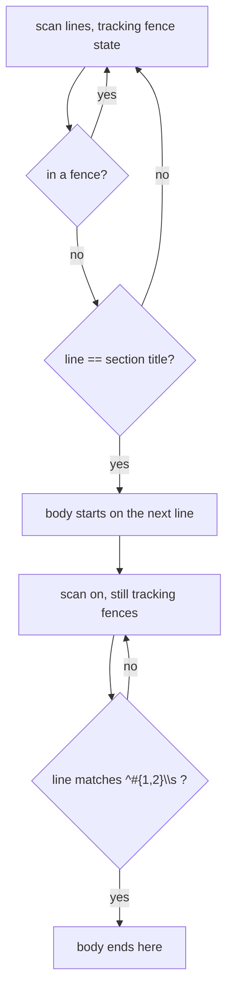

# pidag — spec-41: `extract_section` loses a third of every spec

- **Project**: `/projects/pidag`
- **Crate**: `pidag`
- **Priority**: **P0 — silent data loss in `split`.** Child specs are missing the Requirements
  section outright for most well-structured parents. The contract is what goes missing.
- **Status**: IMPLEMENTED and verified 2026-08-13. Gate green. E6 failed first at
  **37 of 226** sections, then passed at zero. Two sibling defects remain out of scope
  and are specified separately — see spec-42.
- **Source**: 2026-08-13. Surfaced by the spec-40 implementation, which reported that its
  annotation work "never fires visibly" on many specs because the Architecture extracted empty.
- **Depends-On**: none. spec-40 landed; this is what limits its reach.

> **Execution context: entirely inside the `pidag-runner` container**, in `/projects/pidag`.

---

## Overview

```rust
fn extract_section(spec: &str, section_title: &str) -> String {
    if let Some(start) = spec.find(section_title) {
        let remaining = &spec[start + section_title.len()..];
        let end = remaining.find("##").unwrap_or(remaining.len());
        remaining[..end].trim().to_string()
    } else { String::new() }
}
```

Nine lines, wrong three independent ways, and every one is observable on specs in this repo.

**1 — the terminator matches inside `###`.** `remaining.find("##")` finds `##` as a
*substring*, so a `### Functional` sub-heading ends the section. A `## Requirements` whose body
opens with `### Functional` — the house style of every spec from 21 onward — extracts as
**empty**.

**2 — the terminator matches inside code fences.** A `## Exit Criteria` line inside a fenced
block (`specs/08`) or `## Node Details` in sample output (`specs/94`) terminates the section
early.

**3 — the start is not anchored to a line.** `spec.find(section_title)` matches anywhere,
including a `### Requirements` sub-heading (`specs/14`, `specs/96`) or a prose mention in a
bullet (`specs/40`, which quotes `` `## Architecture` `` while describing emission order).
Extraction then begins from the wrong place entirely.

**Measured across `specs/*.md`, 227 sections:**

| outcome | count |
|---|---|
| extracted **empty** despite having content | **37** |
| truncated, losing more than 10% | **39** |
| intact | 151 |

**One third of all spec content is silently lost.** The largest single case is
`specs/27`'s Requirements: 7,942 characters, extracted as nothing.

**Why this matters more than it looks.** `split` writes child specs. A child missing its
Requirements section is not a degraded brief — it is a brief with the contract removed, handed
to an implementer who has no way to know something was dropped. This is the same shape as
every entry in `docs/FINDINGS.md`: it looks right, it produces plausible output, and nothing
fails. The unit tests for `split` pass because their fixtures are simple specs with no `###`
sub-headings — **the one input shape where the broken implementation works.**

---

## Requirements

### Functional

- **E1 (the heading is a line, not a substring)**: a section starts only at a line whose
  entire content is the section title (trailing whitespace permitted). A prose mention, an
  inline-code quotation, or a deeper heading such as `### Requirements` must **not** match.

- **E2 (the body ends at the next heading of the same or higher level)**: the body ends at the
  next line matching `^#{1,2}\s`, i.e. an `#` or `##` heading. **`###` and deeper are content**
  and stay in the body.

- **E3 (code fences are not scanned)**: lines inside a fenced code block — opened and closed
  by a run of three backticks or three tildes at line start, info string permitted — are
  never treated as a heading, for either the start or the terminator.

- **E4 (a missing section is empty, not an error)**: a spec with no such heading yields an
  empty string, as today. Many small specs have no Architecture section.

- **E5 (an empty section stays empty)**: a heading immediately followed by the next heading
  yields an empty body. Distinguishing "absent" from "present but empty" is not required.

- **E6 (the repo is the regression guard)**: a test iterates `specs/*.md` and asserts that for
  every section heading present with non-empty content, extraction returns non-empty. This is
  the check that would have caught the defect, and its absence is why the defect survived.
  **It must fail on the current implementation.**

### Non-Functional

- **N1**: `split`'s grouping, TDD filtering, criteria assignment, filenames and spec-40's
  attribution are all unchanged. This fixes extraction only — but expect child specs to grow,
  because they will finally contain the sections they were always meant to.
- **N2**: no new runtime dependencies. A hand-written line scan is sufficient; **do not add a
  Markdown parser** for nine lines of logic.
- **N3**: **never modify `/projects/_upstream/`.**
- **N4**: the gate stays green; the test count may only go up.
- **N5**: no hardcoded absolute paths — `env!("CARGO_MANIFEST_DIR")`, `_tmp/` for scratch.
- **N6**: **the parent specs are not edited to suit the parser.** The specs are correct
  Markdown; the parser is wrong. Rewriting 37 specs to avoid a bug would be fixing the
  evidence.

---

## Architecture



**Key decision — a line scan, not a Markdown parser.** The grammar needed is "headings at line
start, outside fences". A parser dependency for that is disproportionate, and its own edge
cases would be a new surface.

**Key decision — `###` is content.** Sub-headings structure a section; they do not end it.
This is the whole defect, stated as a rule.

**Key decision — the guard iterates the real `specs/` directory** (E6). A fixture-only test is
what already exists and what already passed while a third of every spec was being dropped. The
repo is the input distribution that matters.

**What this spec is not**: it is not a change to what `split` does with the sections once
extracted, and not a Markdown normalisation pass over `specs/`.

---

## TDD Contract

| id | test | given | expects |
|----|------|-------|---------|
| E1a | `test_prose_mention_does_not_start_a_section` | body quotes `` `## Architecture` `` in a bullet before the real heading | extraction starts at the real heading |
| E1b | `test_sub_heading_does_not_start_a_section` | `### Requirements` appears before `## Requirements` | starts at the `##` heading |
| E2a | `test_sub_headings_are_kept_in_the_body` | `## Requirements` then `### Functional` … `### Non-Functional` | **both** sub-sections present. **The acceptance test** |
| E2b | `test_body_ends_at_next_h2` | two consecutive `##` sections | first body stops at the second heading |
| E2c | `test_body_ends_at_h1` | `## X` followed by `# Y` | body stops at the `#` heading |
| E3a | `test_fenced_heading_does_not_terminate` | a `## Exit Criteria` line inside a ``` block | body continues past it |
| E3b | `test_tilde_fence_is_honoured` | same with `~~~` | body continues past it |
| E4 | `test_missing_section_is_empty` | no such heading | `""` |
| E5 | `test_empty_section_is_empty` | heading immediately followed by another | `""` |
| E6 | `test_no_spec_in_repo_extracts_empty` | every `specs/*.md`, every section | none extracts empty while having content. **Fails on the current implementation** |
| N1 | existing `split_tests.rs`, `split_scope_tests.rs` | unchanged | still green |

**E2a is the acceptance test** — it is the exact shape of the 37 empty extractions.

**E6 is the one that would have caught this.** Run it against the current implementation
first; it must fail, and the report must quote that failure.

---

## Exit Criteria

```bash
cd /projects/pidag

# E2: the terminator no longer matches bare "##"
! grep -q 'remaining.find("##")' src/split/mod.rs

# E3: fence tracking exists
grep -qE '```|fence' src/split/mod.rs

# N2: no Markdown parser dependency added
! grep -qiE 'pulldown|comrak|markdown' Cargo.toml

# N6: the specs themselves were not rewritten to suit the parser
test -z "$(git diff --name-only -- specs/ | grep -v '41-section-extraction')" \
  || { echo "SPECS WERE EDITED"; exit 1; }

# N3/N5
git diff --name-only | grep -q '_upstream' && { echo "VIOLATION"; exit 1; }
! grep -rq '/projects/pidag' tests/*.rs benches/*.rs

bash deploy/scripts/quality-gate.sh . ; echo "GATE EXIT=$?"

cargo test -p pidag test_sub_headings_are_kept_in_the_body -- --exact --nocapture
cargo test -p pidag test_no_spec_in_repo_extracts_empty    -- --exact --nocapture

env PIDAG_REQUIRE_PI=1 PIDAG_REQUIRE_VALIDATOR=1 cargo test -p pidag -j 2 --no-fail-fast 2>&1 | grep -E '^test result:'
```

**Prose criteria**:

1. **`GATE EXIT=0`**, with no `SPECS WERE EDITED` or `VIOLATION` line.
2. **E6 quoted failing before the fix and passing after.** Before, it must report a count in
   the dozens; after, zero. Paste both. If the "before" count is not in the dozens, **stop and
   report** — the diagnosis in this spec would be wrong.
3. **A real split, quoted**: split `specs/36-vault-schema-versioning.md` (whose Requirements
   currently extracts as empty) and paste a child's Requirements section, showing it now
   contains the `### Functional` and `### Non-Functional` content. Write children under
   `_tmp/`, not into `specs/`.
4. **Confirm spec-40's attribution now fires** on a parent whose Architecture previously
   extracted empty, and quote it — the two specs compose, and this is where that shows.
5. Test counts pasted raw, one `^test result:` line per binary, **unsummed**.

---

## Guardrails

- **G1 — do NOT hand-edit any existing file under `specs/`** (N6). The specs are correct
  Markdown and the parser is wrong; rewriting them to avoid the bug would be fixing the
  evidence and would hide the defect from E6. `split` *writing new child files* is its job and
  is not a violation. If this spec looks wrong, **STOP and report it** — five requirements in
  this project have been withdrawn or corrected because a workhorse reported a bad premise
  instead of coding around it.
- **G2 — NO WORKHORSE MAY COMMIT.** Leave work in the tree.
- **G3 — NEVER modify `/projects/_upstream/`.**
- **G4 — do NOT add a Markdown parser dependency** (N2).
- **G5 — do NOT weaken E6 to make it pass.** Not by narrowing which sections it checks, not by
  skipping files, not by an allowlist. If a spec legitimately has an empty section, E5 covers
  it; anything else means extraction is still losing content.
- **G6 — do NOT change what `split` does with sections once extracted** (N1), including
  spec-40's attribution and the TDD filtering.
- **G7 — do NOT regenerate any pinned fixture.** `tests/fixtures/legacy_vault/legacy.redb`
  must still hash to `cd51a399ba5dea8c415bac66c0084d4f168044c0`.
- **G8 — never `rm -rf` a `.pidag/` directory.** Move it aside with `mv`.
- **G9 — report raw output, never summed totals.**
- **G10 — clippy clean at `cargo clippy -p pidag -- -D warnings`.**
- **G11 — no hardcoded absolute paths.**

### Error handling expectations

- `extract_section` returns a `String` and has no error path; keep it that way. A malformed
  spec yields an empty or short section, never a panic.
- An unterminated code fence must not swallow the rest of the file into "inside a fence" such
  that a real heading is missed. Decide the behaviour deliberately, state it in a comment, and
  test it.

---

## Files to Modify

| File | Change |
|------|--------|
| `src/split/mod.rs` | rewrite `extract_section` as a fence-aware line scan (E1–E5) |
| `tests/split_scope_tests.rs` | the TDD Contract above, including the repo-wide guard (E6) |

**Not modified**: `specs/` (by hand), `deploy/`, `/projects/_upstream/`, `split`'s grouping,
TDD filtering, or spec-40 attribution.

## Memory

Store on completion: `workspace/specs/pidag-41-section-extraction`,
`claude-pi-delegation/fix/20260813-extract-section`.
