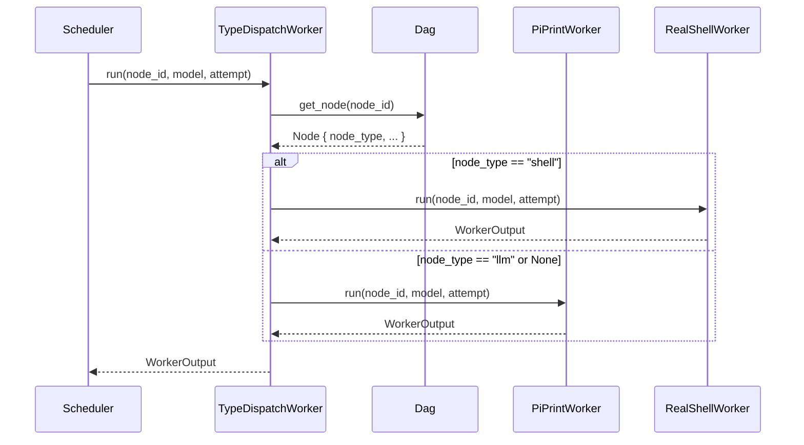

# TypeDispatchWorker — Node-Type Based Worker Dispatch

- **Project**: `${WORKSPACE}/20260601-on-research/crates/pidag`
- **Crate**: `pidag`

---

## Overview

The pidag scheduler currently uses only `PiPrintWorker` for ALL nodes, ignoring the
`node_type` field. This causes shell nodes (validation scripts, quality gates) to be
sent to `pi -p` instead of `bash -c`, resulting in execution failures.

This spec adds a `TypeDispatchWorker` that routes nodes to the correct worker based
on their `node_type` field.

---

## Requirements

**R1**: Create `TypeDispatchWorker` struct that implements the `Worker` trait.

**R2**: `TypeDispatchWorker` must hold references to both `PiPrintWorker` and
`RealShellWorker`.

**R3**: When `run()` is called:
- If `node_type == Some("shell")` → delegate to `RealShellWorker`
- If `node_type == Some("llm")` or `node_type == None` → delegate to `PiPrintWorker`

**R4**: `TypeDispatchWorker` must have access to the `Dag` to look up node types.

**R5**: Update `bin/pidag.rs` `run_subcommand` to use `TypeDispatchWorker` instead
of `PiPrintWorker` directly.

**R6**: Update `bin/pidag.rs` `serve_subcommand` (JSON-RPC server) to also use
`TypeDispatchWorker`.

---

## Architecture

```
bin/pidag.rs
    │
    └── run_subcommand / serve_subcommand
            │
            └── TypeDispatchWorker::new(dag, timeout)
                    │
                    ├── PiPrintWorker (node_type: "llm" or None)
                    │       └── pi -p --model <model> <prompt>
                    │
                    └── RealShellWorker (node_type: "shell")
                            └── bash -c <command>
```

### Data Flow



---

## TDD Contract

| # | Test name | Given | Expected |
|---|-----------|-------|----------|
| T1 | `test_type_dispatch_routes_shell_to_shellworker` | DAG with node `{id: "test", node_type: "shell"}` | `RealShellWorker.run()` is called |
| T2 | `test_type_dispatch_routes_llm_to_piworker` | DAG with node `{id: "test", node_type: "llm"}` | `PiPrintWorker.run()` is called |
| T3 | `test_type_dispatch_routes_none_to_piworker` | DAG with node `{id: "test", node_type: None}` | `PiPrintWorker.run()` is called |
| T4 | `test_shell_node_executes_bash_command` | DAG with shell node `{prompt: "echo hello"}` | Output contains "hello" |
| T5 | `test_mixed_dag_routes_correctly` | DAG with both shell and llm nodes | Each routes to correct worker |

---

## Exit Criteria

- [x] `cargo test -p pidag 2>&1 | grep -E "test_type_dispatch" | grep -c "ok" | grep -q "5"`
- [x] `grep -q "TypeDispatchWorker" crates/pidag/src/worker.rs`
- [x] `grep -q "TypeDispatchWorker::new" crates/pidag/src/bin/pidag.rs`
- [x] `cargo clippy -p pidag -- -D warnings 2>&1 | grep -qv "error"`

---

## Guardrails

- Must NOT change the `Worker` trait signature
- Must NOT change `PiPrintWorker` or `RealShellWorker` implementations
- Must NOT use `unwrap()` or `expect()` in the new code
- `TypeDispatchWorker` must be `Send + Sync` (required by trait)
- Unknown `node_type` values default to `PiPrintWorker` (conservative fallback)
