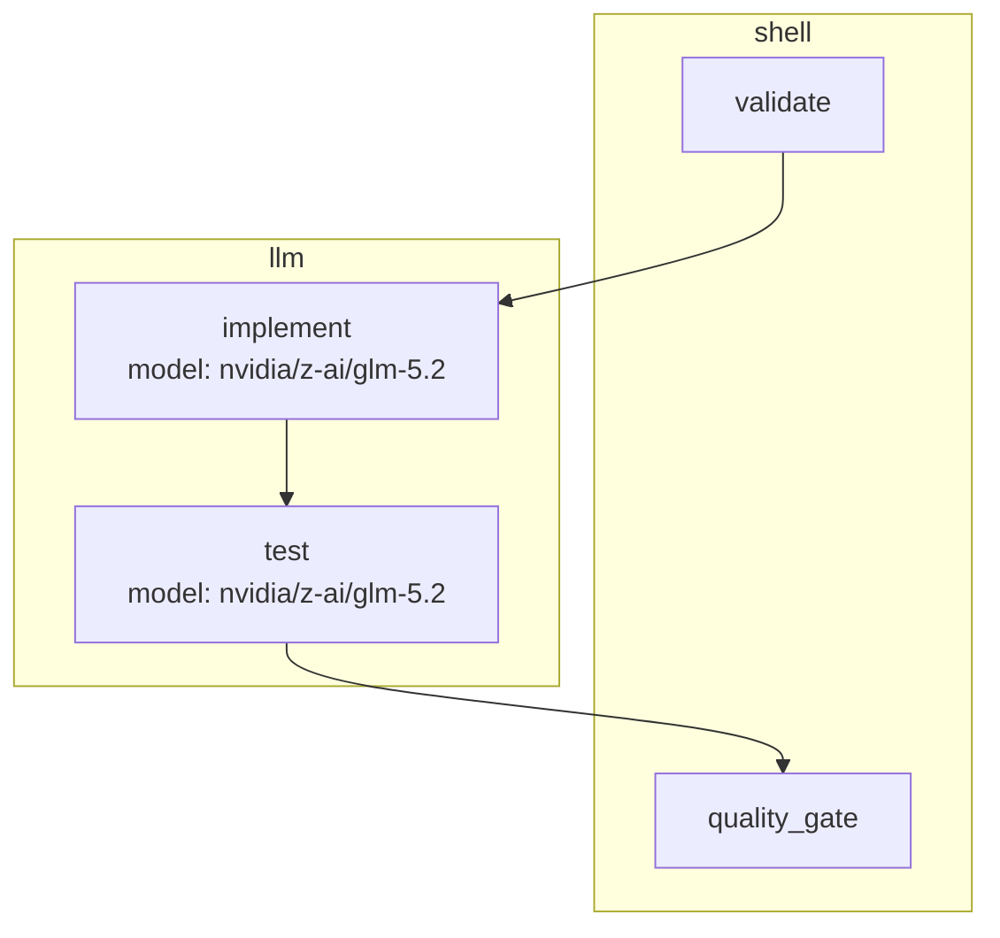
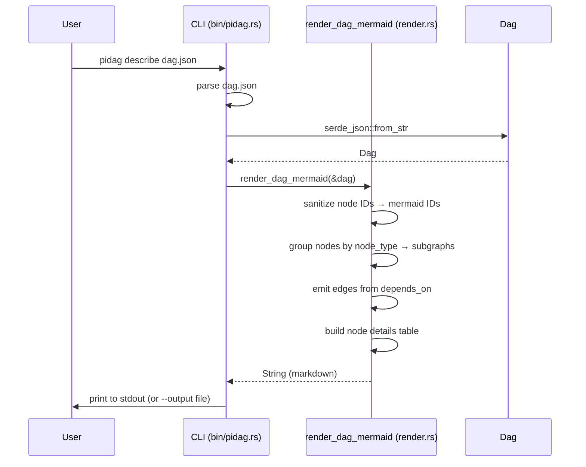

# DAG Mermaid Describe — Visual DAG Documentation

- **Project**: `${WORKSPACE}/20260601-on-research/crates/pidag`
- **Crate**: `pidag`

---

## Overview

pidag DAGs are JSON files. For non-trivial DAGs (SDD specs generate 20+ nodes
with cross-dependencies), reading the JSON to understand the execution plan
is tedious. This spec adds a `pidag describe` subcommand that emits a
**markdown document** with a **mermaid flowchart** rendering of the DAG —
visual structure, node types, model assignments, and dependency edges —
plus a node-details table.

The output is pipable to a `.md` file and commitable to the repo alongside
the DAG JSON, giving each DAG a human-readable, renderable companion doc.

---

## Requirements

**R1**: New subcommand `pidag describe <dag.json>` in `bin/pidag.rs`.
Dispatched from the top-level `match args[1]` arm. Prints the markdown
document to stdout.

**R2**: Optional `--output <path>` flag writes the document to a file
instead of stdout. File path is relative to CWD. Creates parent dirs if
missing.

**R3**: New library function `render_dag_mermaid(dag: &Dag) -> String` in
`render.rs` (alongside the existing `render_status`). Returns the full
markdown document. Pure function — no I/O, no side effects. The CLI
subcommand is a thin wrapper: parse DAG → call this → print or write.

**R4**: The markdown document has three sections:

1. **Header**: `# DAG: <filename>` + a summary line with node count, edge
   count, and node-type breakdown (e.g., `**Nodes:** 4 · **Edges:** 3 ·
   **Types:** shell (2), llm (2)`).
2. **Mermaid flowchart**: a ` ```mermaid ` fenced block with
   `flowchart TD` (top-down). Nodes grouped by `node_type` using
   `subgraph` blocks. Each node rendered as `n_<sanitized_id>["<id>
   <br/>model: <name>"]` (model line only if the node has models). Edges
   rendered as `n_<dep> --> n_<node>` for each `depends_on` entry.
3. **Node details table**: a markdown table with columns
   `| Node | Type | Model | Depends On | Retry | Validate |`, one row
   per node, in topological order.

**R5**: Node ID sanitization for mermaid identifiers: replace every
non-alphanumeric character in the node id with `_`, then prefix with
`n_`. Example: `my-node.v2` → `n_my_node_v2`. This prevents mermaid
syntax errors from dots, hyphens, or other special chars in node IDs.
The original (unsanitized) id appears in the node label for readability.

**R6**: Subgraph grouping by `node_type`:
- `Some("shell")` → subgraph `shell["shell"]`
- `Some("llm")` → subgraph `llm["llm"]`
- `None` or unknown → subgraph `other["other"]` (conservative fallback,
  mirrors `TypeDispatchWorker`'s default-to-piworker convention)

Nodes with no `node_type` and nodes with unrecognized `node_type` values
both go in the `other` subgraph. A node appears in exactly one subgraph.

**R7**: Empty DAG (`nodes: []`) produces a valid document with the header
summary showing `**Nodes:** 0 · **Edges:** 0`, an empty mermaid block
(` ```mermaid\nflowchart TD\n``` `), and a table with only the header row.
No panic, no error — a degenerate but valid output.

**R8**: No new Rust dependencies. Mermaid is plain text output; no
rendering library needed. The function builds strings with `format!` and
`push_str`, same as the existing `render_status`.

**R9**: `print_help()` in `bin/pidag.rs` updated to document the new
subcommand:
```
    pidag describe <dag.json> [--output PATH]
```

---

## Architecture

```
bin/pidag.rs
    │
    └── describe_subcommand(args)
            │
            ├── parse <dag.json> → Dag
            ├── render_dag_mermaid(&dag) → String  (in render.rs)
            └── print to stdout OR write to --output <path>
```

### Output structure (example)

For a DAG with 4 nodes (validate → implement → test → quality_gate):

```markdown
# DAG: my-dag.json

**Nodes:** 4 · **Edges:** 3 · **Types:** shell (2), llm (2)



## Node Details

| Node | Type | Model | Depends On | Retry | Validate |
|---|---|---|---|---|---|
| validate | shell | — | — | 1× | — |
| implement | llm | nvidia/z-ai/glm-5.2 | validate | 3× | bash validate.sh |
| test | llm | nvidia/z-ai/glm-5.2 | implement | 3× | — |
| quality_gate | shell | — | test | 1× | — |
```

### Data Flow



---

## TDD Contract

| # | Test name | Given | Expected |
|---|-----------|-------|----------|
| T1 | `test_mermaid_empty_dag` | `Dag { nodes: [] }` | Header shows `Nodes: 0 · Edges: 0`; mermaid block has `flowchart TD` with no nodes; table has only header row. No panic. |
| T2 | `test_mermaid_single_node` | DAG with one node `{id: "solo", node_type: "llm", models: [{"name": "m1", "paid": false}]}` | Mermaid has `n_solo["solo<br/>model: m1"]` inside `subgraph llm`; no edges; table has one row. |
| T3 | `test_mermaid_linear_chain` | DAG: A → B → C (each depends on previous) | 3 nodes, 2 edges: `n_A --> n_B`, `n_B --> n_C`. |
| T4 | `test_mermaid_diamond` | DAG: A → {B, C} → D | 4 nodes, 4 edges: `n_A --> n_B`, `n_A --> n_C`, `n_B --> n_D`, `n_C --> n_D`. |
| T5 | `test_mermaid_subgraph_grouping` | DAG with mixed `shell` and `llm` nodes | Two `subgraph` blocks: `shell["shell"]` and `llm["llm"]`; each node in the correct subgraph. |
| T6 | `test_mermaid_node_without_models` | Node with `models: []` | Label has no `model:` line; table Model column shows `—`. |
| T7 | `test_mermaid_id_sanitization` | Node with `id: "my-node.v2"` | Mermaid identifier is `n_my_node_v2`; label shows original `my-node.v2`. |
| T8 | `test_describe_writes_to_output_file` | `pidag describe dag.json --output _tmp/out.md` | File `_tmp/out.md` exists and contains the markdown document (not stdout). |

T1-T7 are unit tests on `render_dag_mermaid(&dag) -> String` in
`tests/dag_mermaid_describe_tests.rs`. T8 is an integration test that
spawns the `pidag` binary (or calls `describe_subcommand` directly if
binary spawning is impractical in the test harness).

---

## Exit Criteria

- [x] `cargo test -p pidag` passes (139 existing + 8 new = 147)
- [x] `cargo clippy -p pidag --lib -- -D warnings` clean
- [x] `cargo fmt -p pidag -- --check` clean
- [x] `grep -q "render_dag_mermaid" crates/pidag/src/render.rs`
- [x] `grep -q "describe" crates/pidag/src/bin/pidag.rs`
- [x] `pidag describe` appears in `print_help()` output
- [x] No new dependencies in `Cargo.toml`
- [x] A sample DAG (`_tmp/test-dag.json`) produces valid markdown with a
      renderable mermaid block (manual smoke test: paste into GitHub/VSCode
      mermaid previewer)

---

## Guardrails

- Must NOT change the `Dag` struct, `Node` struct, or any serde model
- Must NOT add any new Rust dependency (mermaid is text output)
- Must NOT use `unwrap()` or `expect()` in production paths (tests may)
- `render_dag_mermaid` must be a pure function (no I/O, no side effects)
- Empty DAGs must produce valid output (no panic, no error)
- Node IDs with special characters must be sanitized for mermaid but
  shown in original form in labels and the details table
- Existing tests must continue to pass with zero changes
- The `render_status` function must NOT change (it renders runtime state;
  `render_dag_mermaid` renders static structure — different concerns)

---

## Files to Modify

| File | Change |
|---|---|
| `crates/pidag/src/render.rs` | Add `render_dag_mermaid(dag: &Dag) -> String` function |
| `crates/pidag/src/lib.rs` | Re-export `render_dag_mermaid` |
| `crates/pidag/src/bin/pidag.rs` | Add `describe` match arm + `describe_subcommand`; update `print_help()` |
| `crates/pidag/tests/dag_mermaid_describe_tests.rs` | NEW — 8 tests (T1-T8) |
| `crates/pidag/HANDOFF.md` | Toggle Next Steps #8 `[ ]`→`[x]` after completion |
| `crates/pidag/Cargo.toml` | No change (no new deps) |
| `crates/pidag/src/dag.rs` | No change (Dag struct unchanged) |
