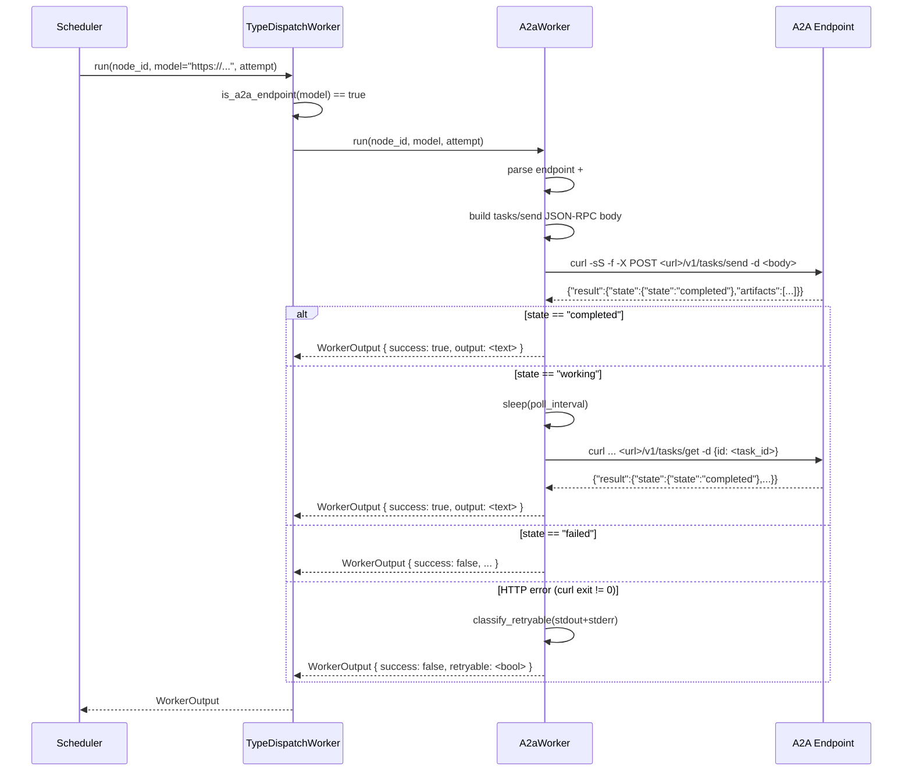

# A2aWorker — Multi-Agent Dispatch via A2A Protocol

- **Project**: `${WORKSPACE}/20260601-on-research/crates/pidag`
- **Crate**: `pidag`

---

## Overview

pidag currently dispatches every `llm` node to `PiPrintWorker`, which shells
out to the local `pi` CLI. This makes pidag a **single-agent orchestrator**:
only one agent backend (pi) is ever used.

This spec adds an `A2aWorker` that dispatches DAG nodes to **any A2A-compliant
remote agent** (Gemini, Claude, Hermes, Orki, …) via the A2A `tasks/send`
JSON-RPC protocol. Routing is by URL prefix: when a `ModelRef.name` starts
with `http://` or `https://`, the `TypeDispatchWorker` sends the node to
`A2aWorker` instead of `PiPrintWorker`.

This is payoff #1 from `docs/claude-pi-delegation/google-a2a-for-pidag.md`:
pidag becomes a **multi-agent orchestrator** with zero new Rust dependencies
(curl + serde_json, both already available).

---

## Requirements

**R1**: `A2aWorker` implements the `Worker` trait. It shells out to `curl`
to POST JSON-RPC requests to the A2A endpoint. No new Rust dependencies.

**R2**: A free function `is_a2a_endpoint(model: &str) -> bool` returns
`true` when `model` starts with `http://` or `https://`, `false` otherwise.
This is the routing predicate used by `TypeDispatchWorker`.

**R3**: `A2aWorker::run` constructs an A2A `tasks/send` JSON-RPC body:

```json
{"jsonrpc":"2.0","method":"tasks/send","params":{
  "message":{"role":"user","parts":[{"type":"text","text":"<prompt>"}]},
  "skillId":"<skill>"   // only when a #fragment skill is present
}}
```

The body is built with `serde_json` (already a dep) so prompt text is
properly JSON-escaped.

**R4**: When the A2A response `result.state.state` is `"working"`,
`A2aWorker` polls `tasks/get` with `result.id` every `poll_interval`
(default 2s) until the state is terminal (`completed` or `failed`) or the
overall `timeout` elapses.

**R5**: Artifact extraction: on `completed`, the first text `Part` from
`result.artifacts[0].parts[0].text` is returned as `WorkerOutput.output`.

**R6**: On HTTP error (curl exit non-zero), `A2aWorker` classifies the
failure with the existing `classify_retryable()` helper on the combined
stdout+stderr. 429 / 503 / quota strings map to `retryable: true`, so the
existing scheduler 429-failover logic advances to the next `ModelRef`.

**R7**: No new Rust dependencies. `curl` is a system binary (shelled out
via `tokio::process::Command`), `serde_json` is already in `Cargo.toml`.
No `Cargo.toml` changes.

**R8**: No changes to the `Worker` trait, `ModelRef` struct, `Event` enum,
or `ModelsConfig`. `ModelRef.name` stays `String`. Routing is by URL prefix
only — existing DAG JSON and config TOML are backward-compatible.

**R9**: `pidag attach` template (`Config::default_config_toml`) updated
with a comment in the `[models]` section documenting the A2A URL format:

```toml
# A2A remote agents: use a URL with an optional #skill fragment.
#   "https://${DEPLOY_HOST_NAME}:7422/agents/hermes#research"
# Routed to A2aWorker (curl + JSON-RPC) instead of PiPrintWorker.
```

---

## Architecture

```
TypeDispatchWorker::run(node_id, model, attempt)
    │
    ├── node_type == "shell"  → RealShellWorker (unchanged)
    │
    └── node_type == "llm"/None/other
            │
            ├── is_a2a_endpoint(model) == true  → A2aWorker
            │       └── curl -sS -f -X POST <url>/v1/tasks/send -d <body>
            │             └── poll tasks/get until terminal or timeout
            │
            └── is_a2a_endpoint(model) == false → PiPrintWorker (unchanged)
                    └── pi -p --output-format json --model <model> <prompt>
```

### ModelRef encoding (backward-compatible)

`ModelRef.name` stays `String`. The URL fragment (`#research`) optionally
selects an A2A skill.

| `ModelRef.name` pattern | Routed to | Example |
|---|---|---|
| Starts with `http://` or `https://` | `A2aWorker` | `https://${DEPLOY_HOST_NAME}:7422/agents/hermes#research` |
| Anything else | `PiPrintWorker` | `nvidia/z-ai/glm-5.2` |

### A2aWorker design

```
A2aWorker {
    prompts: HashMap<String, String>,  // node_id -> prompt (same as PiPrintWorker)
    timeout: Duration,                // overall timeout for send + poll loop
    poll_interval: Duration,           // default 2s, for working -> completed
    program: String,                   // default "curl"
    extra_args: Vec<String>,            // for test shims
}
```

### Data Flow



---

## TDD Contract

| # | Test name | Given | Expected |
|---|-----------|-------|----------|
| T1 | `test_a2a_url_detection` | `is_a2a_endpoint("https://...")` and `is_a2a_endpoint("http://...")` vs a plain model name | `true` for URLs, `false` for `nvidia/z-ai/glm-5.2` |
| T2 | `test_a2a_worker_success` | Shim returns `{"result":{"state":{"state":"completed"},"artifacts":[{"parts":[{"type":"text","text":"hello"}]}]}}` | `WorkerOutput { success: true, output: "hello" }` |
| T3 | `test_a2a_worker_polling` | Shim returns `working` then `completed` on second call | success after poll |
| T4 | `test_a2a_worker_failure` | Shim returns `{"result":{"state":{"state":"failed"}}}` | `success: false` |
| T5 | `test_a2a_worker_429_retryable` | Shim exits 1 with `429 too many requests` on stderr | `retryable: true` |
| T6 | `test_a2a_worker_timeout` | Shim returns `working` forever, timeout 1s | `success: false`, output mentions timeout |
| T7 | `test_type_dispatch_routes_a2a_url` | `TypeDispatchWorker` with A2A shim, `model="https://..."` | routes to A2aWorker (not PiPrintWorker) |
| T8 | `test_a2a_skill_fragment_extracted` | `model="https://agent.example#research"` | endpoint is `https://agent.example`, `skillId: "research"` present in request body |

Tests use a shell shim (`sh -c 'echo ...'`) pattern, same as
`PiPrintWorker::with_command` in existing tests. The shim replaces `curl`
and emits canned JSON-RPC responses.

---

## Exit Criteria

- [x] `cargo test -p pidag` passes (137 existing + 8 new = 145)
- [x] `cargo clippy -p pidag --lib -- -D warnings` clean
- [x] `cargo fmt -p pidag -- --check` clean
- [x] No new dependencies in `Cargo.toml`
- [x] `grep -q "A2aWorker" crates/pidag/src/worker.rs`
- [x] `grep -q "is_a2a_endpoint" crates/pidag/src/worker.rs`
- [x] `grep -q "a2a_worker" crates/pidag/src/worker.rs` (TypeDispatchWorker owns it)
- [x] A DAG with `models: [{"name": "https://...", "paid": false}]` dispatches via curl, not pi

---

## Guardrails

- Must NOT change the `Worker` trait signature
- Must NOT change `ModelRef` struct, `Event` enum, or `ModelsConfig`
- Must NOT add any new Rust dependency (curl is a system binary, not a crate)
- Must NOT use `unwrap()` or `expect()` in production paths (tests may)
- `A2aWorker` must be `Send + Sync` (required by `Worker` trait)
- `is_a2a_endpoint` must be case-sensitive on the prefix (`http://` / `https://`)
- Existing tests (137) must continue to pass with zero changes
- `PiPrintWorker` and `RealShellWorker` implementations must NOT change
- Unknown A2A states (not `completed`/`working`/`failed`) return a failure

---

## Files to Modify

| File | Change |
|---|---|
| `crates/pidag/src/worker.rs` | Add `A2aWorker` struct + `is_a2a_endpoint()` helper + URL/skill parsing + JSON-RPC body builders + response parser + `run()` with send+poll loop. Update `TypeDispatchWorker` to own an `a2a_worker` field and route by URL prefix. |
| `crates/pidag/tests/a2a_worker_tests.rs` | NEW — 8 tests with shell shims |
| `crates/pidag/src/lib.rs` | Re-export `A2aWorker` and `is_a2a_endpoint` |
| `crates/pidag/src/config.rs` | Add A2A URL format comment to `default_config_toml` `[models]` section (R9) |
| `crates/pidag/HANDOFF.md` | Append Next Steps item #7 |
| `crates/pidag/Cargo.toml` | No change (no new deps) |
| `crates/pidag/src/dag.rs` | No change (ModelRef.name stays String) |
