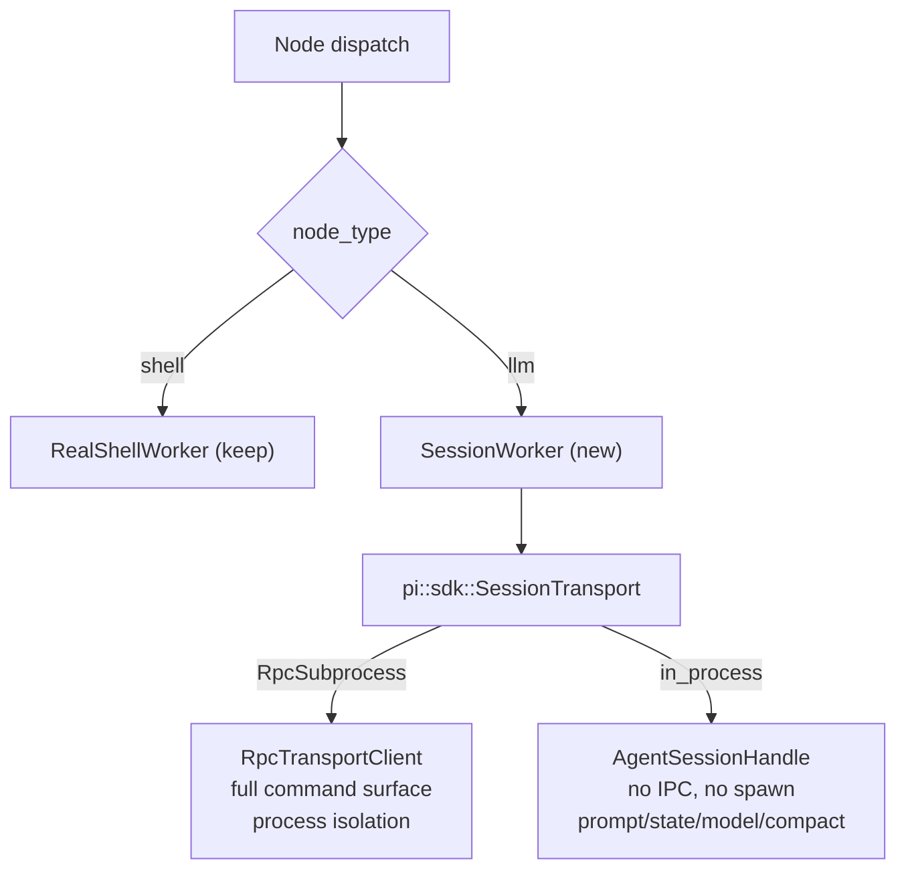

# pidag — Architecture Analysis: realigning on `pi_agent_rust`'s actual capabilities

- **Date**: 2026-08-10
- **Type**: Analysis / architectural direction (NOT an implementation spec)
- **Project**: `/projects/pidag`
- **Upstream analysed**: `/projects/_upstream/pi_agent_rust` (`pi_agent_rust` 0.2.0, `[lib] name = "pi"`)
- **Status**: findings verified against upstream source + the installed `pi` binary

---

## 0. Executive summary

pidag was designed against an **assumed** `pi` interface — "a CLI you shell out to with
`pi -p`". The real `pi_agent_rust` is a Rust **library crate** (`[lib] name = "pi"`,
`src/lib.rs`) exposing a SemVer-checked SDK (`pi::sdk`) that already contains:

- a maintained **subprocess RPC client** (`RpcTransportClient`, 30+ typed commands),
- an **in-process agent session** (`create_agent_session` / `AgentSessionHandle`),
- a **unified transport adapter** (`SessionTransport`) that abstracts the two.

pidag is a Rust crate. It could have `pi = { package = "pi_agent_rust", path = ... }`
in `Cargo.toml` since day one. Instead it hand-rolled process spawning, JSON framing,
session handling, retry classification by string-matching stdout, and model routing by
CLI flags — and got the protocol wrong in ways the test suite is structurally unable
to detect.

**Three conclusions:**

1. **Stop the bleeding.** The committed RPC worker (spec-16) cannot work against real
   `pi`; the default code path currently fails every LLM node. `PI_NO_RPC=1` is the
   immediate mitigation. (§1)
2. **Delete, don't fix.** `src/worker/rpc.rs` should not be repaired — it should be
   replaced by `pi::sdk::RpcTransportClient`, which is the same idea, implemented
   correctly, maintained upstream, and vastly more capable. (§3, §4)
3. **The DAG model gets simpler and stronger** once a node is "a turn in a session"
   rather than "a process invocation". Failover, budgeting, branching, and the
   self-healing SDD loop all become first-class instead of emergent. (§5)

---

## 1. P0 — the committed RPC worker cannot work (verified live)

`src/worker/rpc.rs::ensure_spawned` builds this command line (rpc.rs:84-101):

```
pi --rpc --mode json --thinking <level> [--append-system-prompt ...] [--session _tmp/...]
```

Verified against the installed binary (`/root/.local/bin/pi`):

| # | Defect | Evidence | Impact |
|---|--------|----------|--------|
| **1.1** | `--rpc` and `--mode` are **mutually exclusive** | `pi --rpc --mode json` → `error: the argument '--rpc' cannot be used with '--mode <MODE>'` | The child dies at startup on **every** spawn. RPC mode has never engaged in production. |
| **1.2** | `--session <path>` **opens an existing** session; it does not create one | `pi --rpc --model X --session ./s.jsonl` → `Error: Session not found` | Even with 1.1 fixed, the spawn fails until the file exists. spec-15's session feature is affected by the same misreading. |
| **1.3** | `--model` / `--provider` are **never passed** (spec-16 R7 unimplemented) | `run()` binds `_model` unused; `ensure_spawned` sets no model flag | Per-node model routing (configurable-models R1-R7, spec-13 P13 provider routing) is **dead** in RPC mode. Nodes silently run on `PI_MODEL` (env shows `deepseek-chat` — the **paid** model per `.pidag/config.toml`), bypassing `--allow-paid`. |
| **1.4** | `stderr` piped and never drained | `rpc.rs:105` sets `Stdio::piped()`; nothing reads it | Classic pipe-buffer deadlock: ~64KB of `pi` stderr blocks the child forever, surfacing as a timeout. |
| **1.5** | No respawn after child death | `ensure_spawned` returns `false` on `try_wait() == Ok(Some(_))` → `retryable: false` | One dead process fails **every remaining LLM node** in the DAG. Defeats 429-failover. |
| **1.6** | Stream desync after any error | `send_prompt` restores stdin/stdout and leaves the child alive (rpc.rs:199-203); the read loop **never matches the response `id`** against the request `id` | After one timeout, every subsequent node reads the *previous* node's events. Outputs are silently misattributed. |

**Why 319 green tests missed all of it**: every worker test shims `program` with a bash
script that ignores the real flags, and both `TypeDispatchWorker::with_pi_command` and
`with_pi_and_a2a_command` hardcode `rpc_worker: None` (`type_dispatch.rs:95,127`). The
suite cannot observe the real `pi` CLI contract. This is the root process failure — not
the individual bugs. **No amount of unit testing against self-written shims validates an
external contract.**

> Upstream knew the answer the whole time: `RpcTransportOptions::default()` is
> `args: ["--mode", "rpc"]` (`src/sdk.rs:630-638`).

---

## 2. What pi actually is

| Surface | Location | Notes |
|---|---|---|
| Library crate | `[lib] name = "pi"`, `src/lib.rs` | `pi = { package = "pi_agent_rust", version = "0.2.0" }` |
| SDK module | `pi::sdk` (`src/sdk.rs`) | The **only** SemVer-stable surface; other modules are CLI internals |
| In-process agent | `create_agent_session(SessionOptions) -> AgentSessionHandle` | No subprocess at all |
| Subprocess RPC | `RpcTransportClient::connect(RpcTransportOptions)` | Correct framing, request-id correlation, 30+ commands |
| Unified adapter | `SessionTransport::{in_process, RpcSubprocess}` | Exactly pidag's `PI_NO_RPC` switch, upstream |
| Protocol doc | `docs/rpc.md` | JSON Lines over stdin/stdout; `pi --mode rpc` |
| SDK cookbook | `docs/sdk.md` | 7 recipes + stability table |
| TUI is optional | `[[bin]] pi` has `required-features = ["tui"]` | `--no-default-features` → library without the terminal stack (good for embedding) |

### 2.1 `RpcTransportClient` command surface (verified in `src/sdk.rs`)

`connect`, `request`, `prompt`, `prompt_with_options`, `steer`, `follow_up`, `abort`,
`new_session`, `switch_session`, `fork`, `get_fork_messages`, `get_state`,
`get_session_stats`, `get_messages`, `get_last_assistant_text`, `get_available_models`,
`set_model`, `cycle_model`, `set_thinking_level`, `cycle_thinking_level`,
`set_steering_mode`, `set_follow_up_mode`, `set_auto_compaction`, `set_auto_retry`,
`abort_retry`, `set_session_name`, `compact`, `compact_with_instructions`, `bash`,
`abort_bash`, `export_html`, `get_commands`, `extension_ui_response`, `shutdown`.

pidag uses the equivalent of **one** of these (`prompt`), reimplemented.

### 2.2 `AgentSessionHandle` (in-process)

`prompt`, `prompt_with_abort`, `continue_turn`, `continue_turn_with_abort`,
`new_abort_handle`, `subscribe`/`unsubscribe`, `model`, `set_model`,
`set_thinking_level`, `set_session_name`, `messages`, `state`, `compact`,
`extension_manager`, `into_inner`.

Note the documented gap: **`steer`/`follow_up`/`fork` are RPC-only** — the in-process
handle does not expose them (`docs/sdk.md`, "Compatibility Notes"). This materially
affects the target-architecture choice in §4.

### 2.3 `SessionOptions` — configuration pidag currently does by string-hacking

`provider`, `model`, `api_key`, `thinking`, `system_prompt`, `append_system_prompt`,
`enabled_tools`, `working_directory`, `no_session`, `session_path`, `session_dir`,
`extension_paths`, `extension_policy`, `repair_policy`, `include_cwd_in_prompt`,
**`max_tool_iterations`**, **`tool_factory`**, `on_event`, `on_tool_start`,
`on_tool_end`, `on_stream_event`.

---

## 3. Overlap ledger — what pidag rebuilt

| pidag component | LoC | `pi::sdk` equivalent | Verdict |
|---|---|---|---|
| `worker/rpc.rs` (spawn, framing, read loop) | 254 | `RpcTransportClient` | **Delete.** Broken (§1) and redundant. |
| `worker/pi_print.rs` (`pi -p` one-shot) | 270 | `RpcTransportClient::prompt` / `AgentSessionHandle::prompt` | Reduce to a thin legacy fallback, or delete. |
| `PI_NO_RPC` routing switch | in `type_dispatch.rs` | `SessionTransport` enum | Replace. |
| `classify_retryable(stdout+stderr)` string matching | `worker/mod.rs` | typed `AgentEvent` / `auto_retry_start`/`auto_retry_end` events; `set_auto_retry` | Replace with typed signals. |
| Model routing by respawn with `--model` | `split_provider_model` + spawn flags | `set_model(provider, model_id)` on a **live** session | Strictly better: switches model **without losing context**. |
| Session continuity via `--session` file (spec-15) | | `new_session` / `switch_session` / `session_path` | Replace; current semantics are wrong (§1.2). |
| Anti-loop prompt injected as a CLI arg literal | `rpc.rs:94` (inline const string) | `SessionOptions::append_system_prompt` | Replace with a typed option. |
| Timeout-based worker control | `Duration` + process kill | `AbortHandle`/`AbortSignal`, `max_tool_iterations` | Replace with cooperative cancellation. |
| 429/exhaustion inference | `runtime-429-failover.md` | `get_state` / `get_session_stats` token usage + `set_auto_retry` | Replace inference with measurement. |
| `a2a/` + `mcp/` workers | 404 + ~600 | pi has its own tool/extension system (`tool_factory`, `extension_paths`) | Evaluate separately — possible overlap, not assessed here. |

**~800-1000 LoC of pidag's 14,040 is reimplementation of `pi::sdk`**, and it is the
part that has consumed the last four specs (13, 14, 15, 16) and the most tokens.

---

## 4. Target architecture

### 4.1 The decision



**Recommendation: adopt `RpcTransportClient` as the primary backend** (not the
in-process handle), for three reasons:

1. It has the **complete** command surface — `fork`, `steer`, `abort`, `switch_session`
   are RPC-only, and §5 shows `fork` is the primitive the DAG model actually wants.
2. It preserves **process isolation**: a worker agent that panics or wedges cannot take
   down the orchestrator holding the redb vault and the web UI.
3. It is the smaller migration — pidag already has a subprocess-shaped `Worker` trait.

Keep `SessionTransport` as the seam so in-process becomes a config switch later (it is
strictly cheaper for short leaf nodes: no spawn, no IPC).

### 4.2 Costs and risks to weigh before committing

- **Build weight.** `pi_agent_rust` is a large crate (196K `Cargo.lock`, extensions,
  providers). Depend on it with `default-features = false` to skip the TUI stack.
  Measure the compile-time hit before adopting — this is the main argument *against*.
- **SemVer surface is narrow.** Only `pi::Error`, `pi::PiResult`, and `pi::sdk` are
  stable. Never reach into other `pi::` modules.
- **Version pinning.** A `path =` dependency on `/projects/_upstream/pi_agent_rust`
  couples pidag to a local checkout. Pin a git rev or vendor deliberately.
- **A contract test is mandatory.** The §1 defect class recurs unless at least one test
  exercises the **real** `pi` binary. Shim-only testing is what produced this situation.

---

## 5. The interesting part — what this changes about the DAG model

Once a node is *a turn in a session* rather than *a process invocation*:

**5.1 Sessions become first-class DAG state.** pidag currently models nodes as pure
functions of a prompt. They are not — the SDD loop
(`implement → quality-gate → validate → fix`) is a **conversation**. That is why
spec-15 and spec-16 both reached for sessions: the model was wrong, and the specs were
compensating.

**5.2 `fork(entry_id)` is the missing branching primitive.** Today a shared RPC worker
would give all parallel branches one linear session → context cross-contamination
(and a mutex that silently serialises `--concurrency 4` down to 1). With `fork`, each
parallel dependent forks the common ancestor's session: shared prefix (cheap, prompt-
cache friendly), independent continuations. **The session DAG mirrors the node DAG.**

**5.3 Failover stops throwing away context.** Current design: 429 → kill process →
respawn with the next model → the new agent starts from zero, re-reads the repo,
re-derives state. With `set_model(provider, model_id)` the session continues *mid-
conversation* on a different provider. This is a large token saving and a strictly
better recovery story than `runtime-429-failover.md` describes.

**5.4 Budgeting becomes measurement, not heuristics.** `get_state` / `get_session_stats`
return real token usage. `split_for_auto`'s ">7 exit criteria" heuristic
(`agent/splitter.rs`) is a proxy for "this will exhaust context" — replace the proxy
with the measurement, and split on actual token pressure.

**5.5 The narration-loop bug has a principled fix.** spec-14's anti-loop prompt is a
behavioural patch for what the evidence describes as a **long-context** failure
("narration-only loop observed cross-model under long context",
`worker/pi_print.rs:16`). pi ships `compact` / `set_auto_compaction` /
`auto_compaction_start` events. Compact on token pressure instead of scolding the model
in a system prompt.

**5.6 Guardrails move from prompt-text to the tool boundary.** `SessionOptions::
tool_factory` + `enabled_tools` let pidag wrap or restrict the agent's tools —
approval-gated writes, read-only validate nodes, a genuinely read-only "research" mode.
Every spec's "Guardrails" section is currently enforced by *asking the model nicely*.
This makes them enforceable.

**5.7 Concurrency stops being a lie.** `cli/sdd.rs:31` and `cli/run.rs:20` default to
`--concurrency 4`, and the scheduler honours it with a semaphore — but one shared RPC
process behind one mutex serialises all LLM nodes. N transports (or N forked sessions)
makes the declared concurrency real.

---

## 6. Recommended sequencing

| Step | Work | Why this order |
|---|---|---|
| **0. Now** | Set `PI_NO_RPC=1` (or revert the `type_dispatch.rs` default) | The default path is broken today (§1). One-line mitigation, no spec needed. |
| **spec-17** | Contract test against the **real** `pi` binary: spawn, one prompt, assert an `agent_end`. Gate CI on it. | Nothing else is trustworthy until the shim-blindness is closed. Cheapest, highest leverage. |
| **spec-18** | Replace `worker/rpc.rs` with `pi::sdk::RpcTransportClient` behind the existing `Worker` trait. Delete the hand-rolled framing. Pass model/provider/thinking via `set_model`/`set_thinking_level`. | Fixes 1.1-1.6 by deletion. Restores per-node model routing. |
| **spec-19** | Session-per-DAG-path via `fork`; make `--concurrency` real; retire the `--session` file approach. | Needs 18 landed; unlocks §5.2, §5.7. |
| **spec-20** | Token-aware budgeting (`get_state`) + `compact` on pressure; retire the >7-criteria heuristic and re-evaluate the anti-loop prompt. | Needs 19's session model; unlocks §5.4, §5.5. |
| **later** | Evaluate `tool_factory` guardrails (§5.6); evaluate in-process transport for leaf nodes; audit `a2a/` + `mcp/` overlap. | Independent tracks. |

Specs 14, 15 and 16 are best understood as **three attempts to work around a wrong
integration model**. Spec-18 subsumes 15 and 16 entirely; spec-14's gate logic (Bug A)
is genuinely pidag's own concern and survives.

---

## 7. Process finding (the expensive one)

The token and time cost the user identified did not come from any single bug. It came
from **building against an assumed interface and validating against self-written
shims**. Both halves were required for the failure: assumptions alone would have been
caught by a real-binary test; shims alone would have been harmless against a correct
model.

Standing rule worth adopting: *before integrating an external tool, read its source or
protocol doc, and land one test that exercises the real thing.* For this repo that
means `docs/rpc.md` and `docs/sdk.md` were the two files (2.8K and 9.9K) that would
have prevented specs 13-16.

Second, smaller finding: `HANDOFF.md` is 2,531 lines with the **stale** status at the
top (line 8 still says "spec-14 PLANNED, NOT implemented") and the live status buried
at line 2478. A contract file whose job is "read this first" actively misleads a fresh
agent. Truncate history to `HANDOFF.archive.md`; keep current status at the top.

---

## 8. Open questions (resolve before spec-18)

1. What is the compile-time cost of depending on `pi_agent_rust`
   (`default-features = false`)? If it is severe, the RPC-subprocess route can use the
   **protocol** from `docs/rpc.md` without linking the crate — but then pidag owns the
   framing again, and §7 applies. Prefer linking.
2. Path dependency, git rev, or crates.io `0.2.0`? Affects reproducibility of the
   container build (`deploy/Containerfile`).
3. Does `RpcTransportClient` tolerate concurrent use from multiple tasks, or does pidag
   need one client per lane? (`request()` takes `&mut self` and holds `next_request_id`
   — strongly implies **one client per lane**, which suits §5.2.)
4. Do `a2a/` and `mcp/` duplicate pi's extension/tool system? Not assessed here.
