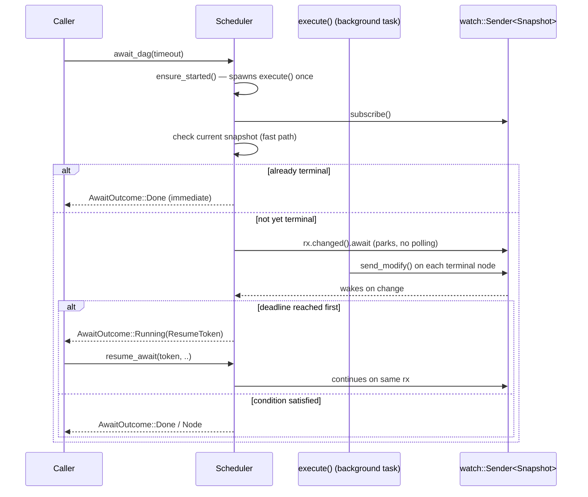

# scheduler — DAG Execution Engine and Completion-Signal Awaiting

[← back to crate README](../README.md)

Split into three files to stay under the 450-line-per-file limit while
keeping a single `Scheduler` type with impl blocks spread across the files
below (allowed within one crate — the orphan rule only restricts
cross-crate impls).

## Files

| File | Responsibility |
|---|---|
| `mod.rs` | Public types (`NodeState`, `RunReport`, `AwaitOutcome`, `ResumeToken`), the `Scheduler` struct, and its public API surface (`new`, `run`, `await_dag`, `resume_await`, `wait_any`, `ensure_started`). |
| `await_loop.rs` | The completion-signal wait loops behind `await_dag`/`wait_any`/`resume_await`: `wait_for_done`, `wait_any_inner`, `done_report`, `next_terminal_node`. No polling — every loop parks on `watch::Receiver::changed()`. |
| `execute.rs` | The Phase-1 scheduling algorithm: `execute()` (Kahn's-algorithm ready-set loop, semaphore-bounded concurrent dispatch, event emission, snapshot publication) and `dispatch_node()` (retry × model-fallback lattice for a single node). |

Private types (`Snapshot`, `Inner`) are defined in `mod.rs` and used by the
other two files via `use super::*` — this works because Rust's privacy
rules make private items visible to the defining module **and all of its
descendant modules**, and `await_loop`/`execute` are declared as
`mod await_loop;` / `mod execute;` children of `scheduler`.

## Completion Signal: `tokio::sync::watch`

The spec requires awaiting a running DAG without polling
(`loop { status(); sleep(..) }` is explicitly forbidden). This module uses a
`tokio::sync::watch::channel<Snapshot>` as that signal:

- `execute()` (the background run) calls `inner.tx.send_modify(..)` on every
  terminal transition (`Done`/`Failed`/`Blocked`) and once more when the DAG
  itself finishes.
- `await_dag`/`wait_any` subscribe (`inner.tx.subscribe()`) and first check
  the **current** value of the channel — an already-terminal condition
  returns immediately, no wait at all.
- If nothing new is available, the loop parks on `rx.changed().await`
  (optionally wrapped in `tokio::time::timeout`), which is a genuine async
  wait backed by the Tokio reactor, not a spin/poll loop.
- On timeout, the loop returns `AwaitOutcome::Running(ResumeToken(rx))` —
  the *same* `watch::Receiver`, so a later `resume_await` continues reading
  from the point it left off instead of missing or replaying transitions.

## `wait_any` vs `await_dag`

Both share the same wait mechanics (`await_loop.rs`) but differ in what
they look for in the snapshot:

- `await_dag` waits for `Snapshot::dag_done`.
- `wait_any` walks `Snapshot::terminal_order` looking for the first node id
  not yet in `Scheduler::consumed`, marks it consumed, and returns it with
  the current `still_running` set. Once every terminal node has been
  consumed, a further `wait_any` call falls through to `Done` instead of
  hanging forever waiting for a node that will never arrive.

`consumed` lives on `Scheduler` (not `Inner`), so it is local to one
`Scheduler` handle — two independent `wait_any` consumers on the same
underlying run would each see the full terminal sequence from the start.

## Why one `Scheduler`, not two

An earlier draft of the Phase 2 tests spawned a second `Scheduler` in a
background task and awaited on the *original* instance. Two `Scheduler`s
constructed from the same `Dag` do **not** share any state — each has its
own `Inner`/`watch` channel — so that pattern could never observe
completion. The design above avoids this by having `await_dag`/`wait_any`
lazily start the run themselves (`ensure_started`) the first time they are
called on a given `Scheduler`, so there is exactly one `execute()` task and
one channel per logical run, no matter how many times `await_dag`/
`wait_any`/`resume_await` are called against it.
